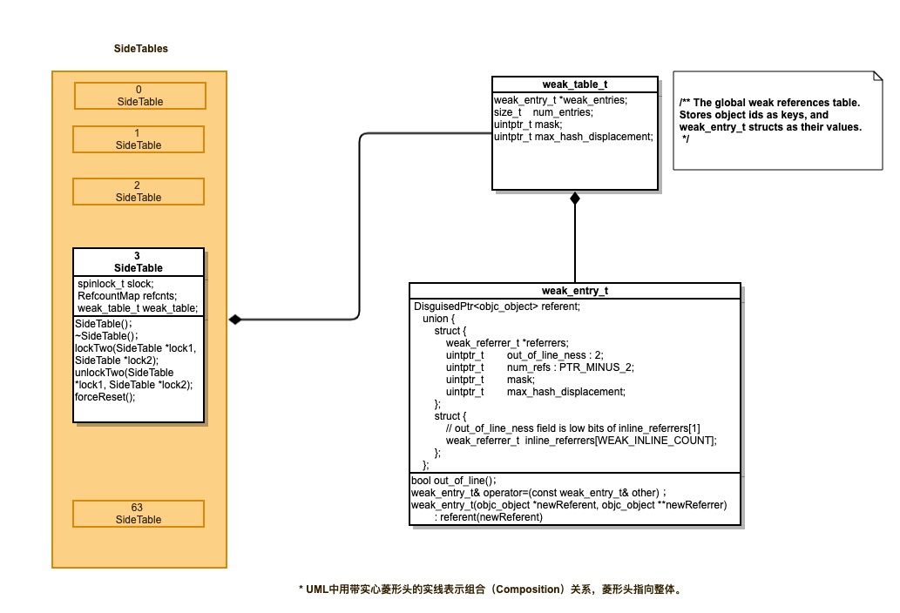
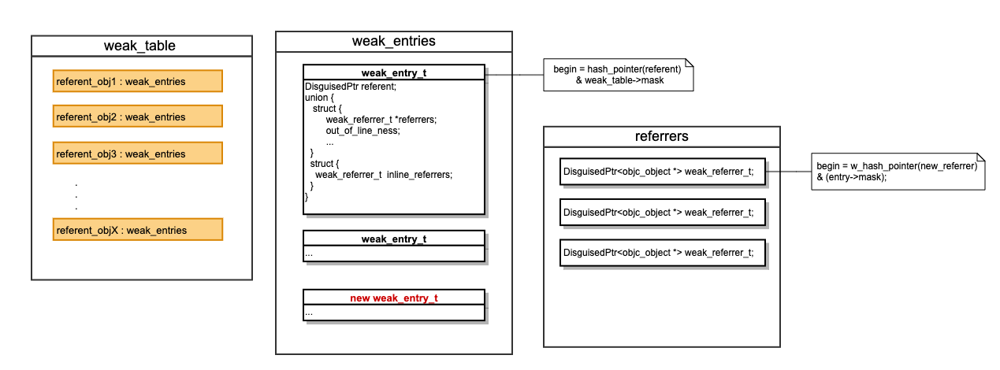

# 1、怎么检测内存泄露？

## 1.1 检测方式

> 1. 代码编写过程中，使用dealloc方法检查对象是否释放
>
> 2. instruments 中leaks、Allocations 
>
>    Leaked memory 可以用 Instrument 的 Leaks 检测出来. Leaks的实现思路是搜索所有可能包含指向malloc内存块指针的内存区域，比如全局数据内存块，寄存器和所有的栈。如果malloc内存块的地址被直接或者间接引用，则是reachable的，反之，则是leaks.
>
>    Abandoned memory，可以用 Instrument 的 Allocations 检测出来。检测方法是用 Mark Generation 的方式，当你每次点击 Mark Generation 时，Allocations 会生成当前 App 的内存快照，而且 Allocations 会记录从上回内存快照到这次内存快照这个时间段内，新分配的内存信息.
>
> 3. 三方工具检查
>
>    * MLeaksFinder
>
>      > 检测原理：为基类 NSObject 添加一个方法 `-willDealloc` 方法，该方法的作用是，先用一个弱指针指向 self，并在一小段时间(3秒)后，通过这个弱指针调用 `-assertNotDealloc`，而 `-assertNotDealloc` 主要作用是直接中断言。
>      >
>      > ```objective-c
>      > - (BOOL)willDealloc {
>      >     __weak id weakSelf = self;
>      >     dispatch_after(dispatch_time(DISPATCH_TIME_NOW, (int64_t)(3 * NSEC_PER_SEC)), dispatch_get_main_queue(), ^{
>      >         [weakSelf assertNotDealloc];
>      >     });
>      >     return YES;
>      > }
>      > - (void)assertNotDealloc {
>      >      NSAssert(NO, @“”);
>      > }
>      > ```
>      >
>      > 这样，当我们认为某个对象应该要被释放了，在释放前调用这个方法，如果3秒后它被释放成功，weakSelf 就指向 nil，不会调用到 `-assertNotDealloc` 方法，也就不会中断言，如果它没被释放（泄露了），`-assertNotDealloc` 就会被调用中断言。这样，当一个 UIViewController 被 pop 或 dismiss 时（我们认为它应该要被释放了），我们遍历该 UIViewController 上的所有 view，依次调 `-willDealloc`，若3秒后没被释放，就会中断言。
>      >
>      > 参考：
>      >
>      > [精准 iOS 内存泄露检测工具](http://wereadteam.github.io/2016/02/22/MLeaksFinder/)
>
>    * FBMemoryProfiler
>
>      > 这套内存泄漏检测类库大概包含了以下三个文件：
>      >
>      > -  [FBMemoryProfiler](https://link.jianshu.com/?t=http://iphone.myzaker.com/zaker/l.php?u=https%3A%2F%2Fgithub.com%2Ffacebook%2FFBMemoryProfiler&target=_new)
>      >
>      >  FBMemoryProfiler 是几个组件的结合。其中包括 FBAllocationTracker 和 FBRetainCycleDetector。
>      >
>      >  可视化工具，直接嵌入到 App 中，可以起到在 App 中直接查看内存使用情况，并筛选潜在泄漏对象的作用
>      >
>      >  
>      >
>      > -  [FBAllocationTracker](https://link.jianshu.com/?t=http://iphone.myzaker.com/zaker/l.php?u=https%3A%2F%2Fgithub.com%2Ffacebook%2FFBAllocationTracker&target=_new)
>      >
>      >  主要用于快速检测潜在的内存泄漏对象，并提供给 FBRetainCycleDetector 进行检测
>      >
>      >  **这是一个用来主动追踪所有 NSObject 的子类的内存分配和释放操作的工具。**
>      >
>      >  
>      >
>      >  FBAllocationTracker 用于检测应用在运行时所有实例的分配。它的原理其实就是用 method swizzling 替换原本的 alloc 方法。这样就可以记录下所有的实例分配了。
>      >
>      >  
>      >
>      >  在需要的时候调用 currentAllocationSummary 方法，就可以得到当前整体的实例分配情况（**前提是在 main 中初始化过，下面有介绍**）：
>      >
>      >  NSArray<FBAllocationTrackerSummary *> *summaries =
>      >
>      >  [[FBAllocationTrackerManager sharedManager] currentAllocationSummary];
>      >
>      >  
>      >
>      > -  [FBRetainCycleDetector](https://link.jianshu.com/?t=http://iphone.myzaker.com/zaker/l.php?u=https%3A%2F%2Fgithub.com%2Ffacebook%2FFBRetainCycleDetector&target=_new)
>      >
>      >  FBRetainCycleDetector 接受一个运行时的实例，**然后从这个实例开始遍历它所有的属性，逐级递归。** 如果发现遍历到重复的实例，就说明存在循环引用，并给出报告。
>      >
>      > ```objective-c
>      >  FBRetainCycleDetector *detector = [FBRetainCycleDetector new];
>      > 
>      >  [detector addCandidate:myObject];
>      > 
>      >  NSSet *retainCycles = [detector findRetainCycles];
>      > 
>      >  NSLog(@"%@", retainCycles);
>      > 
>      > ```
>

## 1.2 内存分类：

> > - Leaked memory:  Memory unreferenced by your application that cannot be used again or freed (also detectable by using the Leaks instrument).
>> - Abandoned memory: Memory still referenced by your application that has no useful purpose.
> > - Cached memory: Memory still referenced by your application that might be used again for better performance.
> >
> > Leaked memory 和 Abandoned memory 都属于应该释放而没释放的内存, 都是内存泄露.

# 2、block

## 2.1 怎么解决循环引用?

 > 1. 借助weak解决循环引用
 > 2. 借助__block解决循环引用
 > 3. "将强引用对象作为block参数传入"解决循环引用
 > 4. 借助NSProxy解决循环引用

## 2.2 为什么用__weak?

> weak引用的好处就是只是产生一条引用，真实内存区的引用计数不加1，在block内部去使用weakSelf，block捕获weakSelf，生成block对象时，在block对象内部产生一个指向真实内存区的__weak引用。从而解决了block对真实内存区的强引用问题。

# 3、__weak 的实现机制？sideTable的数据结构，怎么解决hash冲突？

## 3.1 __weak实现机制？

 > **weak 的实现原理可以概括一下三步：**
 >
 > 1、初始化时: 初始化一个新的weak指针指向对象。
 >
 > 2、存储引用时：调用 objc_storeWeak() 函数，将weak指针的地址存到SideTable下weak_tabel中。
 >
 > 3、释放时，在弱引用对象释放时，**clearDeallocating**中将weak指针置为nil；
 >
 > 调用clearDeallocating函数。首先根据对象地址获取所有weak指针地址的数组，然后遍历这个数组把其中的数据设为nil，最后把这个entry从weak表中删除，最后清理对象的记录。
 >
 > ```objc
 > NEVER_INLINE void
 > objc_object::clearDeallocating_slow()
 > {
 >     assert(isa.nonpointer  &&  (isa.weakly_referenced || isa.has_sidetable_rc));
 > 
 >     SideTable& table = SideTables()[this]; // 在全局的SideTables中，以this指针为key，找到对应的SideTable
 >     table.lock();
 >     if (isa.weakly_referenced) { // 如果obj被弱引用
 >         weak_clear_no_lock(&table.weak_table, (id)this); // 在SideTable的weak_table中对this进行清理工作
 >     }
 >     if (isa.has_sidetable_rc) { // 如果采用了SideTable做引用计数
 >         table.refcnts.erase(this); // 在SideTable的引用计数中移除this
 >     }
 >     table.unlock();
 > }
 > ```
 >
 > 

 ## 3.2 sideTable的数据结构？
>
>来看看SideTable的定义：
>
>```objc
>struct SideTable {
>spinlock_t slock;
>RefcountMap refcnts;
>weak_table_t weak_table;
>> }
>
>```
>
>SideTable的定义很清晰，有三个成员:
>
>> 1. `spinlock_t slock;`: 自旋锁，保证操作 `SideTable` 时的线程安全。看前面的两大块 `weak_table_t` 和 `weak_entry_t` 的时候，看到它们所有的操作函数都没有提及加解锁的事情，如果你仔细观察的话会发现它们的函数名后面都有一个 `no_lock` 的小尾巴，正是用来提醒我们，它们的操作完全并没有涉及加锁。其实它们是把保证它们线程安全的任务交给了 `SideTable`，下面可以看到 `SideTable` 提供的函数都是线程安全的，而这都是由 `slock` 来完成的。
>> 2. `RefcountMap refcnts`: 以 `DisguisedPtr<objc_object>` 为 `key`，以 `size_t` 为 `value` 的哈希表，用来存储对象的引用计数（仅在未使用 `isa` 优化或者 `isa` 优化情况下 `isa_t` 中保存的引用计数溢出时才会用到，这里涉及到 `isa_t` 里的 `uintptr_t has_sidetable_rc` 和 `uintptr_t extra_rc` 两个字段，以前只是单纯的看 `isa` 的结构，到这里终于被用到了，还有这时候终于知道 `rc` 其实是 `refcount`(引用计数) 的缩写）。作为哈希表，它使用的是平方探测法从哈希表中取值，而 `weak_table_t` 则是线性探测（开放寻址法）。（`RefcountMap` 留在引用计数相关文章中来详细分析。）
>> 3. `weak_table_t weak_table` 存储对象弱引用的哈希表，是 `weak` 功能实现的核心数据结构。
>>
>> 
>>
>> 
>>
>> 

## 3.3 怎么解决hash冲突？

> ...

# 4、计时器

## 4.1 NSTimer怎么解决循环引用？

> 1. 自定义timer，使timer的target不直接使用vc；
>    注意：自定义timer与NSTimer间仍然存在强引用，需要在vc dealloc之前stop timer
>
> 2. 使用iOS10新增的`scheldueTimerWithBlock:`;
>    注意：
>
>    * block仍然会产生循环引用，block内使用weakSelf
>    * 持用 NSTimer 对象的类的方法中 -(void)dealloc 调用 NSTimer  的- (void)invalidate 方法；
>
> 3. 使用block，类似iOS新增的接口
>    ```objective-c
>    @implementation NSTimer (SafeBlock)
>                                     
>    + (instancetype)yl_ScheduledTimerWithTimeInterval:(NSTimeInterval)timeInterval repeats:(BOOL)repeats block:(void (^)(void))block {
>        return [NSTimer scheduledTimerWithTimeInterval:timeInterval target:self selector:@selector(handle:) userInfo:[block copy] repeats:repeats];
>    }
>                                     
>    + (void)handle:(NSTimer *)timer {
>        void(^block)(void) = timer.userInfo;
>        if (block) {
>            block();
>        }
>    }
>                                     
>    @end
>    ```
>
>    注意：同2
>
> 4. NSProxy虚基类的方式
>    ///使用NSProxy（其实是借助参数传递中间者+中间者弱持有self就可以解决，完全可以不用消息转发）（使用Proxy的原理是：1.添加了一个中间者Proxy；2.Proxy持有一个弱引用对象，也就是响应方法的目标对象；3. 借助消息转发机制将消息传递给目标对象）
>
>    注意：
>
>    *  持用 NSTimer 对象的类的方法中 -(void)dealloc 调用 NSTimer  的- (void)invalidate 方法；

## 4.2 iOS 常用的计时器有哪几种？一般在什么场景下使用？

> 1.  NSTimer
>
>  使用场景：重复执行某种操作
>
> 2.  CADisplayLink
>
>  使用场景：从原理上可以看出，CADisplayLink适合做界面的不停重绘，比如视频播放的时候需要不停地获取下一帧用于界面渲染。
>
> 3.  DispatchSourceTimer
>
>  - 最小精度为纳秒,误差在50毫秒以内.
>  - 比较常用的 dispatch_after方法并没有直接的cancel方法

## 4.3 NSTimer 都有哪些情况会不准？

> 1. defaultMode、trackingMode
> 2. Runloop中调用了耗时时间长的任务，任务同步

# 5、Runloop

## 5.1 什么情况下会造成Runloop 当前循环一直不结束？

> 耗时同步任务

## 5.2 对Runloop 的理解

### 5.2.1 Runloop 的理解?

 > **RunLoop是一种高级的循环机制，让程序持续运行，并处理程序中的各种事件，让线程在需要做事的时候忙起来，不需要的话就让线程休眠。**
>
 ### 5.2.2 主线程和子线程的Runloop 的区别？
>主线程Runloop默认开启，子线程Runloop需要手动开启
 ### 5.2.3 怎么结束runloop？
>
 > 1. Runloop中没有事件源、timer
 > 2. 超出有效时长
 > 3. 接收到异常信号signal，如 crash；

## 5.3 Runloop 的使用场景有哪些？

> 1. 列表页面 使用timer，将timer加到runloop的common mode下
> 2. 子线程使用performForSelector:AfterDelay:
> 3. 

# 6、AutoReleasePool

## 6.1 AutoReleasePool的底层结构？
 > AutoreleasePool并没有单独的结构，而是由若干个AutoreleasePoolPage以双向链表的形式组合而成（分别对应结构中的parent指针和child指针）
>
## 6.2 什么情况下会产生新Page?
>
 > 当 hot page存在，且已满时，调用autoreleaseFullPage初始化一个新的page，然后调用add方法将对象添加至page栈中;
 >
 > 当 hot page不存在时，调用autoreleaseNoPage创建一个hotPage，然后调用add方法将对象添加至page栈中

## 6.3 嵌套pool

#### 先产生一个 A Pool，又嵌套一个 B Pool，这时候对象C 会在哪个 Pool 下释放？

> 如果对象C添加在哪个Pool里，就在哪个pool下释放。
>
> 待：补

# 7、多线程

## 7.1 常用的多线程有哪几种？

> NSThread、NSOperation、GCD
>
 ## 7.2 Operation 与 GCD 的区别？

 > 区别：
>
 > **1.** GCD 的核心是 C 语言写的系统服务，执行和操作简单高效，因此 NSOperation 底层也通过 GCD 实现，换个说法就是 NSOperation 是对 GCD 更高层次的抽象，这是他们之间最本质的区别。因此如果希望自定义任务，建议使用 NSOperation；
 >
 > **2.** 依赖关系，NSOperation 可以设置两个 NSOperation 之间的依赖，第二个任务依赖于第一个任务完成执行，GCD 无法设置依赖关系，不过可以通过dispatch_barrier_async来实现这种效果；
>
 > **3.** KVO(键值对观察)，NSOperation 和容易判断 Operation 当前的状态(是否执行，是否取消)，对此 GCD 无法通过 KVO 进行判断；
>
 > **4.** 优先级，NSOperation 可以设置自身的优先级，但是优先级高的不一定先执行，GCD 只能设置队列的优先级，无法在执行的 block 设置优先级；
 >
 > **5.** 继承，NSOperation 是一个抽象类，实际开发中常用的两个类是 NSInvocationOperation 和 NSBlockOperation ，同样我们可以自定义 NSOperation，GCD 执行任务可以自由组装，没有继承那么高的代码复用度；
 >
 > **6.** 效率，直接使用 GCD 效率确实会更高效，NSOperation 会多一点开销，但是通过 NSOperation 可以获得依赖，优先级，继承，键值对观察这些优势，相对于多的那么一点开销确实很划算，鱼和熊掌不可得兼，取舍在于开发者自己；

## 7.3 **GCD** **下怎么实现** **dependents ?**


# 8、找错

## 以下代码有没有问题？如果没有问题下面运行结果是什么？


> 存在问题：
>
> 1. strong
> 2. 最后结果 可能小于`12345_10000`


