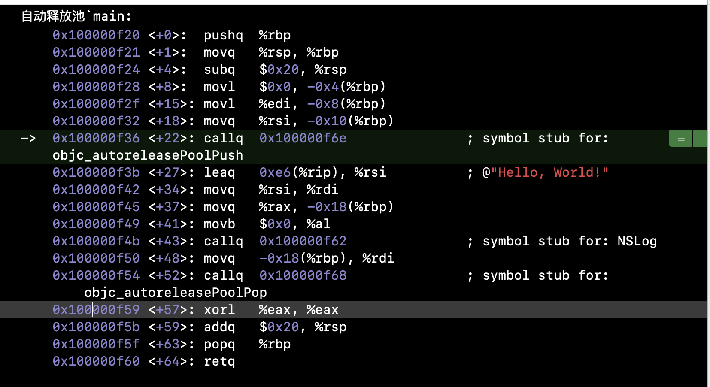
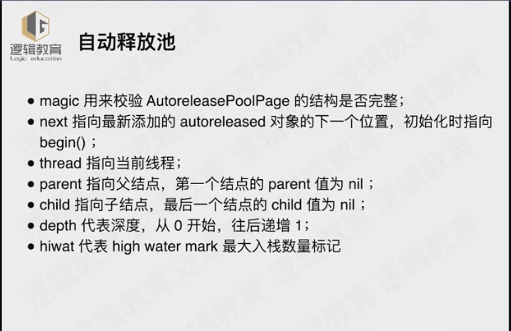

## autoreleasepool是什么？

`xcrun -sdk iphonesimulator clang -arch x86_64 -rewrite-objc main.m`输出`.cpp`文件


```objc
struct __AtAutoreleasePool {
  __AtAutoreleasePool() {atautoreleasepoolobj = objc_autoreleasePoolPush();}
  ~__AtAutoreleasePool() {objc_autoreleasePoolPop(atautoreleasepoolobj);}
  void * atautoreleasepoolobj;
};

```


1. clang之后:  `__AtAutoreleasePool __autoreleasepool; ` 

   `{ }`   形成一个局部作用域空间

   

   压栈：atautoreleasepoolobj = objc_autoreleasePoolPush();

   出栈：objc_autoreleasePoolPop(atautoreleasepoolobj);

   

2. 汇编：

   

3. objc_autoreleasePoolPush：底层 具体实现

   

   

4. 自动释放池和线程的关系

5. 自动释放池和runloop

6. 3个作用

7. ARC & MRC 

8. 
