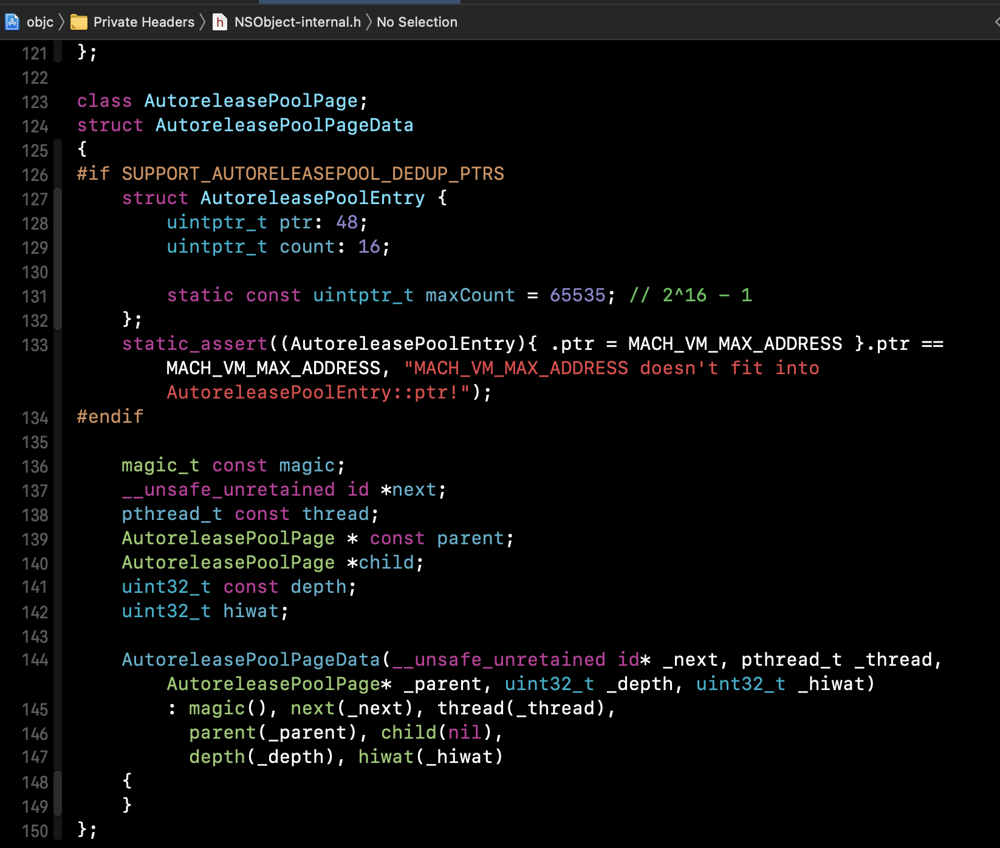
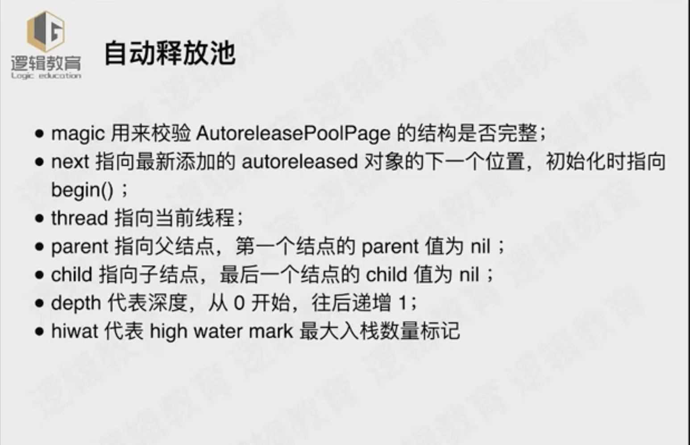
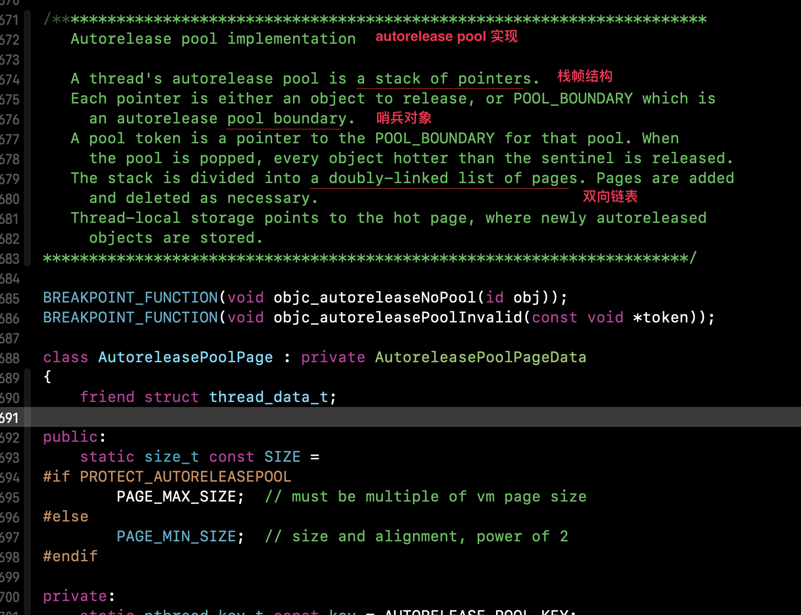
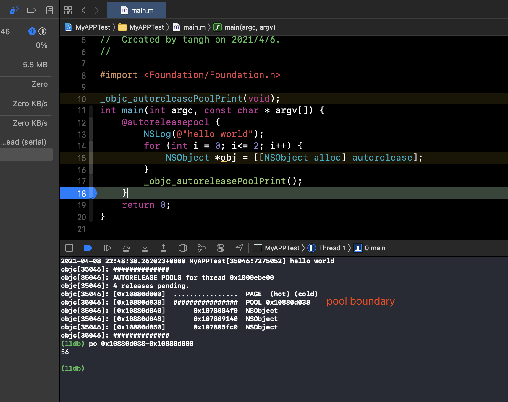
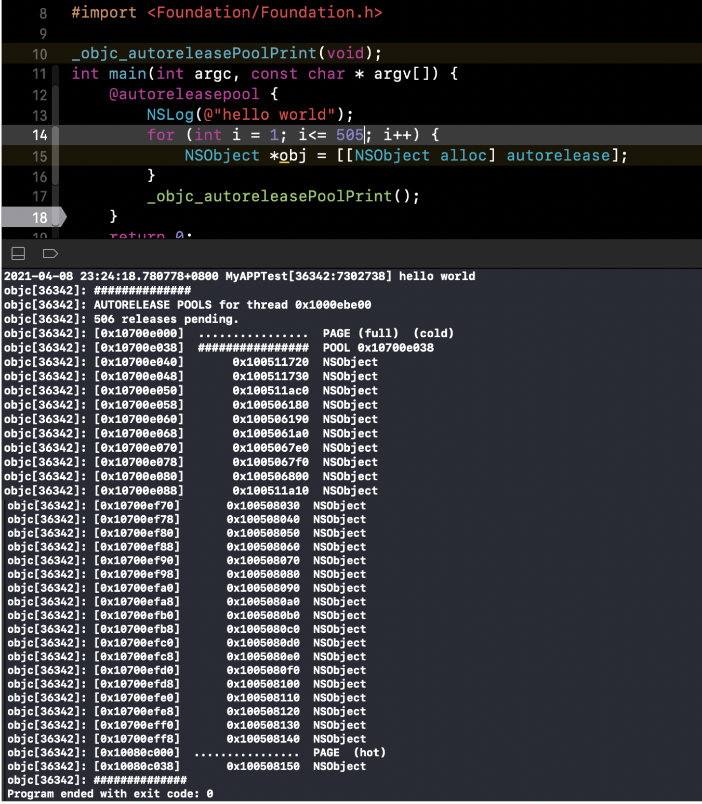

  ### autoreleasepool的本质：

`xcrun -sdk iphonesimulator clang -S -rewrite-objc -fobjc-arc -fobjc-runtime=ios-14.4 main.m`经过clang命令编译成.cpp文件：


1. ` @autoreleasepool` 被编译成：一个局部作用域+一个__AtAutoreleasePool实例变量；

   ```cpp
   struct __AtAutoreleasePool {
     __AtAutoreleasePool() {atautoreleasepoolobj = objc_autoreleasePoolPush();}
     ~__AtAutoreleasePool() {objc_autoreleasePoolPop(atautoreleasepoolobj);}
     void * atautoreleasepoolobj;
   };
   
   ```

   ```c++
   //伪代码：
     __AtAutoreleasePool() {atautoreleasepoolobj = objc_autoreleasePoolPush();}
     ~__AtAutoreleasePool() {objc_autoreleasePoolPop(atautoreleasepoolobj);}
   
   {
     objc_autoreleasePoolPush();
     .
     .
     .
     objc_autoreleasePoolPop() ;
   }
   ```





2. 局部作用域内的变量自动加到__AtAutoreleasePool 实例对象的__AutoreleasePoolPage中

   

3. 一个AutoreleasePoolPage大小：4K

   组成：（56+8+504*8 = 4096）

   * page基本信息： 56字节
   * POOL_BOUNDARY 哨兵对象： 8字节
   * 504个object对象： 504*8字节






4. 思考：

   * 自动释放池和线程的关系

     > Each thread (including the main thread) maintains its own stack of NSAutoreleasePool objects (see Threads). As new pools are created, they get added to the top of the stack. When pools are deallocated, they are removed from the stack. Autoreleased objects are placed into the top autorelease pool for the current thread. When a thread terminates, it automatically drains all of the autorelease pools associated with itself.

     如上所述， 包括主线程在内的所有线程都维护有它自己的自动释放池的堆栈结构。

     新的自动释放池被创建的时候，它们会被添加到栈的顶部，而当池子销毁的时候，会从栈移除。

     对于当前线程来说，Autoreleased对象会被放到栈顶的自动释放池中。

     当一个线程线程停止，它会自动释放掉与其关联的所有自动释放池。

   * 自动释放池和runloop的关系

     主线程的`NSRunLoop`在监测到事件响应开启每一次`event loop`之前，会自动创建一个`autorelease pool`，并且会在`event loop`结束的时候执行`drain`操作，释放其中的对象。

   * 3个作用

   * ARC & MRC

5. 基础业务 --> 极致的性能 创新 稳定 安全

