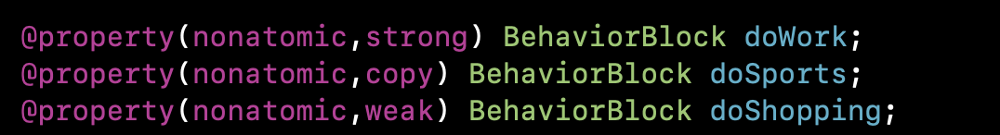
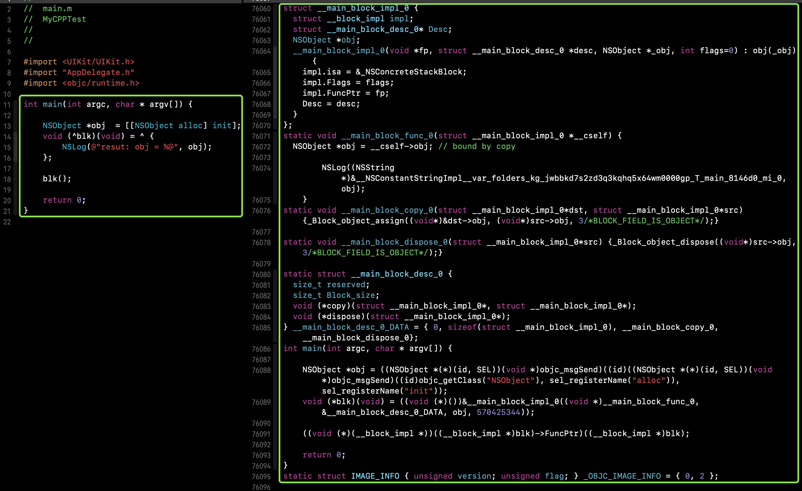
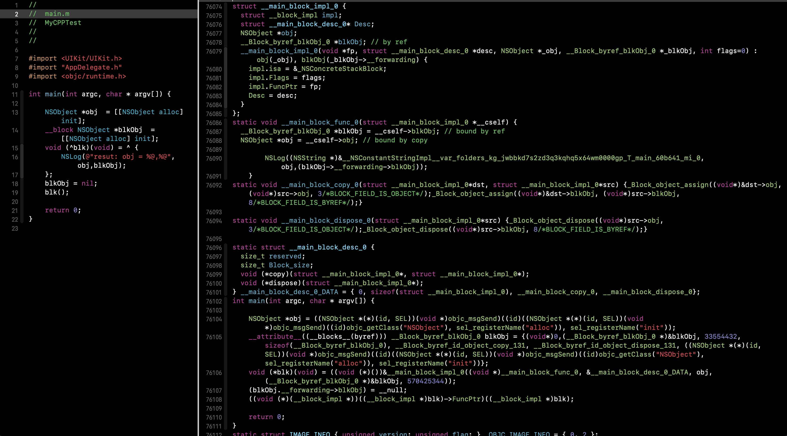
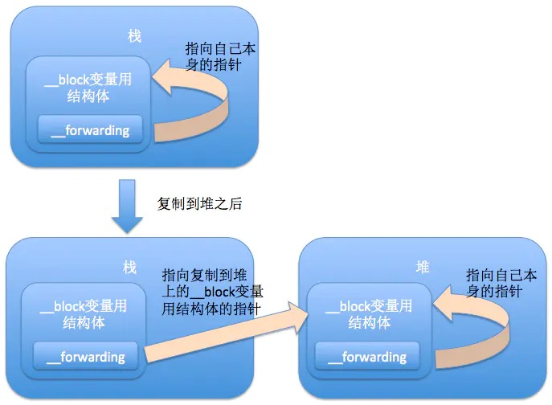
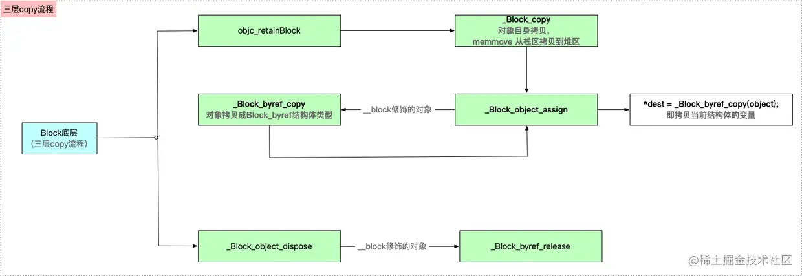

# Block的三种类型

### 三种类型特点：

(堆栈是在运行时分配空间，全局是在编译期就能确定)

* 全局block
  * 位于全局区
  * 在block内部不使用外部变量 or **只使用**全局变量或者静态变量
* 堆区block
  * 位于堆区
  * 前提：在block内部可以使用外部变量或OC属性，并且将block赋值给strong或copy修饰的变量
* 栈区block
  * 位于栈区
  * 前提：在block内部可以使用外部变量或OC属性，并且不对block赋值或者只能赋值给weak修饰的变量

举例说明：




#2. block原理探索

## 2.1 block的本质

先将OC代码转换为 C++ 代码：

`clang -rewrite-objc -fobjc-arc -fobjc-runtime=macosx-11.3 文件名`

```objective-c
int main(int argc, char * argv[]) {
    NSObject *obj  = [[NSObject alloc] init];
    void (^blk)(void) = ^ {
        NSLog(@"resut: obj = %@", obj);
    };
    blk();
    return 0;
}
```

block代码经过编译生成的c++源码:

```cpp
// block结构体定义
struct __block_impl {
  void *isa;
  int Flags;
  int Reserved;
  void *FuncPtr;
};
```



>  **_Block_object_assign 方法分析**
>
> *_Block_object_assign* 方法支持的外部变量主要有以下几种（也代表**Block** 可捕获的外界变量的种类）：
>
> ```objective-c
> // Runtime support functions used by compiler when generating copy/dispose helpers 
> // Values for _Block_object_assign() and _Block_object_dispose() parameters 
> enum { 
>  // see function implementation for a more complete description of these fields and combinations 
> 
> //普通对象，即没有其他的引用类型 
> - BLOCK_FIELD_IS_OBJECT = 3, // id, NSObject, attribute((NSObject)), block, ... 
>  
>  // block类型作为变量 
> - BLOCK_FIELD_IS_BLOCK = 7, // a block variable 
> 
>  // 经过__block修饰的变量 
> - BLOCK_FIELD_IS_BYREF = 8, // the on stack structure holding the __block variable 
> 
>  // weak 弱引用变量 
> - BLOCK_FIELD_IS_WEAK = 16, // declared __weak, only used in byref copy helpers 
> 
>  // 返回的调用对象 - 处理block_byref内部对象内存会加的一个额外标记，配合flags一起使用 
> - BLOCK_BYREF_CALLER = 128, // called from __block (byref) copy/dispose support routines. 
> };
> 
> ```
>
> **_Block_object_assign** 内部具体实现：
>
> * 如果是普通对象(BLOCK_FIELD_IS_OBJECT)，则交给系统arc处理，并拷贝对象指针，即引用计数+1，所以外界变量不能释放
> * 如果是block类型的变量(BLOCK_FIELD_IS_BLOCK)，则通过_Block_copy操作，将block从栈区拷贝到堆区_
> * _如果是 __block 修饰的变量(BLOCK_FIELD_IS_BYREF)，调用_Block_byref_copy函数 进行内存拷贝以及常规处理

总结:

1. main函数中的`blk`被编译成了一个`__main_block_impl_0`的strut;

2. `__main_block_impl_0` 结构体包含一个`__block_impl`结构体、一个`__main_block_desc_0`结构体和一个捕获的外部变量`obj`；

   ```cpp
   struct __main_block_impl_0 {
     struct __block_impl impl;
     struct __main_block_desc_0* Desc;
     NSObject *obj;
     __main_block_impl_0(void *fp, struct __main_block_desc_0 *desc, NSObject *_obj, int flags=0) : obj(_obj) {
       impl.isa = &_NSConcreteStackBlock;
       impl.Flags = flags;
       impl.FuncPtr = fp;
       Desc = desc;
     }
   };
   ```

3. `__block_impl`结构体则包含一个isa、一个FuncPtr 和两个int类型标记；

   ```cpp
   // block结构体定义
   struct __block_impl {
     void *isa;
     int Flags;
     int Reserved;
     void *FuncPtr;
   };
   ```

###  如何查看Block类型？

（看👀--> struct 的isa) 📢：这里只是编译成cpp代码的中间类型，经过汇编，如果会copy到堆区最终将修改成mallocblock

## 2.2 block是怎样捕获外部变量的？

对于 block 外的变量引用，block 默认是将其复制到其数据结构中来实现访问的。也就是说block的自动变量截获只针对block内部使用的自动变量, 不使用则不截获, 因为截获的自动变量会存储于block的结构体内部, 会导致block体积变大。特别要注意的是默认情况下block只能访问不能修改局部变量的值。捕获变量分两种情况如下：

* 非`__block`修饰的变量：<font color='red'>直接保存变量的值，保存后不能改写</font>

* `__block`修饰的变量：<font color='red'>会生成一个 __Block_byref 结构体保存变量的值，block 结构体内部同时也会保存这个 __Block_byref 结构体，后续针对这个变量值的读取与修改，都会通过 __Block_byref 这个结构体。</font>

  ```c++
  struct __Block_byref_blkObj_0 {
    void *__isa;
  __Block_byref_blkObj_0 *__forwarding; //核心： copy前放在栈区，’__forwarding‘指向的是自己；copy后，栈区变量的’__forwarding‘指向堆区变量，堆区变量的’__forwarding‘指向自己；
   int __flags;
   int __size;
   void (*__Block_byref_id_object_copy)(void*, void*);
   void (*__Block_byref_id_object_dispose)(void*);
   NSObject *blkObj;
  };
  ```



### 2.2.1 捕获非`__block`修饰的变量

#### 从内存管理语义角度考察

原则：遇强捕强遇弱捕弱

#### 从输出捕获变量值考察

* 捕获外部变量(传递的是值)

* 捕获静态变量(传递的是静态变量的指针)

* 捕获全局变量（没有传递，直接访问的全局区）

* 捕获外部OC对象（传的是对象的值）

  原因：**为了保证block内部能够正常访问外部的变量，block有个变量捕获机制；auto变量age的block访问方式是值传递，static变量num的block访问方式是指针传递，block不需要对全局变量捕获，都是直接采用取全局变量的值**。

  

  | 捕获变量类型   | 变量存放区域                                                 | block内修改此值，外部变量值是否一致                          |
  | -------------- | ------------------------------------------------------------ | ------------------------------------------------------------ |
  | 局部(普通)变量 | block赋值前，变量放在栈区，<br />block赋值后，在blockcopy到堆区的同时，重新构建一个变量到堆区,block内访问的是堆区变量，**block外访问的是栈区变量** | **否** / (block内、外是两个变量,捕获是做了一次深copy）<br/>*交给系统arc处理，并拷贝对象指针，即引用计数+1，所以外界变量不能释放* |
  | 局部静态变量   | 静态区                                                       | **是** /  (因为捕获是将局部静态变量的指针的指针捕获)         |
  | `__block`变量  | block赋值前，变量放在栈区，<br />block赋值后，在blockcopy到堆区的同时，重新构建一个结构体变量到堆区,block内访问的是结构体变量，**block外访问的是栈区变量**，**只不过编译后通过变量的forwarding指针最终访问的都是堆区变量** | **是** /  (因为捕获是将局部变量构建成一个block_bref结构体[对象]，与'指针的指针'相似，外部变量的访问是通过结构体的forwarding最终是访问的堆区的变量) |
  | 全局变量       | 全局区                                                       | **是** /  (因为并没有捕获，而是直接操作全局区)               |
  | 全局静态变量   | 全局区                                                       | **是** /  (因为并没有捕获，而是直接操作全局区)               |
  
  

### 2.2.2 捕获`__block`修饰的变量

对于用 `__block` 修饰的外部变量引用，block 是复制其引用地址来实现访问的。block可以修改__block 修饰的外部变量的值。

通过编译源码解析成的c代码，会发现加上`__block`修饰符的局部变量，竟然跟block一样变成了一个`__Block_byref_bmuArray_0`结构体类型变量实例！！！！

此时我们在block内部访问val变量则需要通过一个叫__forwarding的成员变量来间接访问val变量。

#### `__block变量`与__forwarding



通过__forwarding, 无论是在block中还是 block外访问__block变量, 也不管该变量在栈上或堆上, 都能顺利地访问同一个__block变量。

### 2.2.3 block的三层copy总结



block的三层拷贝是指以下三层：

- 【第一层】通过`_Block_copy`实现对象的`自身拷贝`,从栈区拷贝至堆区
- 【第二层】通过`_Block_byref_copy`方法，将对象拷贝为`Block_byref`结构体类型
- 【第三层】调用`_Block_object_assign`方法，对`__block`修饰的`当前变量的拷贝`

> 注：只有`__block修饰`的对象，block的copy才有三层


### 总结：

### 1. __block 的实现原理（或 __block的作用？）

结合`__block`的三层copy 自由发挥

### 2. block捕获变量的内存管理

* 栈区block：

  当block在栈上的时候，对(`对象类型的auto变量`和`__block变量`)都不会产生强引用，永远都是弱引用，

* 堆区block:  

  1、如果block被拷贝到堆上

  a) 会调用block内部的copy函数

  b) copy函数内部会调用_Block_object_assign函数

  c) _Block_object_assign函数会根据auto变量的修饰符__strong、__weak、__unsafe_unretained做出相应的操作，形成强引用或者弱引用

  2、如果block从堆上移除

  a) 会调用block内部的dispose函数

  b) dispose函数内部会调用_Block_object_dispose函数

  c) _Block_object_dispose函数会自动释放引用的auto变量(release，引用计数-1，若为0，则销毁)

  

  >  当block内部访问了对象类型的auto变量时:
  >
  > 如果block在栈空间，不论是ARC还是MRC环境，不管外部变量是强引用还是弱引用，block都会弱引用访问对象;
  >
  > 如果block在堆空间，如果外部强引用，block内部也是强引用；如果外部弱引用，block内部也是弱引用;

* 全局block: (在block内部不使用外部变量 or **只使用**全局变量或者静态变量)


# 3. block内循环引用解决方案

*  方案一：借助weak

  ```objective-c
  - (void)testBlockLifeCircle_weak {
    __weak typeof(self) weakSelf = self;
  
    self.yl_VBlock = ^{
      NSLog(@"demoName = %@",[weakSelf demoName]);
    };
    self.yl_VBlock();
  }	
  ```

  

* 方案二：借助__block

  ```objective-c
  - (void)testBlockLifeCircle_block {
  
    __block YLBlockRetainCycleViewController *tmpVC = self;
    self.yl_VBlock = ^{
      NSLog(@"demoName = %@",[tmpVC demoName]);
      tmpVC = nil; // 📢：1.必须将变量置为nil
    };
    self.yl_VBlock(); // 📢：2.必须调用block(如果不调不会，解决循环引用)
  }
  ```

  

*  方案三：借助参数

  ```objective-c
  - (void)testBlockLifeCircle_Parameter {
    self.yl_PBlock = ^(YLBlockRetainCycleViewController *vc) {
      NSLog(@"demoName = %@",[vc demoName]);
    };
    self.yl_PBlock(self);
  }
  
  ```

  

*  方案四：使用NSProxy（其实是借助参数传递中间者+中间者弱持有self就可以解决，完全可以不用消息转发）（使用Proxy的原理是：1.添加了一个中间者Proxy；2.Proxy持有一个弱引用对象，也就是响应方法的目标对象；3. 借助消息转发机制将消息传递给目标对象）

  ```objective-c
  - (void)testBlockLifeCircle_Rroxy {
    YLProxy *proxy = [YLProxy proxyWithTarget:self];
    self.yl_PoxBlock = ^(YLProxy *pox) {
      NSLog(@"demoName = %@",[pox.target demoName]);
    };
    self.yl_PoxBlock(proxy);
  }
  ```

  