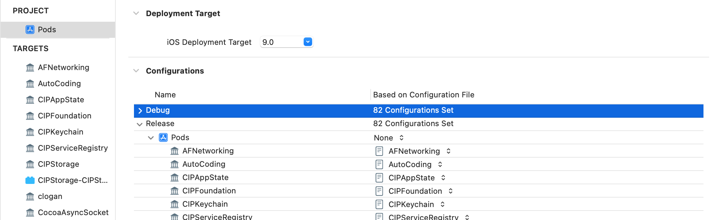

# 1.编译原理

## 1.1 宏观看：程序编译打包流程

以（包含Swift文件与Pods库）的项目为例：

包含Swift文件与Pods库项目的编译可以分成三个大的过程：<font color='red'>编译每个 pod 、编译整个 **Pod** 工程和编译主工程。</font>

- **第一个过程：Xcodeproj 工具会为每个 pod 单独创建一个 target ，具体编译过程如下：**

  > 1. 1. 处理 **info.plist** 文件
  >    2. **clang** 编译所有 **.m/.c/.mm** 源文件为 **.o** 目标文件
  >    3. **Lb** 命令将 **.o** 文件链接成为一个 **Framework**
  >    4. 拷贝所有 **.h** 头文件与 **.bundle** 资源文件到 **Xyz.framework/Headers** 目录
  >    5. **codesign** 对 **Framework** 进行代码签名

- **第二个过程：比较简单，主要就是生成了一个 Pod 工程的静态库**。

- **第三个过程：编译主工程的过程，步骤较多：

  > 1. 1. 写入一些辅助脚本文件到临时文件夹
  >    2. 创建 **app** 目录
  >    3. 检查 **Entitlements** 文件
  >    4. 运行 **CocoaPods** 自定义脚本检查 **Manifest.lock**
  >    5. 编译所有 **swift** 文件，然后 **merge** 成一个 **swiftmodule**
  >    6. 拷贝 **Xyz-Swift.h** 头文件
  >    7. 编译 **.xcdatamodeld** 数据模型文件
  >    8. 编译 **.m/.c/.mm** 源文件
  >    9. 拷贝 **.swiftmodule** 文件
  >    10. 拷贝 **.swiftdoc** 文件
  >    11. 链接 **.o** 目标文件
  >    12. 用 **ibtool** 编译 **xib/storyboard UI**文件
  >    13. 用 **actool** 编译 **AssetCatalog** 资源文件
  >    14. 处理 **info.plist** 文件
  >    15. 链接 **xibc/storyboardc** 文件
  >    16. 运行 **CocoaPods** 自定义脚本嵌入生成的 **Pod framework**
  >    17. 运行 **CocoaPods** 自定义脚本拷贝 **Pod** 里的资源
  >    18. 拷贝 **Swift** 标准库到 **App** 中（包体积增大约**18M**）（**iOS12** 以上应该已经内置标准库，不需要再拷贝了）
  >    19. **touch** 生成 **.app** 文件
  >    20. 对 **App** 进行代码签名

总结：

> 1. 编译信息写入辅助文件，创建文件架构 .app 文件
> 2. 处理文件打包信息
> 3. 执行 CocoaPod 编译前脚本，checkPods Manifest.lock
> 4. 编译.m文件，使用 CompileC 和 clang 命令
> 5. *链接需要的 Framework*
> 6. 编译 xib
> 7. 拷贝 xib ，资源文件
> 8. 编译 ImageAssets
> 9. 处理 info.plist
> 10. 执行 CocoaPod 脚本
> 11. 拷贝标准库
> 12. 创建 .app 文件和签名
>
> 不理解的地方可参考：[App程序编译的完整流程](https://acefish.github.io/15538518127841.html)

## 1.2 微观看：单一文件的编译过程

**clang编译过程**

常用的clang命令：

- clang -rewrite-objc main.m 将obj文件重写为 c， c++文件
- clang -Xclang -ast-dump -fsyntax-only main.m 语法分析：生成抽象语法树
- clang -Xclang -dump-tokens main.m 词法分析：这里会把代码切成一个个 Token，比如大小括号，等于号还有字符串等


### 1.2.1 预处理

主要完成以下操作：

> 1. import相关头文件
> 1. 完成宏替换
> 1. 处理以"#"开头的预处理命令
> 1. 删除注释

### 1.2.2 词法分析

主要是完成： 将预处理过的代码里切成一个个 Token，比如大小括号，等于号还有字符串等

### 1.2.3 语法分析

> 1. 在 Clang 中由 Parser 和 Sema 两个模块配合完成
> 2. 验证语法是否正确（比如语句末尾缺少分号）
> 3. 根据当前语言的语法，生成语义节点，并将所有节点组合成抽象语法树（AST）

### 1.2.4 静态分析

> 1. 通过语法树进行代码静态分析，找出非语法性错误
> 2. 模拟代码执行路径，分析出control-flow graph（CFG）

### 1.2.5 code-gen(中间代码生成)

> - CodeGen 负责将语法树从顶至下遍历，翻译成 LLVM IR。LLVM IR 是 Frontend 的输出，也是 LLVM Backend 的输入，前后端的桥接语言
>
> - 与 Objective-C Runtime 桥接：
>
>   > 主要内容包括：
>   >
>   > 1. Class / Meta Class / Protocol / Category 内存结构生成，并存放在指定 section 中（如 Class：_DATA，_objc_classrefs）
>   > 2. Method / Ivar / Property 内存结构的生成
>   > 3. 组成 method_list / ivar_list /property_list 并填入Class
>   > 4. 将语法树中的 ObjCMessageExpr 翻译成相应版本的 objc_msgSend，对 super 关键字的调用翻译成 objc_msgSendSuper
>   > 5. 根据修饰符 strong / weak / copy / atomic 合成 @property 自动实现的 setter / getter
>   > 6. ARC：分析对象引用关系，将 objc_storeStrong / objc_storeWeak 等 ARC 代码插入
>   > 7. 将 ObjCAutoreleasePoolStmt 转译成 objc_autoreleasePoolPush/Pop
>   > 8. 实现自动调用 [super dealloc]
>   > 9. 为每个拥有 ivar 的Class 合成 .cxx_destructor 方法来自动释放类的成员变量，代替 MRC 的 "self.xxx = nil"
>   > 10. Non-Fragile ABI：为每个 Ivar 合成 OBJC_IVAR_$_ 偏移值常量
>   > 11. 存取 Ivar 的语句 (_ivar = 123; int a = _ivar;) 转写成 base + OBJC_IVAR_$_ 的形式
>   > 12. 处理 @synthesize
>   > 13. ⽣成 block_layout 的数据结构
>   > 14. 变量的 capture (__block / __weak)
>   > 15. ⽣成 _block_invoke 函数

## 1.3 **Xcode Build** **配置**（待补）

# 2. 版本管理

引自： [版本管理工具及 Ruby 工具链环境](https://mp.weixin.qq.com/s?__biz=MzA5MTM1NTc2Ng==&mid=2458322728&idx=1&sn=3a16de4b2adae7c57bbfce45858dfe06&chksm=870e0831b0798127994902655fdee3be7d6abd53734428dd8252b8f584343aad217e77a70920&scene=178&cur_album_id=1477103239887142918#rd)

### 前言

软件工程中，版本控制系统是敏捷开发的重要一环，为后续的持续集成提供了保障。`Source Code Manager` (SCM) 源码管理就属于 VCS 的范围之中，熟知的工具有如 `Git` 。而 `CocoaPods` 这种针对各种语言所提供的 `Package Manger (PM)`也可以看作是 SCM 的一种。

而像 `Git` 或 `SVN` 是针对项目的单个文件的进行版本控制，而 PM 则是以每个独立的 Package 作为最小的管理单元。包管理工具都是结合 `SCM` 来完成管理工作，对于被 PM 接管的依赖库的文件，通常会在 `Git` 的 `.ignore` 文件中选择忽略它们。

例如：在 `Node` 项目中一般会把 `node_modules` 目录下的文件 ignore 掉，在 iOS / macOS 项目则是 `Pods`。

## 2.1 Git

`Git` 在提交更新时，会对所有文件制作一个快照并将其存在数据库中。Git 管理的文件存在 3 种状态：

> - **working director：** 工作目录，即我们肉眼可见的文件
> - **stage area：** 暂存区 (或称 `index area` )，存在 `.git/index` 目录下，保存的是执行 `git add` 相关命令后从工作目录添加的文件。
> - **commit history：** 提交历史，存在 `.git/` 目录下，到这个状态的文件改动算是入库成功，基本不会丢失了。


## 2.2  PM

作为 Git Submodule 的强化版，PM 基本都具备了语义化的版本检查能力，依赖递归查找，依赖冲突解决，以及针对具体依赖的构建能力和二进制包等。

常见包管理工具，简单对比如下：

| **Key File** | **Git submodule** | **CocoaPods** | **SPM**          | **npm**           |
| :----------- | :---------------- | :------------ | :--------------- | :---------------- |
| **描述文件** | .gitmodules       | Podfile       | Package.swift    | Package.json      |
| **锁存文件** | .git/modules      | Podfile.lock  | Package.resolved | package-lock.json |

PM 工具基本围绕这个两个文件来现实包管理：

> - **描述文件**：声明了项目中存在哪些依赖，版本限制；
> - **锁存文件（Lock 文件）**：记录了依赖包最后一次更新时的全版本列表。

除了这两个文件之外，中心化的 PM 一般会提供依赖包的托管服务，比如 npm 提供的 **npmjs.com**[3] 可以集中查找和下载 npm 包。如果是去中心化的 PM 比如 `iOS` 的 `Carthage` 和 `SPM` 就只能通过 Git 仓库的地址了。


###  `PM` 是如何进行依赖库的版本管理？

> PM 工具基本围绕这个两个文件来现实包管理：
>
> - **描述文件**：声明了项目中存在哪些依赖，版本限制；
> - **锁存文件（Lock 文件）**：记录了依赖包最后一次更新时的全版本列表。
>
> PM 基本都具备了语义化的版本检查能力，依赖递归查找，依赖冲突解决，以及针对具体依赖的构建能力和二进制包等。
>
> 以cocoapods为例：
>
> > **`CocoaPods` 是开发 iOS/macOS 应用程序的一个第三方库的依赖管理工具。** 利用 `CocoaPods`，可以定义自己的依赖关系（简称 `Pods`），以及在整个开发环境中对第三方库的版本管理非常方便。
> >
> > 
> >
> > ### `Podfile` :描述依赖关系
> >
> > `Podfile` 是一个文件，以 DSL（其实直接用了 Ruby 的语法）来描述依赖关系，用于定义项目所需要使用的第三方库。该文件支持高度定制，你可以根据个人喜好对其做出定制。更多相关信息，请查阅 **Podfile 指南**[4]。
> >
> > ### `Podfile.lock` ： 锁存依赖关系（建议加入Git管理）
> >
> > 这是 `CocoaPods` 创建的最重要的文件之一。它记录了需要被安装的 Pod 的每个已安装的版本。如果你想知道已安装的 `Pod` 是哪个版本，可以查看这个文件。推荐将 `Podfile.lock` 文件加入到版本控制中，这有助于整个团队的一致性。
> >
> > ### `Manifest.lock` ： 位于本地沙盒，是上次podfile.lock 的副本，用于验证是否有pod的更新
> >
> > 这是每次运行 `pod install` 命令时创建的 `Podfile.lock` 文件的副本。如果你遇见过这样的错误 **沙盒文件与 `Podfile.lock` 文件不同步 (The sandbox is not in sync with the `Podfile.lock`)**，这是因为 `Manifest.lock` 文件和 `Podfile.lock` 文件不一致所引起。由于 `Pods` 所在的目录并不总在版本控制之下，这样可以保证开发者运行 App 之前都能更新他们的 `Pods`，否则 App 可能会 crash，或者在一些不太明显的地方编译失败。
> >
> > ### Master Specs Repo
> >
> > 

### `Ruby` 和 `RVM/rbenv` 之间的关系是什么？

> **都是管理多个 Ruby 环境的工具，它们都能提供不同版本的 Ruby 环境管理和切换。**

### `Gem`、`Bundler` 和 `CocaPods` 之间的关系是什么？

> 待补充

### 如何通过 `Bundler` 来管理工程中的 `Gem` 环境？

>  Bundler 通过读取项目中的依赖描述文件 `Gemfile` ，来确定各个 Gems 的版本号或者范围，来提供了稳定的应用环境。当我们使用 `bundle install` 它会生成 `Gemfile.lock` 将当前 librarys 使用的具体版本号写入其中。之后，他人再通过 `bundle install` 来安装 libaray 时则会读取 `Gemfile.lock` 中的 librarys、版本信息等。

### 如何锁死工程内部的 `CocoaPods` 版本？

> 1. 在 iOS 工程中初始化 `Bundler` 环境
>
> 2. 在 `Gemfile` 中声明使用的 `CocoaPods` 版本并安装
>
>    编辑一下这个 `Gemfile` 文件，指定使用 `CocoaPods 1.5.3` 这个版本，则使用 `Gemfile` 的 DSL 编写以下内容：
>
>    ```ruby
>    # frozen_string_literal: true
>    
>    source "https://rubygems.org"
>    
>    git_source(:github) {|repo_name| "https://github.com/#{repo_name}" }
>    
>    # gem "rails"
>    gem "cocoapods", "1.5.3"
>    ```
>
>    
>
> 3. 使用当前环境下的 `CocoaPods` 版本操作 iOS 工程
>
>    使用 `bundle exec pod install` 来执行 Install 这个操作，就可以使用gemfile文件中指定的cocoapods版本了。

# 3. CocoaPods 

## 3.1 CocoaPods核心组件

简单概述 CocoaPods 的核心模块？

>  如图：
>
> 

## 3.2 pod install流程

#### `pod` 命令是如何找到并启动 CocoaPods 程序的？

> 一句话概括：通过执行`/bin`目录下的pod脚本，唤起CocoaPods的。
>
> > 每当我们输入 `pod xxx` 命令时，系统会首先调用 `pod` 命令。
> >
> > 所有的命令都是在 `/bin` 目录下存放的脚本，当然 Ruby 环境的也不例外。我们可以通过 `which pod` 来查看命令所在位置：
> >
> > ```ruby
> > $ which pod
> > /Users/xxxx/.rvm/gems/ruby-2.6.1/bin/pod
> > ```
> >
> > > 这里的显示路径不是 `/usr/local/bin/pod` 的原因是因为使用 *RVM* 进行版本控制的。
> >
> > 脚本内容：
> >
> > ```ruby
> > #!/usr/bin/env ruby_executable_hooks
> > 
> > require 'rubygems'
> > version = ">= 0.a"
> > 
> > str = ARGV.first
> > if str
> >   str = str.b[/\A_(.*)_\z/, 1]
> >   if str and Gem::Version.correct?(str)
> >     version = str
> >     ARGV.shift
> >   end
> > end
> > 
> > if Gem.respond_to?(:activate_bin_path)
> >     load Gem.activate_bin_path('cocoapods', 'pod', version)
> > else
> >     gem "cocoapods", version
> >     load Gem.bin_path("cocoapods", "pod", version)
> > end
> > ```
> >
> > 程序 CocoaPods 是作为 Gem 被安装的，此脚本用于唤起 CocoaPods。逻辑比较简单，就是一个单纯的命令转发。`Gem.activate_bin_path` 和 `Gem.bin_path` 用于找到 CocoaPods 的安装目录 `cocoapods/bin`，最终加载该目录下的 `/pod` 文件;

#### 简述 pod install 流程？

> 
>
> * 环境准备（`prepare`） ： 在 `prepare` 阶段会将 `pod install` 的环境准备完成，包括**版本一致性**、**目录结构**以及将 *pre-install* 的装载插件脚本全部取出，并执行对应的 `pre_install` hook。
>
> * 解决依赖冲突(`resolve_dependencies`) :  依赖解析过程就是通过 `Podfile`、`Podfile.lock` 以及沙盒中的 `manifest` 生成 *Analyzer* 对象。*Analyzer* 内部会使用 *Molinillo* （具体的是 `Molinillo::DependencyGraph` 图算法）解析得到一张依赖关系表。
>
>   > PS：通过 *Analyzer* 能获取到很多依赖信息，例如 *Podfile* 文件的依赖分析结果，也可以从 specs_by_target 来查看各个 *target* 相关的 specs。
>
>   另外，需要注意的是 analyze 的过程中有一个 *pre_download* 的阶段，即在 *--verbose* 下看到的 **Fetching external sources** 过程。这个 *pre_download* 阶段**不属于依赖下载**过程，而是在当前的**依赖分析**阶段。
>
>   > PS：该过程主要是解决当我们在通过 Git 地址引入的 Pod 仓库的情况下，系统无法从默认的 Source 拿到对应的 Spec，需要直接访问我们的 Git 地址下载仓库的 zip 包，并取出对应的 `podspec` 文件，从而进行对比分析。
>
> *  下载依赖文件（`download_dependencies`）: 在 `create_file_accessors` 中会创建沙盒目录的文件访问器，通过构造 `FileAccessor` 实例来解析沙盒中的各种文件。接着是最重要的 `install_pod_sources` 过程，它会调用对应 Pod 的 `install!` 方法进行资源下载。
>
>   下面再来看看 `pod_installer` 中的 `install!` 方法，主要是通过调用 `cocoapods-downloader` 组件，将 Pod 对应的 Source 下载到本地。实现如下：
>
>   ```ruby
>   def install!
>       download_source unless predownloaded? || local?
>       PodSourcePreparer.new(root_spec, root).prepare! if local?
>       sandbox.remove_local_podspec(name) unless predownloaded? || local? || external?
>   end
>   ```
>
> * 验证 targets（`validate_targets` ）： 用来验证之前流程中的产物 (pod 所生成的 Targets) 的合法性。主要作用就是构造 `TargetValidator`，并执行 `validate!` 方法：
>
>   ```ruby
>   def validate_targets
>       validator = Xcode::TargetValidator.new(aggregate_targets, pod_targets, installation_options)
>       validator.validate!
>   end
>   
>   def validate!
>       verify_no_duplicate_framework_and_library_names
>       verify_no_static_framework_transitive_dependencies
>       verify_swift_pods_swift_version
>       verify_swift_pods_have_module_dependencies
>       verify_no_multiple_project_names if installation_options.generate_multiple_pod_projects?
>   end
>   
>   ```
>
>   验证环节在整个 Install 过程中仅占很小的一部分。因为只是验证部分，是完全解耦的。
>
> * 生成工程 (`Integrate`)：工程文件的生成是 `pod install` 的最后一步，他会将之前版本仲裁后的所有组件通过 Project 文件的形式组织起来，并且会对 Project 中做一些用户指定的配置。在 `install` 过程中，除去依赖仲裁部分和下载部分的时间消耗，在工程文件生成也会有相对较大的时间开销。这里往往也是**速度优化核心位置**。
>
> * 写入依赖 (`write_lockfiles`): 将依赖更新写入 `Podfile.lock` 和 `Manifest.lock`.
>
> * 结束回调（`perform_post_install_action`）: 最后一步收尾工作，为所有插件提供 post-installation 操作以及 hook。
>
> 核心组件在 `pod install` 各阶段的作用如下：
>
> 


#### `resolve_dependencies` 阶段中的 `pre_download` 是为了解决什么问题？

> 该过程主要是解决当我们在通过 Git 地址引入的 Pod 仓库的情况下，系统无法从默认的 Source 拿到对应的 Spec，需要直接访问我们的 Git 地址下载仓库的 zip 包，并取出对应的 `podspec` 文件，从而进行对比分析。

#### `validate_targets` 都做了哪些校验工作？

> 1. **verify_no_duplicate_framework_and_library_names**
>
>    > 验证是否有重名的 `framework`，如果有冲突会直接抛出 `frameworks with conflicting names` 异常。
>
> 2. **verify_no_static_framework_transitive_dependencies**
>
>    > 验证动态库中是否有静态链接库 (`.a` 或者 `.framework`) 依赖，如果存在则会触发 `transitive dependencies that include static binaries...` 错误。假设存在以下场景：
>    >
>    > 1. 1. 组件 A 和组件 B 同时依赖了组件 C，C 为静态库，如 `Weibo_SDK `;
>    >
>    >    2. 组件 A 依赖组件 B，而组件 B 的 `.podspec` 文件中存在以下设置时，组件 B 将被判定为存在静态库依赖：
>    >
>    >    3. 1. podspec 设置了 `s.static_framework = true`
>    >
>    >       2. podspec 以 `s.dependency 'xxx_SDK` 依赖了静态库 `xxx_SDK`
>    >
>    >       3. podspec 以 `s.vendored_libraries = 'libxxx.a'` 方式内嵌了静态库 `libxxx`
>    >
>    >          
>    >
>    > 2. - **此时如果项目的 Podfile 设置了 use_framework! 以动态链接方式打包的时，则会触发该错误。**
>    >
>    >      **问题原因**
>    >
>    >      Podfile 中不使用 `use_frameworks!` 时，每个 pod 是会生成相应的 .a（静态链接库）文件，然后通过 Static Libraries 来管理 pod 代码，在 Linked 时会包含该 pod 引用的其他的 pod 的 .a 文件。
>    >
>    >      Podfile 中使用 `use_frameworks!` 时是会生成相应的 .framework 文件，然后通过 Dynamic Frameworks 的方式来管理 pod 代码，在 Linked 时会包含该 pod 引用的其他的 pod 的 `.framework` 文件。
>    >
>    >      上述场景中虽然以 framework 的方式引用了 B 组件，然而 B 组件实际上是一个静态库，需要拷贝并链接到该 pod 中，然而 Dynamic Frameworks 方式并不会这么做，所以就报错了。
>    >
>    >      **解决方案**
>    >
>    > 3. 1. 1. 修改 pod 库中 `podspec`，增加 `pod_target_xcconfig`，定义好 `FRAMEWORK_SEARCH_PATHS` 和 `OTHER_LDFLAGS` 两个环境变量；
>    >
>    >    2. 2. hook `verify_no_static_framework_transitive_dependencies` 的方法，将其干掉！**对应 issue**[11]
>    >
>    >    3. 3. 修改 pod 库中 `podspec`，开启 static_framework 配置 `s.static_framework = true`
>
> > 1. 1. 
>
> 3. **verify_swift_pods_swift_version**:
>
>    > 确保 Swift Pod 的 Swift 版本正确配置且互相兼容的。
>
> 4. **verify_swift_pods_have_module_dependencies**
>
>    > 检测 Swift 库的依赖库是否支持了 module，这里的 module 主要是针对 Objective-C 库而言。首先，Swift 是天然支持 module 系统来管理代码的，Swift Module 是构建在 **LLVM Module**[12] 之上的模块系统。Swift 库在解析后会生成对应的 `modulemap` 和 `umbrella.h` 文件，这是 LLVM Module 的标配，同样 Objective-C 也是支持 LLVM Module。**当我们以 Dynamic Framework 的方式引入 Objective-C 库时，Xcode 支持配置并生成 header，而静态库 .a 需要自己编写对应的 `umbrella.h` 和 `modulemap`**。
>    >
>    > 其次，如果你的 Swift Pod 依赖了 Objective-C 库，又希望以静态链接的方式来打包 Swift Pod 时，就需要保证 Objective-C 库启用了 `modular_headers`，这样 CocoaPods 会为我们生成对应 `modulemap` 和 `umbrella.h` 来支持 LLVM Module。你可以从这个地址 - **http://blog.cocoapods.org/CocoaPods-1.5.0/**[13] 查看到更多细节。
>
> 5. *verify_no_pods_used_with_multiple_swift_versions**
>
>    > 检测是否所有的 *Pod Target* 中版本一致性问题。
>
> 用一个流程图来概括这一验证环节：
>
> 


## 3.3 核心组件详解

CLAide：[CocoaPods 命令解析 - CLAide](https://mp.weixin.qq.com/s?__biz=MzA5MTM1NTc2Ng==&mid=2458324063&idx=1&sn=eff7c06743eac09a08fb96b874fb4ed6&chksm=870e0346b0798a50c9bea91cef28286694792b84bdf7b6488608560c9c5bd309f170756211ac&scene=178&cur_album_id=1477103239887142918#rd)

Podfile ：[Podfile 的解析逻辑](https://mp.weixin.qq.com/s?__biz=MzA5MTM1NTc2Ng==&mid=2458324199&idx=1&sn=3886bbbcef3640bf97e16fcec34b451f&chksm=870e03feb0798ae84ab4b5dab26dfbe8ebbac0bca8491493fa4919f6069bfef58cd04df5ab34&scene=178&cur_album_id=1477103239887142918#rd)

> 大多 iOS 工程师最先接触到的 CocoaPods 概念应该是 `Podfile`，而 `Podfile` 属于 `cocoapods-core`（以下简称 **Core**） 的两大概念之一。另外一个则是 **Podspec**[2] (用于描述 Pod Library 的配置文件)，只有当你需要开发 Pod 组件的时候才会接触。

CocoaPods是用 Ruby 写的，并由若干个 Ruby 包 (gems) 构成的：

- **CocoaPods/CocoaPod**

- - 这是是一个面向用户的组件，每当执行一个 pod 命令时，这个组件都将被激活。该组件包括了所有使用 CocoaPods 涉及到的功能，并且还能通过调用所有其它的 gems 来执行任务。

- **CocoaPods/Core**

- - Core 组件提供支持与 CocoaPods 相关文件的处理，文件主要是 Podfile 和 podspecs。

  - **Podfile**

  - - Podfile 是一个文件，以 DSL（其实直接用了 Ruby 的语法）来描述依赖关系，用于定义项目所需要使用的第三方库。该文件支持高度定制，你可以根据个人喜好对其做出定制。更多相关信息，请查阅[ **Podfile 指南**](http://guides.cocoapods.org/syntax/podfile.html)
    - 个人理解：主要用于 **pod** 库集成时，描述当前工程的各 **target** 依赖的 **pod** 库信息。

  - **Podspec**

  - - .podspec 也是一个文件，该文件描述了一个库是怎样被添加到工程中的。它支持的功能有：列出源文件、framework、编译选项和某个库所需要的依赖等。
    - 个人理解：主要用在开发 **pod** 库时，描述 **pod** 库的**version**、**source**、**dependency**、**resources** 等描述信息

- **CocoaPods/Xcodeproj**

- - 这个 gem 组件负责所有工程文件的整合。它能够对创建并修改 .xcodeproj 和 .xcworkspace 文件。它也可以作为单独的一个 gem 包使用。如果你想要写一个脚本来方便的修改工程文件，那么可以使用这个 gem。

# 4.

1. **读取 Podfile 文件**

2. - 在加载 podspecs 过程中，CocoaPods 就建立了包括版本信息在内的所有的第三方库的列表。Podspecs 被存储在本地路径 ~/.cocoapods 中。


1. **加载源文件**

2. - 每个 .podspec 文件都包含一个源代码的索引，这些索引一般包裹一个 git 地址和 git tag。它们以 commit SHAs 的方式存储在 ~/Library/Caches/CocoaPods 中。这个路径中文件的创建是由 Core gem 负责的。
   - **CocoaPods** 将依照 **Podfile**、**.podspec** 和缓存文件的信息将源文件下载到 **Pods** 目录中


1. **生成 Pods.xcodeproj**

2. - 每次 pod install 执行，如果检测到改动时，CocoaPods 会利用 Xcodeproj gem 组件对 Pods.xcodeproj 进行更新。如果该文件不存在，则用默认配置生成。否则，会将已有的配置项加载至内存中。


1. **安装第三方库**

2. - 由于每个第三方库有不同的 target，因此对于每个库，都会有几个文件需要添加，每个 target 都需要：

   - - 一个包含编译选项的 **.xcconfig** 文件
     - 一个同时包含编译设置和 **CocoaPods** 默认配置的私有 **.xcconfig** 文件
     - 一个编译所必须的 **prefix.pch** 文件
     - 另一个编译必须的文件 **dummy.m**


- - 当每个 pod 的 target 完成了上面的内容时，整个 Pods target 就会被创建。
  - 同时如果源码中包含有资源 **bundle**，还会将这个 bundle 添加至程序 target 的指令将被添加到 **Pods-Resources.sh** 文件中。
  - 还有一个名为 **Pods-environment.h** 的文件，文件中包含了一些宏，这些宏可以用来检查某个组件是否来自 pod。
  - 最后，将生成两个认可文件，一个是 **plist**，另一个是 **markdown**，这两个文件用于给最终用户查阅相关许可信息。


1. **读取写入至磁盘**

2. - 之前的许多工作都是在内存中进行的。为了让这些成果能被重复利用，我们需要将所有的结果保存到一个文件中。所以 Pods.xcodeproj 文件被写入磁盘，另外两个非常重要的文件：Podfile.lock 和 Manifest.lock 都将被写入磁盘。


- -  **Podfile.lock**

  - - 这是 CocoaPods 创建的最重要的文件之一。它记录了需要被安装的 pod 的每个已安装的版本。如果你想知道已安装的 pod 是哪个版本，可以查看这个文件。推荐将 Podfile.lock 文件加入到版本控制中，这有助于整个团队的一致性。


- - **Manifest.lock**

  - - 这是每次运行 **pod install** 命令时创建的 **Podfile.lock** 文件的副本。如果你遇见过这样的错误 沙盒文件与 **Podfile.lock** 文件不同步 **(The sandbox is not in sync with the Podfile.lock)**，这是因为 **Manifest.lock** 文件和 **Podfile.lock** 文件不一致所引起。由于 **Pods** 所在的目录并不总在版本控制之下，这样可以保证开发者运行 **app** 之前都能更新他们的 **pods**，否则 **app** 可能会 **crash**，或者在一些不太明显的地方编译失败。


- - **xcproj**

  - - 如果你已经依照我们的建议在系统上安装了 [xcproj](https://github.com/0xced/xcproj)，它会对 Pods.xcodeproj 文件执行一下 touch 以将其转换成为旧的 ASCII plist 格式的文件。为什么要这么做呢？虽然在很久以前就不被其它软件支持了，但是 Xcode 仍然依赖于这种格式。如果没有 xcproj，你的 Pods.xcodeproj 文件将会以 XML 格式的 plist 文件存储，当你用 Xcode 打开它时，它会被改写，并造成大量的文件改动。


注意：

- 为了保证 **pod** 库版本兼容，建议将 **Podfile.lock** 文件纳入版本控制，这样不仅简单方便，也能保证所使用 **Pod** 的版本是正确的。


**Cocoapods 发布流程**

参考：

1. [**搭建自己的pod库**](https://davidlii.cn/2019/08/31/podspec.html)
2. [**开发并上传静态库到CocoaPods**](https://itcn.blog/p/1648574898056792.html)
3. [**iOS 基于 Cocoapods 插件进行组件二进制的探索**](https://juejin.cn/post/6882212750513307655)**（源码分析为主）**
4. [基于**CocoaPods**的组件化原理及私有库实践](https://cloud.tencent.com/developer/article/1398152)（补充内容）


- 核心是管理 **podSpec** 索引文件。


- **发布cocoapods 的静态库，关键节点**

- 1. **开发完成，库上传前，配置 Mach-O Type**


- - - 注意：这样指定为静态库，在**pod install** 后还是会还原回去，正确的做法是修改**.podspec**文件，配置 **static_framework** 变量

    - - **s.static_framework = true #**指定**pod**加静态库标签


1. 1. **找到生成的.framework文件，移动到你想要放的位置（该位置必须与podspec文件里s.ios.vendored_frameworks的位置一样）**

   2. **修改podspec文件**

   3. - **s.ios.vendored_frameworks = 'XHLib.framework' #**自己的framework

      - **注意：如果是开源库的话修改 source_files 配置**

      - - **s.source_files = 'XHLib/Classes/\**/\*'**


1. 1. **commit、tag、push**


- 🌰：

- - [**AliPay podSpec**](https://github.com/littleSun/AliPay/blob/master/AliPay_SDK.podspec)
  - [**WechatSDK podSpec**](https://github.com/littleSun/WechatSDK/blob/master/WeChat_SDK.podspec)


**Cocoapods 编译原理**

参考：

1. [**pods的原理**](https://philm.gitbook.io/philm-ios-wiki/mei-zhou-yue-du/pods-de-yuan-li#framework-de-bu-tong)
2. [**细聊 Cocoapods 与 Xcode 工程配置**](https://juejin.cn/post/6844903459754360840)
3. [Podfile 的解析逻辑](https://mp.weixin.qq.com/s?__biz=MzA5MTM1NTc2Ng==&mid=2458324199&idx=1&sn=3886bbbcef3640bf97e16fcec34b451f&chksm=870e03feb0798ae84ab4b5dab26dfbe8ebbac0bca8491493fa4919f6069bfef58cd04df5ab34&scene=178&cur_album_id=1477103239887142918#rd)
4. [**iOS SDK开发系列二之Cocoapods项目编译原理对比和Xcode环境变量介绍**](https://blog.csdn.net/Deft_MKJing/article/details/88869653)
5. [**iOS包依赖管理工具（二）：CocoaPods原理和知识**](https://juejin.cn/post/6934158661912789006)**(**一些**基础的配置信息介绍，略看即可)**
6. [Xcode编译环境变量](http://www.cnblogs.com/xiaodao/archive/2012/03/28/2422091.html)


**文件结构**


- **.xcworkspace**文件实际是一个文件夹，**Workspace** 信息保存在**contents.xcworkspacedata**里，该文件只指示它所使用的工程的文件目录


- **Pods**目录


- - **Pods.xcodeproj**，**Pods**工程，所有第三方库由**Pods**工程构建，每个第**3**方库对应**Pods**工程的**1**个**target**，并且这个工程还有**1**个核心的 **Pods-Xxx**的**target
    **
  - 每个第三方库，都会在**Pods**目录下有**1**个对应的目录**
    **
  - **Headers**


- - - 在**Headers**下有两个目录，**Private**和**Public**，第**三**方库的私有头文件会在**Private**目录下有对应的头文件，不过是一个软链接，链接到第**三**方库的头文件**，**第**三**方库的**Pubic**头文件也会在**Public**目录下有对应的头文件，也是软链接**。
      **

  - **Target Support Files** 支撑**target**的文件


- - - 在**Target Support Files**目录下每一个第**三**方库都会有一个对应的文件夹，比如**AFNetworking**，该目录下有一个空实现文件，也有预定义头文件用来优化头文件编译速度，还会有一个**xcconfig**文件，该文件会在工程配置中使用，主要存放头文件搜索目录**(HEADER_SEARCH_PATHS)**，依赖库搜索目录（**LIBRARY_SEARCH_PATHS**），**OTHER_CFLAGS**、**OTHER_LDFLAGS**等。


- - - 在**Target Support Files**目录下还会有一个**Pods-XXX**的文件夹，该文件夹存放了第三方库声明文档**markdown**文档和**plist**文件，还有一个**dummy**的空实现文件，还有**debug**和**release**各自对应的**xcconfig**配置文件，另外还有两个脚本文件，**Pods-XXX-frameworks.sh**脚本用于实现**framework**库的链接，当依赖的第三方库是**framework**形式才会用到该脚本，另外一个脚本文件**: Pods-XXX-resources.sh**用于编译**storyboard**类的资源文件或者拷贝***.xcassets**之类的资源文件。


- - **文件结构**


**Pods**

**├── Podfile # 指向根目录下的Podfile 说明依赖的第3方库**

**├── Frameworks # 文件系统并没有对应的目录 这只是1个虚拟的group 表示需要链接的frameowork**

**├── └── iOS   # 文件系统并没有对应的目录 这只是1个虚拟的group 这里表示是ios需要链接的framework**

**├──   └── Xxx.framework # 链接的frameowork列表**

**├── Pods    # 虚拟的group 管理所有第3方库**

**│  └── AFNetwoking #AFNetworking库 虚拟group 对应文件系统Pods/AFNetworking/AFNetworking目录下的内容**

**│    ├── xxx.h  #AFNetworking库的头文件 对应文件系统Pods/AFNetworking/AFNetworking目录下的所有头文件**

**│    ├── xxx.m  #AFNetworking库的实现文件 对应文件系统Pods/AFNetworking/AFNetworking目录下的所有实现文件**

**│    └── Support Files # 虚拟group 支持文件 没有直接对应的文件系统目录，该group下的文件都属于目录: Pods/Target Support Files/AFNetworking/**

**│      ├── AFNetworking.xcconfig # AFNetworking编译的工程配置文件**

**│      ├── AFNetworking-prefix.pch # AFNetworking编译用的预编译头文件**

**│      └── AFNetworking-dummy.m  # 空实现文件**

**├── Products # 虚拟group**

**│  ├── libAFNetworking.a # AFNetworking target将生成的静态库**

**│  └── libPods-CardPlayer.a # Pods-CardPlayer target将生成的静态库**

**└── Targets Support Files # 虚拟group 管理支持文件**

**└── Pods-CardPlayer  # 虚拟group Pods-CardPlayer target**

**├── Pods-CardPlayer-acknowledgements.markdown # 协议说明文档**

**├── Pods-CardPlayer-acknowledgements.plist  # 协议说明文档**

**├── Pods-CardPlayer-dummy.m # 空实现**

**├── Pods-CardPlayer-frameworks.sh # 安装framework的脚本**

**├── Pods-CardPlayer-resources.sh  # 安装resource的脚本**

**├── Pods-CardPlayer.debug.xcconfig # debug configuration 的 配置文件**

**└── Pods-CardPlayer.release.xcconfig # release configuration 的 配置文件**


**工程结构**


- **Pods**工程会为每个依赖的第**3**方库定义**1**个**Target**，还会定义**1**个**Pods-Xxx**的**target**，每个**Target**会生成**1**个静态库


- **Pods**工程会新建**Debug**和**Release**两个**Configuration**，每个**Configuration**会为不同的**target**设置不同的**xcconfig**，**xcconfig**指出了头文件查找目录，要链接的第**3**方库，链接目录等信息。




- - **target 的 Configuration 对应的是 support files 中的 xcconfig 文件，该文件内部包含了编译时 查找头文件的目录**（Header_SERACH_PATHS），**依赖库的目录**（LIBRARY_SEARCH_PATHS），**要链接的Framework（**OTHER_LD_FLAGS**）等信息。**


- 主工程编译配置：**Debug Configuration**设置了配置文件**Pods-xxx.debug.xcconfig**文件，**Release Configuration**则设置了配置文件**Pods-xxx.release.xcconfig**文件，这些配置文件指明了头文件的查找目录，要链接的第三方库


**编译并链接第三方库的原理**


- **头文件查找**

- - 主工程的**Configuration**设置了配置文件，而配置文件里说明了头文件的查找目录，所以主工程可以引用第3方库的头文件：


- **如何链接库**

- - 配置文件同样说明了链接库的查找目录以及要链接的库**，**而在我们主工程的**main target**还会添加对**libPods-CardPlayer.a**的链接

 

- **编译顺序**

- - 主工程的**main target**显示指出了需要链接库**libPods-xxx.a**，而**libPods-xxx.a**由**target Pods-xxx**产生，所以主工程的**main target**将会隐式依赖于**target Pods-xxx**，而在**target Pods-xxx** 的配置中，显示指出了依赖对第三方库对应的**target**的依赖


- -  所以**main target -> target Pods-CardPlayer ->** 第**三**方库对应的**target**。因为存在上述依赖关系，所以能保证编译顺序，编译链接都不会有问题。

**使用 framework**

- 在**PodFile**设置了**use_frameworks!**，则第**3**方库使用**Framework**形式的库，**PodFile**的内容如下所示：


- **Pods**工程设置的**target**的类型都是**framework**，而不是**static library**，而主工程对**Pods**的依赖，也不再是依赖**libPods-xxx.a**，而是**Pods_xxx.framework**。