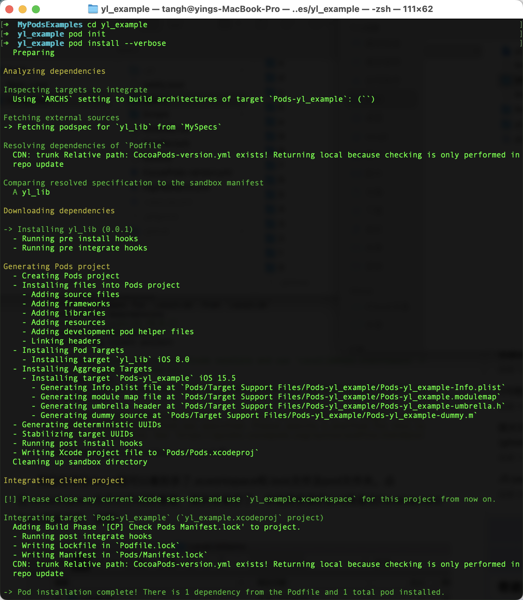

# 1.**pod install**干了什么




> > 使用`pod install --verbose`命令可以查看这个过程的详细内容,如下：
> >
> > ```ruby
> > $ pod install --verbose
> > 
> > Analyzing dependencies
> > 
> > Updating spec repositories
> > Updating spec repo `master`
> >   $ /usr/bin/git pull
> >   Already up-to-date.
> > 
> > 
> > Finding Podfile changes
> >   - AFNetworking
> >   - HockeySDK
> > 
> > Resolving dependencies of `Podfile`
> > Resolving dependencies for target `Pods' (iOS 6.0)
> >   - AFNetworking (= 1.2.1)
> >   - SDWebImage (= 3.2)
> >     - SDWebImage/Core
> > 
> > Comparing resolved specification to the sandbox manifest
> >   - AFNetworking
> >   - HockeySDK
> > 
> > Downloading dependencies
> > 
> > -> Using AFNetworking (1.2.1)
> > 
> > -> Using HockeySDK (3.0.0)
> >   - Running pre install hooks
> >     - HockeySDK
> > 
> > Generating Pods project
> >   - Creating Pods project
> >   - Adding source files to Pods project
> >   - Adding frameworks to Pods project
> >   - Adding libraries to Pods project
> >   - Adding resources to Pods project
> >   - Linking headers
> >   - Installing libraries
> >     - Installing target `Pods-AFNetworking` iOS 6.0
> >       - Adding Build files
> >       - Adding resource bundles to Pods project
> >       - Generating public xcconfig file at `Pods/Pods-AFNetworking.xcconfig`
> >       - Generating private xcconfig file at `Pods/Pods-AFNetworking-Private.xcconfig`
> >       - Generating prefix header at `Pods/Pods-AFNetworking-prefix.pch`
> >       - Generating dummy source file at `Pods/Pods-AFNetworking-dummy.m`
> >     - Installing target `Pods-HockeySDK` iOS 6.0
> >       - Adding Build files
> >       - Adding resource bundles to Pods project
> >       - Generating public xcconfig file at `Pods/Pods-HockeySDK.xcconfig`
> >       - Generating private xcconfig file at `Pods/Pods-HockeySDK-Private.xcconfig`
> >       - Generating prefix header at `Pods/Pods-HockeySDK-prefix.pch`
> >       - Generating dummy source file at `Pods/Pods-HockeySDK-dummy.m`
> >     - Installing target `Pods` iOS 6.0
> >       - Generating xcconfig file at `Pods/Pods.xcconfig`
> >       - Generating target environment header at `Pods/Pods-environment.h`
> >       - Generating copy resources script at `Pods/Pods-resources.sh`
> >       - Generating acknowledgements at `Pods/Pods-acknowledgements.plist`
> >       - Generating acknowledgements at `Pods/Pods-acknowledgements.markdown`
> >       - Generating dummy source file at `Pods/Pods-dummy.m`
> >   - Running post install hooks
> >   - Writing Xcode project file to `Pods/Pods.xcodeproj`
> >   - Writing Lockfile in `Podfile.lock`
> >   - Writing Manifest in `Pods/Manifest.lock`
> > 
> > Integrating client project
> > 
> > ```
>
> #### 1. 读取 Podfile 文件
>
> 你是否对 Podfile 的语法格式感到奇怪过，那是因为这是用 Ruby 语言写的。相较而言，这要比现有的其他格式更加简单好用一些。
>
> 在安装期间，第一步是要弄清楚显示或隐式的声明了哪些第三方库。在加载 podspecs 过程中，CocoaPods 就建立了包括版本信息在内的所有的第三方库的列表。Podspecs 被存储在本地路径 `~/.cocoapods` 中。
>
> ##### 版本控制和冲突
>
> CocoaPods 使用[语义版本控制 - Semantic Versioning](http://semver.org/) 命名约定来解决对版本的依赖。由于冲突解决系统建立在非重大变更的补丁版本之间，这使得解决依赖关系变得容易很多。例如，两个不同的 pods 依赖于 CocoaLumberjack 的两个版本，假设一个依赖于 `2.3.1`，另一个依赖于 `2.3.3`，此时冲突解决系统可以使用最新的版本 `2.3.3`，因为这个可以向后与 `2.3.1` 兼容。
>
> 但这并不总是有效。有许多第三方库并不使用这样的约定，这让解决方案变得非常复杂。
>
> 当然，总会有一些冲突需要手动解决。如果一个库依赖于 CocoaLumberjack 的 `1.2.5`，另外一个库则依赖于 `2.3.1`，那么只有最终用户通过明确指定使用某个版本来解决冲突。
>
> #### 2. 下载依赖,加载源文件
>
> CocoaPods 执行的下一步是加载源码。每个 `.podspec` 文件都包含一个源代码的索引，这些索引一般包裹一个 git 地址和 git tag。它们以 commit SHAs 的方式存储在 `~/Library/Caches/CocoaPods` 中。这个路径中文件的创建是由 Core gem 负责的。
>
> CocoaPods 将依照 `Podfile`、`.podspec` 和缓存文件的信息将源文件下载到 `Pods` 目录中。
>
> #### 3. 生成 Pods.xcodeproj
>
> 每次 `pod install` 执行，如果检测到改动时，CocoaPods 会利用 Xcodeproj gem 组件对 `Pods.xcodeproj` 进行更新。如果该文件不存在，则用默认配置生成。否则，会将已有的配置项加载至内存中。
>
> ##### 安装第三方库
>
> 当 CocoaPods 往工程中添加一个第三方库时，不仅仅是添加代码这么简单，还会添加很多内容。由于每个第三方库有不同的 target，因此对于每个库，都会有几个文件需要添加，每个 target 都需要：
>
> - 一个包含编译选项的 `.xcconfig` 文件
> - 一个同时包含编译设置和 CocoaPods 默认配置的私有 `.xcconfig` 文件
> - 一个编译所必须的 `prefix.pch` 文件
> - 另一个编译必须的文件 `dummy.m`
>
> 一旦每个 pod 的 target 完成了上面的内容，整个 `Pods` target 就会被创建。这增加了相同文件的同时，还增加了另外几个文件。如果源码中包含有资源 bundle，将这个 bundle 添加至程序 target 的指令将被添加到 `Pods-Resources.sh` 文件中。还有一个名为 `Pods-environment.h` 的文件，文件中包含了一些宏，这些宏可以用来检查某个组件是否来自 pod。最后，将生成两个认可文件，一个是 `plist`，另一个是 `markdown`，这两个文件用于给最终用户查阅相关许可信息。
>
> #### 4. 写入锁存文件，更新依赖至磁盘
>
> 直到现在，许多工作都是在内存中进行的。为了让这些成果能被重复利用，我们需要将所有的结果保存到一个文件中。所以 `Pods.xcodeproj` 文件被写入磁盘，另外两个非常重要的文件：`Podfile.lock` 和 `Manifest.lock` 都将被写入磁盘。
>
> ##### Podfile.lock
>
> 这是 CocoaPods 创建的最重要的文件之一。它记录了需要被安装的 pod 的每个已安装的版本。如果你想知道已安装的 pod 是哪个版本，可以查看这个文件。推荐将 Podfile.lock 文件加入到版本控制中，这有助于整个团队的一致性。
>
> ##### Manifest.lock
>
> 这是每次运行 `pod install` 命令时创建的 `Podfile.lock` 文件的副本。如果你遇见过这样的错误 `沙盒文件与 Podfile.lock 文件不同步 (The sandbox is not in sync with the Podfile.lock)`，这是因为 Manifest.lock 文件和 `Podfile.lock` 文件不一致所引起。由于 `Pods` 所在的目录并不总在版本控制之下，这样可以保证开发者运行 app 之前都能更新他们的 pods，否则 app 可能会 crash，或者在一些不太明显的地方编译失败。
>
> ##### xcproj
>
> 如果你已经依照我们的建议在系统上安装了 [xcproj](https://github.com/0xced/xcproj)，它会对 `Pods.xcodeproj` 文件执行一下 `touch` 以将其转换成为旧的 ASCII plist 格式的文件。为什么要这么做呢？虽然在很久以前就不被其它软件支持了，但是 Xcode 仍然依赖于这种格式。如果没有 xcproj，你的 `Pods.xcodeproj` 文件将会以 XML 格式的 plist 文件存储，当你用 Xcode 打开它时，它会被改写，并造成大量的文件改动。

# 2. pod install & pod update

### pod install（会读取podfile.lock中的版本号)

`pod install`一般是你第一次想要为项目添加pod的时候使用的，它同样也使用在你为Podfile文件添加或移除pod库的时候。

- 每次`pod install`命令运行的时候，`pod install`会为每一个它安装的pod库在`Podfile.lock`文件中写入其版本号。`Podfile.lock`文件追踪每一个安装的pod库的版本号，并锁定这些版本号。
- 当你运行`pod install`时，它将只解决不在Podfile.lock中的pod库依赖关系 
  - 对于在`Podfile.lock`文件中的pod库，`pod install`会只下载`Podfile.lock`文件中指定的版本，而不会去检查这个库是否有更新的版本。
  - 对于不在`Podfile.lock`文件中的pod库，`pod instal`l会搜索这个pod库在`Podfile`文件中指定的版本

### pod outdated

每当你运行`pod outdated`命令时，CocoaPods会列出所有在Podfile.lock中的有新版本的pod库。这意味着当你对这些pod使用`pod update PODNAME`时，他们会更新（只要新版本仍然遵守你在`Podfile`中做的类似于`pod 'MyPod', '~>x.y'`这样的限制）

### pod update（忽略podfile.lock,直接拉取有最新版本的库）

当你运行了`pod update PODNAME`命令，CocoaPods会在不考虑`Podfile.lock`中版本的情况下试着去查找`PODNAME`的最新版本。`pod update PODNAME`命令会将相应的pod更新到最新的版本（新版本仍然遵守你在`Podfile`中做的限制）

### 在Podfile中使用确定的版本是不够的

> 有人认为通过在`Podfile`中为pod指定确定的版本就足够保证所有的用户都会拥有相同的版本。
>
> 随后他们可能会只使用`pod update`（即使是在添加一个新pod时），并且认为这将不会更新其他pod库版本，因为已经在`Podfile`中指定了确定的版本。
>
> 但是事实上，这样做不能够保证*用户1*和*用户2*总是取得完全相同的pod库版本。
>
> 一个典型的例子是，如果pod `A`依赖于pod`A2`（通过在`A.podspec`中的`dependency 'A2', '~> 3.0`声明的）。在这种情况下，在你的Podfile中使用`pod 'A', '1.0.0'`的确会强制*用户1*和*用户2*总是使用pod`A`的`1.0.0`版本，但是：
>
> - *用户1*可能会使用`A2`的`3.4`版本
> - 同时当随后加入项目的*用户2*运行了`pod install`命令，他可能会得到pod`A2`的`3.5`版本（因为`A2`的维护者可能发布了一个新的版本）
>
> 这就是为什么唯一能够保证团队中所有的成员都用使用pod库的相同版本的方法就是使用`Podfile.lock`并且正确的使用`pod install`和`pod update`。

# 3. Podfile.lock & Manifest.lock

Manifest.lock是Podfile.lock的副本，它是在Pods目录里面。它的作用是这样的，我们通常是不把Pods文件放到版本管理里面，而把Podfile.lock放到版本管理里面。这时对于拉取代码之后是否需要更新pod，就可以通过对比本地的Manifest.lock和远程Podfile.lock是否相同即可。


# 5. 常见问题

1.  如果pod中用到framework,应该在哪里添加？ 如果pod中用到framework，如AVFoundation,直接在podspec文件中添加s.frameworks = ‘AVFoundation’或者s.frameworks = [‘AVFoundation’,'MapKit'],而不应该添加在项目的Link Binary With Libraries下面。 

2.  怎么取更新私有 pod？ 更新私有pod的过程和创建pod的步骤一致，但是要记得在更改代码后要记得一定重新run一下aggregate,更改podspec里的s.version(因为tag不能重复提交)， 重新pod repo push 

3. 如果出现这个错误怎么办：

   ```javascript
   [!] An unexpected version directory `Assets` was encountered for the `/Users/nimo/.cocoapods/repos/xxxx` Pod in the `xxxx` repository.
   ```

   这个错误，请查看：

4. - podspec 是否未上传到[服务器](https://cloud.tencent.com/product/cvm?from=10680)
   - Podfile的source地址是否是Spec Repo的地址，而不是具体某一个Pod的地址。

