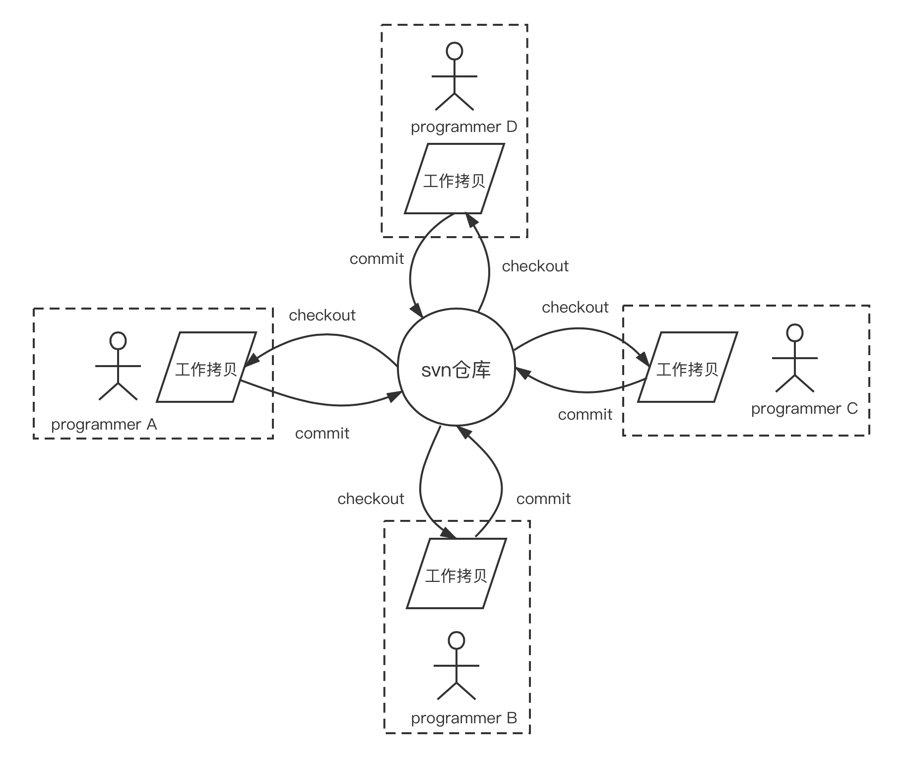
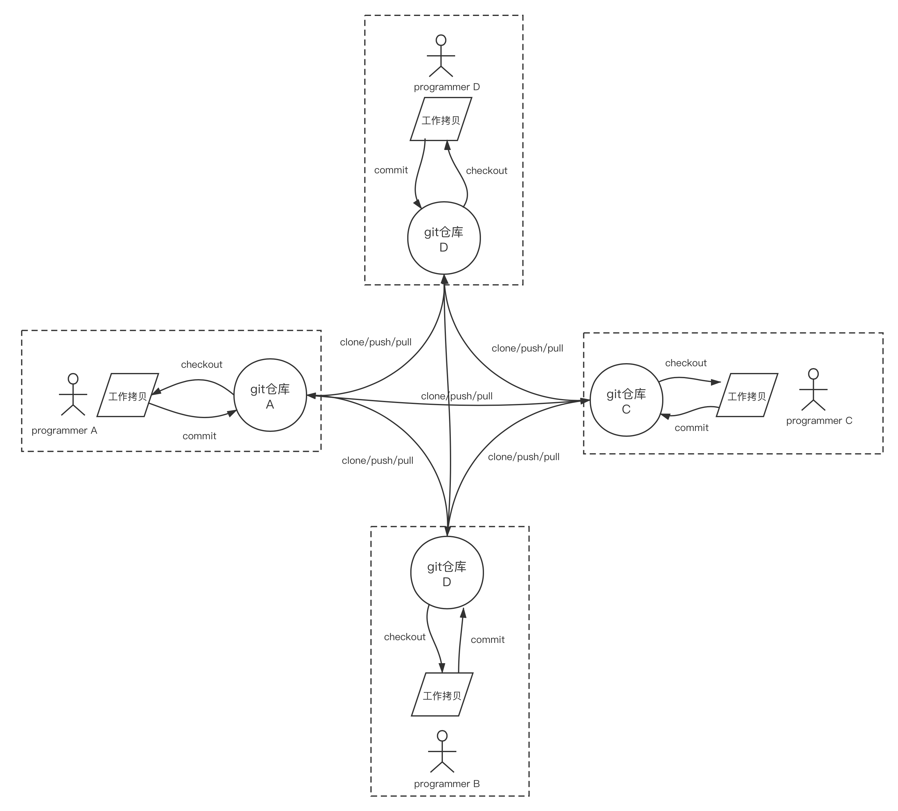

# 1. 版本控制（简称：VCS）

### **什么是版本控制？**

它是一个记录一段时间内对一个文件或一组文件的更改的系统，以便你以后可以调用特定版本。

版本控制系统由一个中央共享存储库组成，同事可以在其中对文件或文件集进行更改。

版本控制可让您：

- 将文件还原到以前的状态。
- 将整个项目还原到以前的状态。
- 比较随时间的变化。
- 查看谁最后修改了可能导致问题的内容。
- 谁修改了问题，何时修改了。

### Git与SVN的区别？

## 差异对比表

| 差异     | svn                                                          | git                                                          |
| -------- | ------------------------------------------------------------ | ------------------------------------------------------------ |
| 系统特点 | 1.集中式版本控制系统（文档管理很方便） 2.企业内部并行集中开发  3.windows系统上开发推荐使用 4.克隆一个拥有将近一万个提交(commit),五个分支,每个分支有大约1500个文件，用时将近一个小时 | 1.分布式系统（代码管理很方便） 2.开源项目开发 3.mac,Linux系统上开发推荐使用 4.克隆一个拥有将近一万个提交(commit),五个分支,每个分支有大约1500个文件，用时1分钟 |
| 灵活性   | 1.搭载svn的服务器出现故障，无法与之交互 2.所有的svn操作都需要中央仓库交互（例：拉分支，看日志等） | 1.可以单机操作，git服务器故障也可以在本地git仓库工作 2.除了push和pull（或fetch）操作，其他都可以在本地操作 3.根据自己开发任务任意在本地创建分支 4.日志都是在本地查看，效率较高 |
| 安全性   | 较差，定期备份，并且是整个svn都得备份                        | 较高，每个开发者的本地就是一套完整版本库，记录着版本库的所有信息（gitlab集成了备份功能） |
| 分支方面 | 1.拉分支更像是copy一个路径 2.可针对任何子目录进行branch 3.拉分支的时间较慢，因为拉分支相当于copy 4.创建完分支后，影响全部成员，每个人都会拥有这个分支 5.多分支并行开发较重（工作较多而且繁琐） | 1.我可以在Git的任意一个提交点（commit point）开启分支！（git checkout -b newbranch HashId） 2.拉分支时间较快，因为拉分支只是创建文件的指针和HEAD 3.自己本地创建的分支不会影响其他人 4.比较适合多分支并行开发 5.git checkout hash值(切回之前的版本，无需版本回退) 6.强大的cherry-pick |
| 版本控制 | 1.保存前后变化的差异数据，作为版本控制 2.版本号进行控制，每次操作都会产生一个高版本号（svn的全局版本号，这是svn一个较大的特点，git是hash值） | 1.git只关心文件数据的整体发生变化，更像是把文件做快照，文件没有改变时，分支只想这个文件的指针不会改变，文件发生改变，指针指向新版本 2. 40 位长的哈希值作为版本号，没有先后之分 3.git rebase操作可以更好的保持提交记录的整洁 |
| 工作流程 | 1.每次更改文件之前都得update操作，有的时候修改过程中这个文件有更新，commit不会成功 2.有冲突，会打断提交动作（冲突解决是一个提交速度的竞赛：手快者，先提交，平安无事；手慢者，后提交，可能遇到麻烦的冲突解决。） | 1.开始工作前进行fetch操作，完成开发工作后push操作，有冲突解决冲突 2.git的提交过程不会被打断，有冲突会标记冲突文件 3.gitflow流程（经典） |
| 内容管理 | svn对中文支持好，操作简单，适用于大众                        | 对程序的源代码管理方便，代码库占用的空间少，易于分支化管理   |
| 学习成本 | 使用起来更方便，svn对中文支持好，操作简单，适用于大众        | 更在乎效率而不是易用性，成本较高（有很多独有的命令，rebase，远程仓库交互的命令，等等） |
| 权限管理 | svn的权限管理相当严格，可以按组、个人针对某个子目录的权限控制（每个目录下都会有个.svn的隐藏文件） | git没有严格的权限管理控制，只有账号角色划分（在项目的home文件下有且只有一个.svn目录） |
| 管理平台 | 有吧（这个“吧”字，肯定有，但本人没有接触过）                 | gitlab（建议使用，集成的功能较多，API开发），gerrit，github等 |

引自链接：https://juejin.cn/post/6844903619813179405

### Git原理

git原理的几个关键概念就交代完了，再回顾一下：

- 和subversion这样的集中式版本管理工具最大的不同就是每个程序员节点都是git仓库，拥有全部开发、协作所需的全部信息，完全可以脱离“中心节点”；
- 如果说git聚焦于数据平面的功能，那么github则是一个基于git网络协作的**控制平面**的实现；
- **objects**是个筐，什么都往里面装。git仓库的核心数据都存在.git/objects下面，主要类型包括：blob、tree和commit；
- 每个**commit**都是一个git仓库的快照，记住commit对象是分析对象关系的入口;
- git是基于数据内容的hash值做等值判定的，object是不可变的，默克尔树(Merkle Tree)用来快速判断变化。
- branch和tag因为是“指针”，因此创建、销毁和切换都非常轻量。

## 1.1 SVN

就像上图中那样，所有开发人员开始生产代码的前提是**必须先从中心仓库checkout一份代码拷贝到自己本地的工作目录**；而进行版本管理操作或者与他人进行协作的前提也是：**中心版本仓库必须始终可用**。这有点像以太网的“半双工的集线器(hub)模式”：svn中心仓库就像集线器本身，每个程序员节点就像连接到集线器上的主机；当一个程序员提交(commit)代码到中心仓库时，其他程序员不能提交，否则会出现冲突；如果中心仓库挂掉了，那么整个版本管理过程也将停止，程序员节点间无法进行协作，这就像集线器(hub)挂掉后，所有连接到hub上的主机节点间的网络也就断开无法相互通信一样。

## 1.2 Git

如上图所示，git号称分布式版本管理系统，本质上是没有像subversion中那个所谓的“中心仓库”的。**每个程序员都拥有一个本地git仓库**，而不仅仅是一份代码拷贝，这个仓库就是一个**独立的版本管理节点**，它拥有程序员进行代码生产、版本管理、与其他程序员协作的**全部信息**。即便在一台没有网络连接的机器上，程序员也能利用该仓库完成代码生产和版本管理工作。在网络ready的情况下，任意两个git仓库之间可以进行点对点的协作，这种协作无需中间协调者(中心仓库)参与。

引自：https://tonybai.com/2020/04/07/illustrated-tale-of-git-internal-key-concepts/

# 2. 常用软件

## Application Loader

## Charles Proxy

## Kaleidoscope

## NameChanger

## Proxifier

## Reveal

## LICEcap

## iFunBox

## iTerm2

## XScope

## Sublime