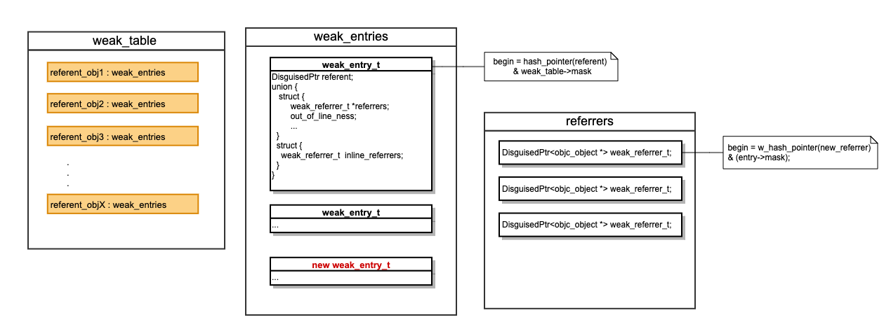

# 常见的内存泄露场景:

目前，在 ARC 环境下，导致内存泄漏的根本原因是代码中**存在循环引用**，从而导致一些内存无法释放，最终导致 dealloc() 方法无法被调用。主要原因大概有一下几种类型：

1. Retain Cycle，Block 强引用
2. NSTimer使用不当
3. 第三方提供方法造成的内存泄漏
4. CoreFoundation 方式申请的内存，忘记释放

# 2. 怎么检测内存泄露?

方式有三种：

* 静态分析（Analyze）

  > **主要分析以下四种问题：**
  >
  > 1.逻辑错误：访问空指针或未初始化的变量等；
  >
  > 2.内存管理错误：如内存泄漏等；
  >
  > 3.声明错误：从未使用过的变量；
  >
  > 4.Api调用错误：未包含使用的库和框架。

* 动态分析 （Instrument）

  > 使用 Leaks 内存泄漏检测工具，选择 Xcode -> Product -> Profile，选择 Leaks：
  >
  > 选中 Leaks，在 Leaks 所在栏中选择 CallTree；
  >
  > Call Tree 会给我们大概的位置，这个时候需要缩小范围、筛选数据；
  >
  > 点击下方的 CallTree ，发现有这几个筛选项：
  >
  > > 1. Separate by Thread ：按线程分开做分析，这样更容易揪出那些吃资源的问题线程。
  > > 2. Invert Call Tree ：反向输出调用树。把调用层级最深的方法显示在最上面，更容易找到最耗时的操作。
  > > 3. Hide System Libraries：隐藏系统库文件。过滤掉各种系统调用，只显示自己的代码调用。
  > > 4. Flattern Recursion：拼合递归。将同一递归函数产生的多条堆栈（因为递归函数会调用自己）合并为一条。

* 自动化检测 （MLeaksFinder）

  > 使用三方库`MLeaksFinder`
  >
  > [MLeaksFinder](https://link.juejin.cn?target=https%3A%2F%2Flinks.jianshu.com%2Fgo%3Fto%3Dhttps%3A%2F%2Fgithub.com%2FZepo%2FMLeaksFinder) 是 WeRea d团队开源的一款检测 iOS 内存泄漏的框架，对代码没有侵入性，而且其使用非常简单，只需要引入项目中，如果有内存泄漏，3秒后自动弹出 alert 来显示捕捉的信息。它默认只检测应用里 UIViewController 和 UIView 对象的泄漏情况。因为一般应用里内存泄漏影响最严重的就是这两种内存占用比较高的对象，它也可以在代码里设置扩展以检测其他类型的对象泄漏情况
  >
  > `MLeaksFinder`的实现原理
  >
  > 一般情况下，当一个 UIViewController 被 pop 或者 dismiss 掉后，它的 view 和 view 的subview等也会很快地被释放掉，除非我们把它设置为单例或者还有强引用指向它。MLeaksFinder 的做法就是根据这种基本情况，在一个 UIViewController 被 pop 或者 dismiss 掉3秒后，看看它的 view 和 view 的 subview 等是否还存在，如果还存在，就意味着有可能有内存泄漏发生，弹框提醒用户。
  >
  > ```objective-c
  > - (BOOL)willDealloc {
  >     __weak id weakSelf = self;
  >     dispatch_after(dispatch_time(DISPATCH_TIME_NOW, (int64_t)(2 * NSEC_PER_SEC)), dispatch_get_main_queue(), ^{
  >         [weakSelf assertNotDealloc];
  >     });
  >     return YES;
  > }
  > 
  > - (void)assertNotDealloc {
  >      NSAssert(NO, @“”);
  > }
  > 
  > ```
  >
  > #### MLeaksFinder的特性
  >
  > - 不侵入代码
  > - 白名单机制
  > - 可以构建泄漏堆栈
  > - 扩展性和其他特殊处理
  >
  > MLeaksFinder 虽然帮我们找到了内存泄漏的对象，但是我们具体不知道引起循环引用的链条，用户还要自己去看代码进行排查，这是很浪费时间的。因为内存泄漏一般都是循环引用导致的。
  >
  > ### FBRetainCycleDetector介绍
  >
  > `FBRetainCycleDetector`是`FaceBook`开源的用于检测强引用循环的工具。默认是在`DEBUG`环境中启用，当然你也可以通过设置`RETAIN_CYCLE_DETECTOR_ENABLED`以始终开启。使用这个工具可以传入应用内存里的任意一个 Objective-C 对象，FBRetainCycleDetector 会查找以该对象为根节点的强引用树中有没有循环引用。
  >
  > ```objc
  >   #import <FBRetainCycleDetector/FBRetainCycleDetector.h>
  > 
  >    _handlerBlock = ^{
  >        NSLog(@"%@", self);
  >    };
  > 
  >    FBRetainCycleDetector *detector = [FBRetainCycleDetector new];
  >    [detector addCandidate:self];
  >    NSSet *retainCycles = [detector findRetainCycles];
  >    NSLog(@"%@", retainCycles);
  >     
  > ```
  >
  > 这两个工具一起搭配使用真是如虎添翼，很容易排查出内存的问题。所以查找内存泄漏现在一般是两个工具一起用，先用 MLeaksFinder 找出泄漏的对象，然后再用 FBRetainCycleDetector 检测该对象有没有循环引用，如果有，根据找出来的循环引用链条去查看修改代码就方便很多了。
  >
  > #### **具体使用**
  >
  > 引入 MLeaksFinder 库的时候，也默认引入了 FBRetainCycleDetector 库，默认在 `Debug` 环境下起作用.

# 3. Block 

[Block 内链](https://github.com/chiefky/YLNoteHub/blob/develop/content/Block/Block.md)

### 3.1 block 怎么解决循环引用? 为什么用__weak 能解决?

（1）block 怎么解决循环引用?

* 方案一：借助weak

  ```objective-c
  - (void)testBlockLifeCircle_weak {
    __weak typeof(self) weakSelf = self;
  
    self.yl_VBlock = ^{
      NSLog(@"demoName = %@",[weakSelf demoName]);
    };
    self.yl_VBlock();
  }	
  ```

  

* 方案二：借助__block

  ```objective-c
  - (void)testBlockLifeCircle_block {
  
    __block YLBlockRetainCycleViewController *tmpVC = self;
    self.yl_VBlock = ^{
      NSLog(@"demoName = %@",[tmpVC demoName]);
      tmpVC = nil; // 📢：1.必须将变量置为nil
    };
    self.yl_VBlock(); // 📢：2.必须调用block(如果不调不会，解决循环引用)
  }
  ```

  

* 方案三：借助参数

  ```objective-c
  - (void)testBlockLifeCircle_Parameter {
    self.yl_PBlock = ^(YLBlockRetainCycleViewController *vc) {
      NSLog(@"demoName = %@",[vc demoName]);
    };
    self.yl_PBlock(self);
  }
  
  ```

  

* 方案四：使用NSProxy（其实是借助参数传递中间者+中间者弱持有self就可以解决，完全可以不用消息转发）（使用Proxy的原理是：1.添加了一个中间者Proxy；2.Proxy持有一个弱引用对象，也就是响应方法的目标对象；3. 借助消息转发机制将消息传递给目标对象）

  ```objective-c
  - (void)testBlockLifeCircle_Rroxy {
    YLProxy *proxy = [YLProxy proxyWithTarget:self];
    self.yl_PoxBlock = ^(YLProxy *pox) {
      NSLog(@"demoName = %@",[pox.target demoName]);
    };
    self.yl_PoxBlock(proxy);
  }
  ```

  > 总结：
  >
  > 1. block内部使用‘__weak’ 修饰的局部变量代替原来的强引用变量，打破双方互相持有引用计数无法减1
  > 2. block内部使用‘__block’修饰的局部变量，在内部将'____block'变量置为nil，并且外部必须调用block执行才可,借助手动打破强引用；
  > 3. 借助block参数传递原来的强引用变量，参数变量作为函数的一部分不会被block持有，从而避免了循环引用产生
  > 4. Proxy有点画蛇添足，本质就是借助参数再加一层弱持有。

（2）为什么用__weak 能解决?

> 因为block捕获外部变量的原则是”遇强捕强遇弱捕弱“，使用‘__weak’修饰的变量被捕获进block后，不会造成原对象引用计数的+1，从而打破了原来的互相持有无法释放问题。

# 4. weak实现原理

### 4.1 __weak 的实现机制？ sideTable的数据结构，怎么解决hash冲突？

（1） __weak 的实现机制?

**weak 实现原理的概括**

Runtime维护了一个weak表，用于存储指向某个对象的所有weak指针。weak表其实是一个hash（哈希）表，Key是所指对象的地址，Value是weak指针的地址（这个地址的值是所指对象的地址）数组。

weak 的实现原理可以概括一下三步：

1、初始化时：runtime会调用objc_initWeak函数，初始化一个新的weak指针指向对象的地址。

2、添加引用时：objc_initWeak函数会调用 objc_storeWeak() 函数， objc_storeWeak() 的作用是更新指针指向，创建对应的弱引用表。

3、释放时，调用clearDeallocating函数。clearDeallocating函数首先根据对象地址获取所有weak指针地址的数组，然后遍历这个数组把其中的数据设为nil，最后把这个entry从weak表中删除，最后清理对象的记录。

* SideTables哈希数组 (个人理解为数组下标是通过向某一个哈希函数传入key得到，然后从数组中直接取值)

* weak-table：哈希表（也称散列表， 哈希表本质是一个数组，数组中的每一个元素成为一个箱子，箱子中存放的是键值对）

  两者关系如图：

  

  

**总结：**

​      底层数据模型：哈希表+数组的形式

（key: 弱引用对象的地址; value：一个存放weak指针的地址的数组）

以 `table.delegate = vc1;`,`table.datadource = vc1;`为例：

| key        | value                                       |
| ---------- | ------------------------------------------- |
| vc1 的地址 | 【table.delegate,table.datadource】地址数组 |

> weak采用的是一个全局HashMap，当销毁一个对象时，根据对象从哈希表中找到存放所有指向该对象的weak指针的数组，然后将数组中的所有元素都置为nil;
>
> 基本步骤:
>
> * 对象dealloc的时候，从全局的hashmap中，根据一个唯一代表对象的值作为key，找到存储所有指向该对象的weak指针的数组
> * 将数组的所有元素（weak指针）置为nil

(2)  解决hash冲突的常见办法

```
开放定址法（线性探测再散列，二次探测再散列，伪随机探测再散列）;
再哈希法;
链地址法;
建立一个公共溢出区;
```

# 5. iOS中常用的计时器有哪些，分别适用于什么场景？

NSTimer

CADisplayLink

GCD Timer

# 6.Runloop

6、什么情况下会造成Runloop 当前循环一直不结束？

7、Runloop 的理解？主线程和子线程的Runloop 的区别？怎么结束runloop？

8、Runloop 都用过哪些场景？

```c++

```

