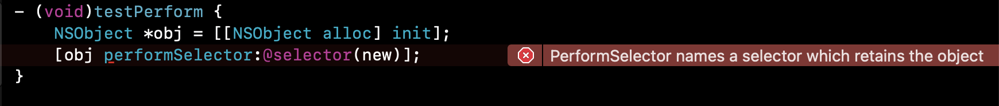

# 1. Error：内存泄露

## 1.1 performSelector引起的内存泄漏警告



performSelector系列颇具有动态性，当使用这三个方法时，编译器很容易就给出警告：PerformSelector may cause a leak because its selector is unknown。为什么会提示有内存泄漏问题呢？

### 1.1.1 产生警告的原因

首先要明确：**调用`performSelector:`编译器会假设调用方法的返回值是一个对象，且不会对返回值进行retain/release**。

如果调用的方法是`alloc, new, copy, mutableCopy`方法家族中的方法(包含以它们开头)，方法调用的结果是开辟了一块内存空间，但是系统仍然按照非retain/release处理，没有对它们的引用计数纳入管理，这时内存空间无法释放，就会产生内存泄露。

当**显式调用**这些方法时，编译器都能明显分析出来，并给出提示：Error：PerformSelector names a selector which retains the object。告诉我们这不符合引用计数管理的规则，编译不通过。

**【引用计数管理的规则]】**There are really only 4 things that ARC would consider for the return value:4

- Ignore non-object types (void, int, etc)
- Retain object value, then release when it is no longer used (standard assumption)
- Release new object values when no longer used (methods in the init/ copy family or attributed with ns_returns_retained)
- Do nothing & assume returned object value will be valid in local scope (until inner most release pool is drained, attributed with ns_returns_autoreleased)

The call to methodForSelector: assumes that the return value of the method it’s calling is an object, but does not retain/release it. So you could end up creating a leak if your object is supposed to be released as in #3 above (that is, the method you’re calling returns a new object).

比如这样：

```objc
- (id)newObject {
    return [NSObject new];
}
```

```objc
// 调用method family中的方法：
[str performSelector:@selector(copy)];
// 调用以method family中的方法名开头的方法：
[self performSelector:@selector(newObject)];
```

但是**隐式调用**的时候，编译器无能为力了，只能给出警告：PerformSelector may cause a leak because its selector is unknown。

```objc
// 隐式调用无法分析出错误: 出现内存泄露
id obj1 = [str performSelector:NSSelectorFromString(@"copy")];
[str performSelector:NSSelectorFromString(@"mutableCopy")];
id obj2 = [[NSObject class] performSelector:NSSelectorFromString(@"new")];
id obj3 = [self performSelector:NSSelectorFromString(@"newObject")];
```

### 1.1.2 消除此类警告

**（不考虑利用`#pragma`消除警告）**

Tip: 根据`performSelector`的实现，效果上可以直接使用`IMP`，也可以使用`objc_msgSend()`，甚至使用`NSInvocation`、`sendAction`等，这样就达到同等实现而没有警告了。

以下几种方式：

a. 通过`methodForSelector`获取函数指针，转换成C函数后直接调用;

🌰：

```objc
if (!person) return;
// 获取函数指针
IMP imp = [person methodForSelector:selector];
// 类型转换
void (*func)(id, SEL) = (void *)imp;
// 调用
func(person, selector);
```

b. methodForSelector简化版

🌰：

```objc
((void (*)(id, SEL))[person methodForSelector:selector])(self, selector);
```

c. objc_msgSend

🌰：

```objective-c
((void *(*)(id, SEL))objc_msgSend)((id)self, NSSelectorFromString(@"show"));
```

d. NSInvocation

🌰：

```objective-c
SEL selector = NSSelectorFromString(@"show");
NSMethodSignature *methodSig = [[self class] instanceMethodSignatureForSelector:selector];
NSInvocation *invocation = [NSInvocation invocationWithMethodSignature:methodSig];
[invocation setSelector:selector];
[invocation setTarget:self];
[invocation invoke];
```

e. sendAction

🌰：

```
[UIApplication.sharedApplication sendAction:NSSelectorFromString(@"show") to:self from:nil forEvent:nil];
```

### 1.1.3 解决内存泄漏

当我们一定要调用`newObject`这类特殊的方法时（可能性极小），怎么解决内存泄漏问题呢？把return的对象的引用计数减少即可，比如：

当使用`objc_msgSend()`时

```objective-c
id obj = CFBridgingRelease(((void *(*)(id, SEL))objc_msgSend)(self, NSSelectorFromString(@"newObject")));
```

当使用`methodForSelector`时

```objective-c
id obj = CFBridgingRelease(((void *(*)(id, SEL))[self methodForSelector:NSSelectorFromString(@"newObject")])(self, NSSelectorFromString(@"newObject")));
```

# 2.Error: 'NSUnknownKeyException'

```objc
2021-12-07 17:14:37.124220+0800 YLNote[10182:9065367] *** Terminating app due to uncaught exception 'NSUnknownKeyException', reason: '[<YLKVCPerson 0x600000121270> setValue:forUndefinedKey:]: this class is not key value coding-compliant for the key name.'
```

崩溃原因：`setValue:forUndefinedKey:`,向未定义的key设值；

解决方案：
