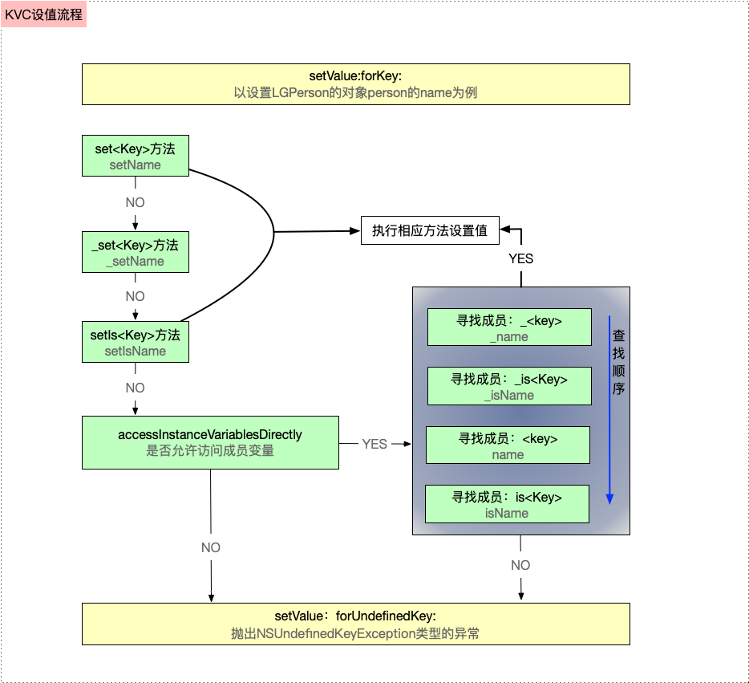
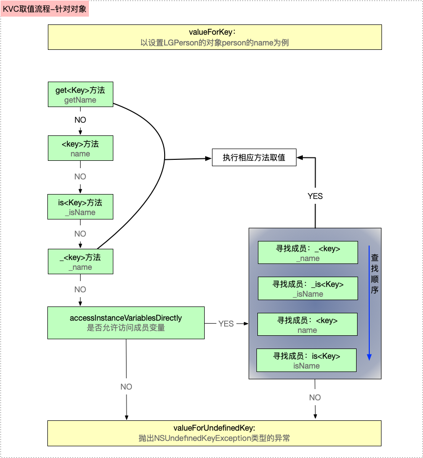

# 1. KVC底层原理

### 简介

KVC`（Key Value Coding）` 是一种可以通过key来访问类属性的机制。而不是通过调用`Setter、Getter`方法访问。可以在运行时动态访问和修改对象的属性。 KVC的方法定义在`Foundation/NSKeyValueCoding`中。

### KVC 相关API

主要有以下四个常用的方法

- 通过`key` 设值/取值

```objective-c
//直接通过Key来取值
- (nullable id)valueForKey:(NSString *)key;

//通过Key来设值
- (void)setValue:(nullable id)value forKey:(NSString *)key;
复制代码
```

- 通过`keyPath` （即`路由`）设值/取值

```objective-c
//通过KeyPath来取值
- (nullable id)valueForKeyPath:(NSString *)keyPath; 

//通过KeyPath来设值                 
- (void)setValue:(nullable id)value forKeyPath:(NSString *)keyPath;  
```

## 1.1 通过`key` 设值/取值

###  1.1.1 设值

当调用setValue:forKey:设置属性value时，其底层的执行流程为：

- 【第一步】首先查找是否有这三种setter方法，按照查找顺序为：`set<Key>`：->` _set<Key> `-> `setIs<Key>` ;

- - 如果有其中任意一个setter方法，则直接设置属性的value（主注意：key是指成员变量名，首字符大小写需要符合KVC的命名规范）
  - 如果都没有，则进入【第二步】

- 【第二步】：如果没有第一步中的三个简单的setter方法，则查找accessInstanceVariablesDirectly是否返回YES

- - 如果返回YES，则查找间接访问的实例变量进行赋值，查找顺序为：`_<key>` -> `_is<Key>` -> `<key>` -> `is<Key>` ;

- - - 如果找到其中任意一个实例变量，则赋值
    - 如果都没有，则进入【第三步】

  - 如果返回NO，则进入【第三步】

- 【第三步】如果setter方法 或者 实例变量都没有找到，系统会执行该对象的`setValue：forUndefinedKey:`方法，默认抛出`NSUndefinedKeyException`类型的异常

  

### 1.1.2 取值 

- 【第一步】首先查找getter方法，按照 `get<Key>` -> `<key>` -> `is<Key>` -> `_<key> `的方法顺序查找，

- - 如果找到，则进入【第五步】
  - 如果没有找到，则进入【第二步】（个人感觉描述时可以从这里直接跳到第四步）

> * 【第二步】如果第一步中的getter方法没有找到，KVC会查找countOf <Key>和objectIn <Key> AtIndex :和<key> AtIndexes :
>   - 如果找到countOf <Key>和其他两个中的一个，则会创建一个响应所有NSArray方法的集合代理对象，并返回该对象，即NSArray的子类 NSKeyValueArray。代理对象随后将接收到的所有NSArray消息转换为countOf<Key>，objectIn<Key> AtIndex：和<key>AtIndexes：消息的某种组合，用来创建键值编码对象。如果原始对象还实现了一个名为get<Key>：range：之类的可选方法，则代理对象也将在适当时使用该方法（注意：方法名的命名规则要符合KVC的标准命名方法，包括方法签名。）
>   - 如果没有找到这三个访问数组的，请继续进入【第三步】
> * 【第三步】如果没有找到上面的几种方法，则会同时查找`countOf <Key>`，`enumeratorOf<Key>`和`memberOf<Key>`这三个方法
>
> - - 如果这三个方法都找到，则会创建一个响应所有NSSet方法的集合代理对象，并返回该对象，此代理对象随后将其收到的所有NSSet消息转换为`countOf<Key>`，`enumeratorOf<Key>`和`memberOf<Key>`：消息的某种组合，用于创建它的对象
>   - 如果还是没有找到，则进入【第四步】

- 【第四步】如果还没有找到，检查类方法`accessInstanceVariablesDirectly`是否YES，依次搜索`_<key>`，`_is<Key>`，`<key>`或`is<Key>`的实例变量

- - 如果搜到，直接获取实例变量的值，进入【第五步】

- 【第五步】根据搜索到的属性值的类型，返回不同的结果

- - 如果是对象指针，则直接返回结果
  - 如果是NSNumber支持的标量类型，则将其存储在NSNumber实例中并返回它
  - 如果是是NSNumber不支持的标量类型，请转换为NSValue对象并返回该对象

- 【第六步】如果上面5步的方法均失败，系统会执行该对象的`valueForUndefinedKey:`方法，默认抛出`NSUndefinedKeyException`类型的异常。

  

## 1.2 通过`keyPath` （即`路由`）设值/取值

然而在开发过程中，一个类的成员变量有可能是自定义类或其他的复杂数据类型，你可以先用KVC获取该属性，然后再次用KVC来获取这个自定义类的属性，但这样是比较繁琐的，对此，KVC提供了一个解决方案，那就是键路径`keyPath`。

```objectivec
- (nullable id)valueForKeyPath:(NSString *)keyPath;                  //通过KeyPath来取值
- (void)setValue:(nullable id)value forKeyPath:(NSString *)keyPath;  //通过KeyPath来设值
```

```objective-c
@interface Address : NSObject

@end
@interface Address()
@property (nonatomic,copy)NSString* country;
@end
@implementation Address
@end
@interface People : NSObject
@end
@interface People()
@property (nonatomic,copy) NSString* name;
@property (nonatomic,strong) Address* address;
@property (nonatomic,assign) NSInteger age;
@end
@implementation People
@end
int main(int argc, const char * argv[]) {
    @autoreleasepool {
        People* people1 = [People new];
        Address* add = [Address new];
        add.country = @"China";
        people1.address = add;
        NSString* country1 = people1.address.country;
        NSString * country2 = [people1 valueForKeyPath:@"address.country"];
        NSLog(@"country1:%@   country2:%@",country1,country2);
        [people1 setValue:@"USA" forKeyPath:@"address.country"];
         country1 = people1.address.country;
        country2 = [people1 valueForKeyPath:@"address.country"];
        NSLog(@"country1:%@   country2:%@",country1,country2);
    }
    return 0;
}
//打印结果 
2016-04-17 15:55:22.487 KVCDemo[1190:82636] country1:China   country2:China
2016-04-17 15:55:22.489 KVCDemo[1190:82636] country1:USA   country2:USA
```


# 3. KVC的实际应用

## 3.1KVC如何处理异常


## 3.1应用场景

1. #### 动态地取值和设值

   利用KVC动态的取值和设值是最基本的用途了。相信每一个iOS开发者都能熟练掌握，

2. #### 用KVC来访问和修改私有变量

   对于类里的私有属性，Objective-C是无法直接访问的，但是KVC是可以的，请参考本文前面的Dog类的例子。

3. #### Model和字典转换

4. #### 修改一些控件的内部属性

5. #### 操作集合

6. ##### 用KVC实现高阶消息传递

7. ##### 用KVC中的函数操作集合