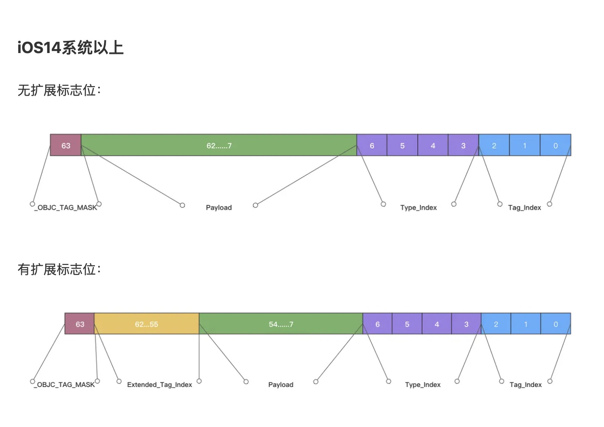

# 前言

## 内存布局（内存分区）

共享库（libobjc.A.dylib等）与内核空间的内存布局在栈区之上;如下图：


- **内核区**：用于加载内核代码，预留1GB

- **共享区：用于加载系统库，例如:libobjc.a.dylib**

- **栈区**：创建临时变量时由编译器自动分配，在不需要的时候自动清除的变量的存储区。里面的变量通常是局部变量、函数参数等。在一个进程中，位于用户虚拟地址空间顶部的是用户栈，编译器用它来实现函数的调用。和堆一样，用户栈在程序执行期间可以动态地扩展和收缩。栈区的内存地址一般是0x7开头,从高地址到底地址分配内存空间（**<font color=red>TaggedPointer</font>**）

- **堆区**：那些由 new alloc 创建的对象所分配的内存块，它们的释放系统不会主动去管，由我们的开发者去告诉系统什么时候释放这块内存(一个对象引用计数为0是系统就会回销毁该内存区域对象)。一般一个 new 就要对应一个release。在ARC下编译器会自动在合适位置为OC对象添加release操作。会在当前线程Runloop退出或休眠时销毁这些对象，MRC则需程序员手动释放。堆可以动态地扩展和收缩。堆区的内存地址一般是0x6开头,从底地址到高地址分配内存空间

- **未初始化数据（静态区）**：BSS段又称静态区，未初始化的全局变量，静态变量存放在这里。一旦初始化就会被回收，并且将数据转存到数据段中。

- **已初始化数据（常量区）**：数据段又称常量区，专门存放常量，直到程序结束的时候才会被回收

- **代码段**：用于存放程序运行时的代码，代码会被编译成二进制存进内存的程序代码区。程序结束时系统会自动回收存储在代码段中的数据。

- **保留区**：内存有4MB保留，地址从低到高递增

  

  如何查看对象地址：

  


# 1. 内存管理方案

* 堆区：由开发者（借助<font color="red">引用计数</font>）管理的，需要告诉系统什么时候释放内存。

  ARC下：编译器会自动在合适的时候插入引用计数管理代码（`retain`、`release`、`autorelease`）；

  MRC下：需要开发者手动释放。

* 栈区、其他区：编译器自动分配，由系统管理，在不需要的时候自动清除；

> 结合引用计数存储位置，分成以下三类管理对象内存
>
> * 引用计数
> * TaggedPointer
> * SideTable

## 1.1 引用计数原理

### 1.1.1 引用计数存储位置

引用计数的存储位置分三种情况：

* 特例：TaggedPointer对象：苹果会直接将其指针值作为引用计数返回
* 开启isa优化的对象（NONPOINTER_ISA == 1）：引用计数存储在isa_t中的`shiftcls`字段中
* 普通对象（NONPOINTER_ISA == 0） and  `shiftcls`字段越界的对象： 引用计数存储在SideTable中，通过对象的内存地址找到散列表周边保存的`retaincount`（最终值：`shiftcls` + `retaincount` + 1）

### 1.1.2 引用计数管理

[引用计数](https://link.juejin.cn/?target=https%3A%2F%2Fbaike.baidu.com%2Fitem%2F%E5%BC%95%E7%94%A8%E8%AE%A1%E6%95%B0%2F10205507%3Ffr%3Daladdin)是计算机编程语言中的一种内存管理技术，是指将资源（可以是对象、内存或磁盘空间等等）的被引用次数保存起来，当被引用次数变为零时就将其释放的过程。

当一个对象创建并在堆区申请内存时，对象的引用计数为1；当其他的对象需要持有这个对象时，就需要将这个对象的引用计数加1；当其他的对象不再需要持有这个对象时，需要将对象的引用计数减1；当对象的引用计数为0时，对象的内存就会立即释放，对象销毁。

引用计数发生变化的操作有哪些：

- 调用`alloc、new、copy、mutableCopy`名称开头的方法创建的对象，该对象的引用计数加1。
- 调用`retain`方法时，该对象的引用计数加1。
- 调用`release`方法时，该对象的引用计数减1。
- `autorelease`方法不改变该对象的引用计数器的值，只是将对象添加到自动释放池中。
- `retainCount`方法返回该对象的引用计数值。

####  alloc引起引用计数+1 的原因

答案看源码：


> 引用计数规则:
>
> 1. 自己生成的对象，自己持有。（alloc,new,copy,mutableCopy等）
> 2. 非自己生成的对象，自己也能持有。（retain 等）
> 3. 不再需要自己持有的对象时释放。（release，dealloc 等）
> 4. 非自己持有的对象无法释放。
>

# 2. 特殊对象(TaggedPointer &SideTable)

先简单了解几个概念：

* TaggedPointer ：内置Tagged Pointer**指针**中包含了当前对象的地址、类型、具体数值。

* nonpointer ： isa_t 联合体的第一位；0，代表普通指针，存储着class、meta-class对象的内存地址；1，代表优化过，使用位域存储更多信息；

* SideTable： 在OC中扮演这一个很重要的角色。在runtime中，通过`SideTable`来管理对象的引用计数以及weak引用。同时，系统中维护了一个全局的`SideTables`，这是一个`SideTable`的集合。

  >  **SideTable** 主要存放了OC对象的引用计数（RefcountMap）和弱引用相关信息（weak_table_t）。
  >
  >  * RefcountMap：以DisguisedPtr<objc_object>为key的hash表，用来存储OC对象的引用计数(仅在未开启isa优化 或 在isa优化情况下isa_t的引用计数溢出时才会用到)。
  >  * weak_table_t：存储对象弱引用指针的hash表。是OC weak功能实现的核心数据结构。

* AssociationsHashMap：存放对象的关联对象map的map（key为传入的object，value为map，也就是ObjectAssociationMap）

以上4种标记或者是结构代表了4类数据的内存管理方式；下面详细梳理；

## 2.1 TaggedPointer

> > 为什么要使用taggedPointer?
> > 假设要存储一个NSNumber对象，其值是一个整数。正常情况下，如果这个整数只是一个NSInteger的普通变量，在64位CPU下是占8个字节的。1个字节有8位，如果我们存储一个很小的值，会出现很多位都是0的情况，这样就造成了内存浪费，苹果为了解决这个问题，引入了taggedPointer的概念。
> >
> > 以NSNumber为🌰，对象占用内存空间情况：
> >
> > arm64之前：指针（8个字节）+ NSNumber对象（16个字节 内存对齐）
> >
> > arm64之后：TaggedPointer指针（只占8字节）
>
> 
>
> - **Tagged Pointer**是苹果为了解决32位CPU到64位CPU的转变带来的内存占用和效率问题，针对**NSNumber、NSDate**以及部分**NSString**的内存优化方案。
> - **Tagged Pointer指针**的值不再是地址了，而是真正的值。所以，实际上它**不再是一个对象**了，它只是一个披着对象皮的普通变量而已。所以，它的**内存并不存储在堆中（而是在栈上），也**不需要malloc和free**。
> - **Tagged Pointer指针**中包含了当前对象的地址、类型、具体数值。因此Tagged Pointer指针在内存读取上有着3倍的效率，创建时比普通需要**malloc**跟**free**的类型**快106倍**。
>
> TaggedPointer混淆原理：
>
> 混淆原理：使用一个随机数`objc_debug_taggedpointer_obfuscator`对真正的内存地址异或操作。根据异或运算的特性，a^b^b=a，因此只需要将混淆后的地址再与`objc_debug_taggedpointer_obfuscator`异或一次就能够完成反混淆。
>
> **Tagged Pointer内存结构**
>
> 
>
> 
>
> 与macOS不同，iOS系统采用 `MSB`（`Most Significant Bit`，即最高有效位）为`Tagged Pointer`标志位。
>
> **各bit含义解释**
>
> * _OBJC_TAG_MASK: 占1bit，是`Tagged Pointer`标志位，1意味着该地址是`Tagged Pointer`，0则不是。
>
> * Extended_Tag_Index：占8bit，只有当Tag_Index=7的时候才存在，表示这是一个用于扩展的标志位，会额外占用8位来存储扩展的Tag Index。类标识的基本类型和扩展类型我们可以在`Runtime`源码中的`objc_tag_index_t`查到：
>
>   
>
> * Tag_Index：占3bit，是类标志位，可以在`Runtime`源码中查看`NSNumber`、`NSDate`、`NSString`等类的标志位。
>
> * Payload：对NSNumber而言，最多占56bit，最少占48bit（取决于Tag Index是否为extended tag index），存储具体的数值。
>
> * Type_Index: 占4bit，代表NSNumber具体的数据类型，具体的对应关系：
>
>   | Type_Index | 对应数据类型                                                 |
>   | ---------- | ------------------------------------------------------------ |
>   | 0          | char                                                         |
>   | 1          | usigned char, short                                          |
>   | 2          | unsigned short,int                                           |
>   | 3          | unsigned int,NSInteger,NSUInteger,long,unsigned long,long long,unsigned long long |
>   | 4          | float                                                        |
>   | 5          | double                                                       |
>
>   
>
>   结论：`Tagged Pointer`可表示的数字范围是-2^55+1 ~ 2^55-1，对于超出这个范围的数字，NSNumber会自动转换为普通的内存分配在堆上的OC对象。
>
>   **如何判断指针是否为Tagged Pointer**
>
>   在  [objc runtime源码](https://link.juejin.cn?target=https%3A%2F%2Fgithub.com%2FKanthine%2FSourceCode%2Fblob%2F51fd88340a1d76047dcb8bb02e47f14482d00706%2Fobjc4-750%2Fruntime%2Fobjc-internal.h)中找到了 `_objc_isTaggedPointer()`的实现：
>
>   ```cpp
>   static inline bool _objc_isTaggedPointer(const void * _Nullable ptr){
>       //将一个指针地址和 _OBJC_TAG_MASK 常量做 & 运算：判断该指针的最高位或者最低位为 1，那么这个指针就是 Tagged Pointer。
>       return ((uintptr_t)ptr & _OBJC_TAG_MASK) == _OBJC_TAG_MASK;
>   }
>   ```
>   
>
> `_OBJC_TAG_MASK` 的定义：
>
> ```cpp
>   #if OBJC_MSB_TAGGED_POINTERS //MSB 高位优先
>   #   define _OBJC_TAG_MASK (1UL<<63) //Tagged Pointer 指针
>   #else //LSB 低位优先
>   #   define _OBJC_TAG_MASK 1UL //Tagged Pointer 指针
>   #endif
> ```
>
>   因此 `ptr & _OBJC_TAG_MASK` 按位与运算之后如果判断标志位为1则该指针是`Tagged Pointer` 。

**附**：**tagged Pointer** 针对 **obj_msg_send** 的处理

​	•	对于内置Tagged Pointer类型的对象来说，其中的高四位保存的是一个索引值，通过这个索引值可以在objc_debug_taggedpointer_classes数组中查找到对象所属的Class对象；

​	•	对于自定义扩展Tagged Pointer类型的对象来说，其中的高52位到59位这8位bit保存的是一个索引值，通过这个索引值可以在objc_debug_taggedpointer_ext_classes数组中查找到对象所属的Class对象。

## 2.2  SideTable

### 2.2.1 nonpointer（是否开启指针优化 ）

> - `0，`代表普通的指针，存储着`Class`、`Meta-Class`对象的内存地址 ---- （**<font color=red>未开启isa优化</font>** ）
>
>   如果nonpointer为0，代表raw isa，也就是没有结构体的部分，访问对象的 isa 会直接返回一个指向 cls 的指针，也就是在 iPhone 迁移到 64 位系统之前时 isa 的类型。
>
> - 1，代表优化过，使用位域存储更多的信息 -----（<font color=red>**开启isa优化**</font> ）

### 2.2.2 SideTable&weak底层原理

> 来看看SideTable的定义：
>
> ```objc
> struct SideTable {
>     spinlock_t slock;
>     RefcountMap refcnts;
>     weak_table_t weak_table;
> }
> 
> ```
>

SideTable的定义很清晰，有三个成员:

> 1. **<font color='red'>spinlock_t </font> slock**: 自旋锁，保证操作 `SideTable` 时的线程安全。看前面的两大块 `weak_table_t` 和 `weak_entry_t` 的时候，看到它们所有的操作函数都没有提及加解锁的事情，如果你仔细观察的话会发现它们的函数名后面都有一个 `no_lock` 的小尾巴，正是用来提醒我们，它们的操作完全并没有涉及加锁。其实它们是把保证它们线程安全的任务交给了 `SideTable`，下面可以看到 `SideTable` 提供的函数都是线程安全的，而这都是由 `slock` 来完成的。
>
> 2. **<font color='red'>RefcountMap </font> refcnts**: 以 `DisguisedPtr<objc_object>` 为 `key`，以 `size_t` 为 `value` 的哈希表，用来存储对象的引用计数（仅在未使用 `isa` 优化或者 `isa` 优化情况下 `isa_t` 中保存的引用计数溢出时才会用到，这里涉及到 `isa_t` 里的 `uintptr_t has_sidetable_rc` 和 `uintptr_t extra_rc` 两个字段，以前只是单纯的看 `isa` 的结构，到这里终于被用到了，还有这时候终于知道 `rc` 其实是 `refcount`(引用计数) 的缩写）。作为哈希表，它使用的是平方探测法从哈希表中取值，而 `weak_table_t` 则是线性探测（开放寻址法）。
>
>    (仅在未开启isa优化或在isa优化情况下isa_t的引用计数溢出时才会用到，<font color="red">**未溢出时是放在isa_t下的extra_rc字段中**</font>)。
>
> 3. **<font color='red'>weak_table_t </font> weak_tabl**e： 存储对象弱引用的哈希表，是 `weak` 功能实现的核心数据结构。

> 

> 


* SideTables哈希数组 (个人理解为数组下标是通过向某一个哈希函数传入key得到，然后从数组中直接取值)

* weak-table：哈希表（也称散列表， 哈希表本质是一个数组，数组中的每一个元素成为一个箱子，箱子中存放的是键值对）

  两者关系如图：


**总结：**

​      底层数据模型：哈希表+数组的形式

（key: 弱引用对象的地址; value：一个存放weak指针的地址的数组）

