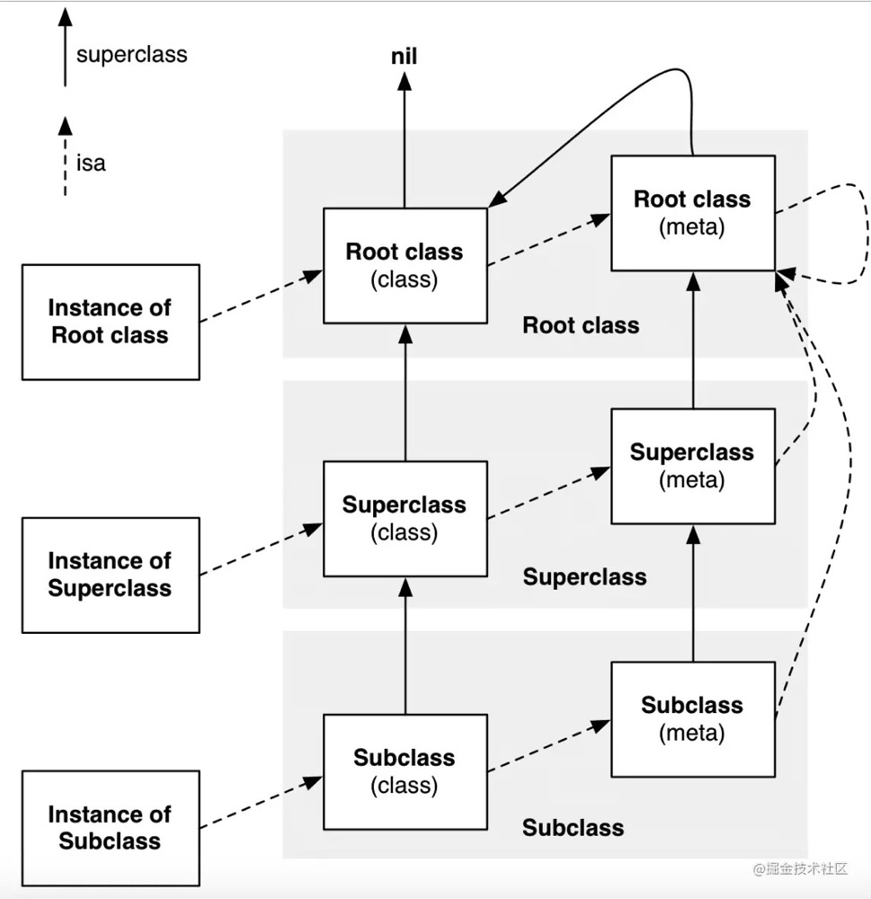
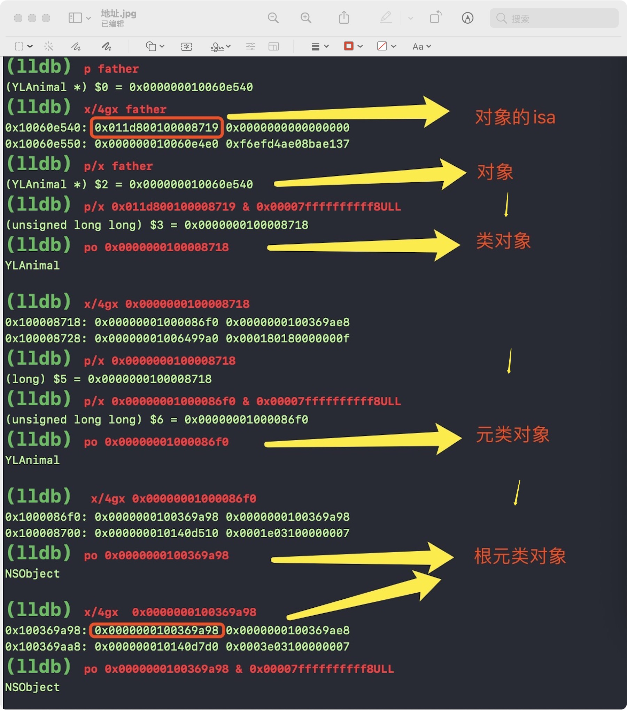
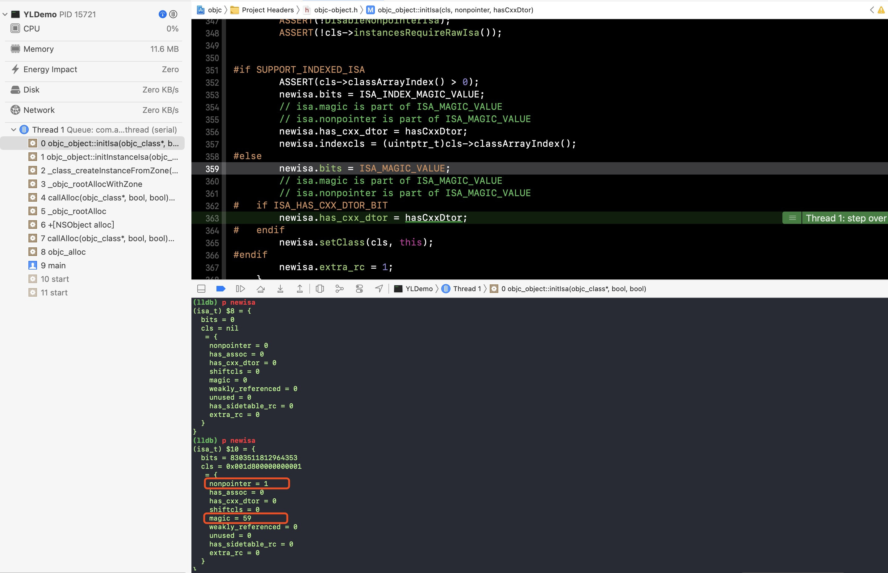
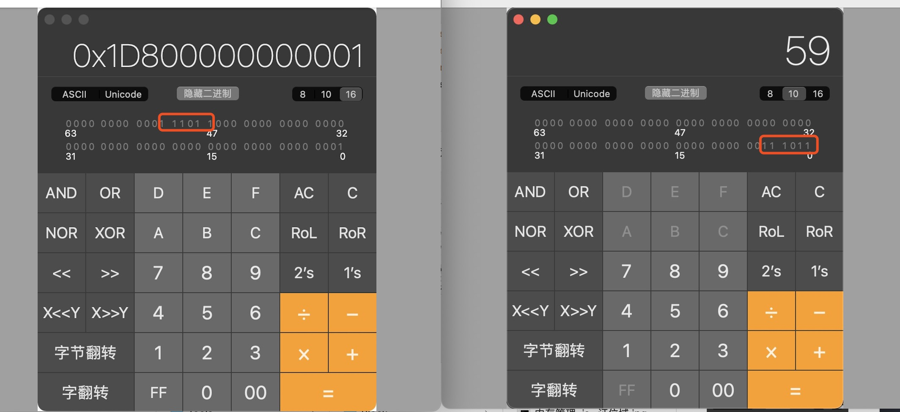
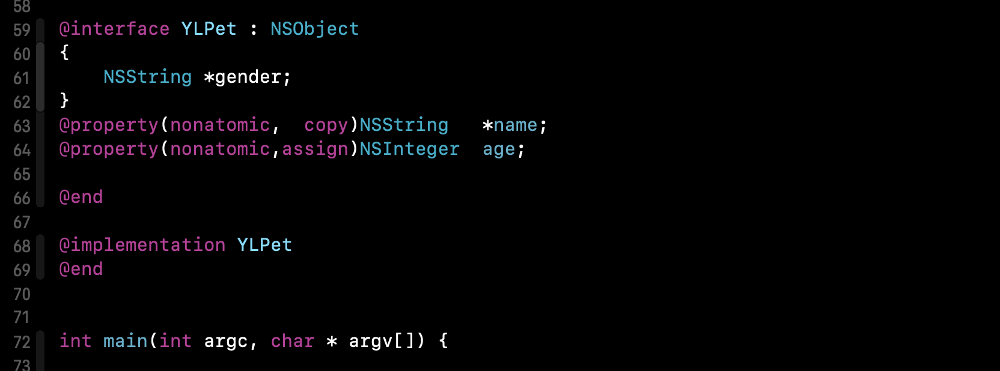
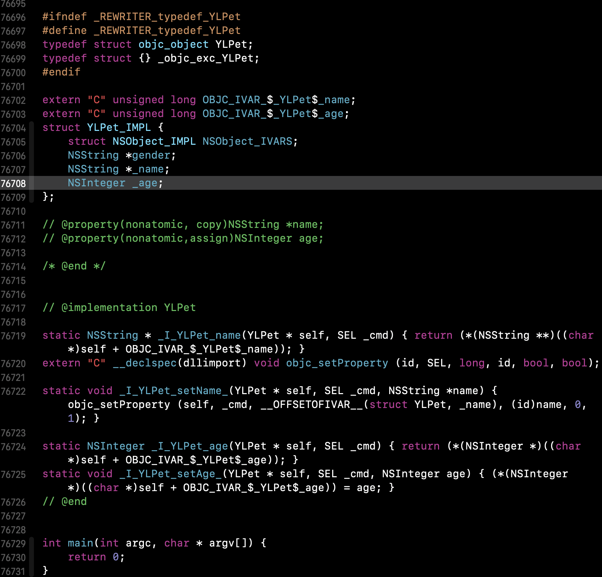
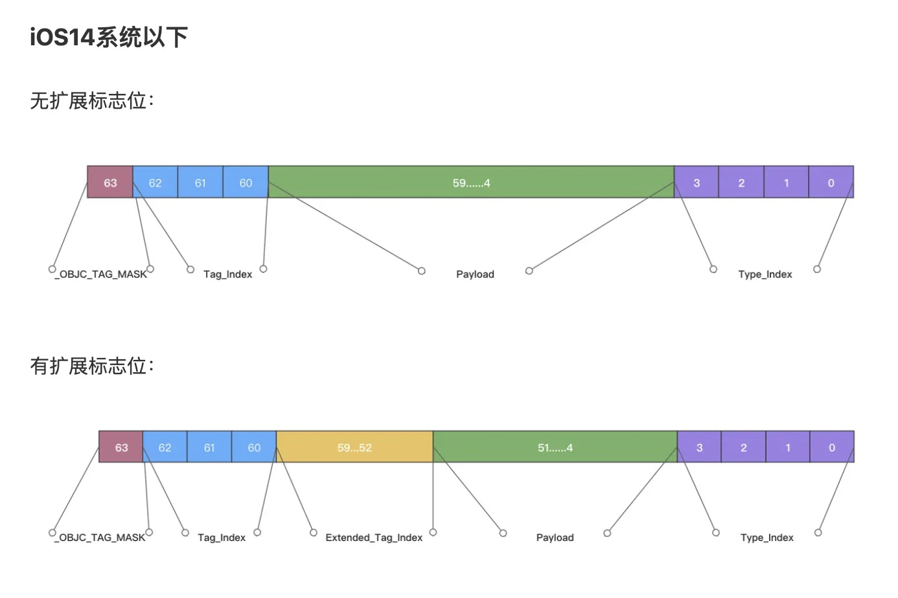
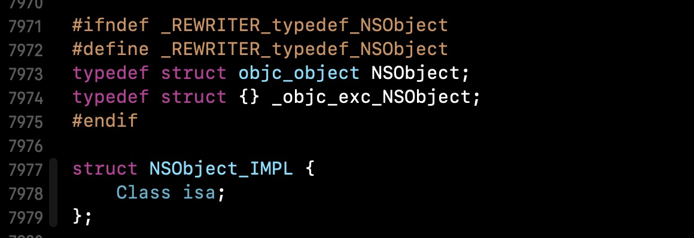
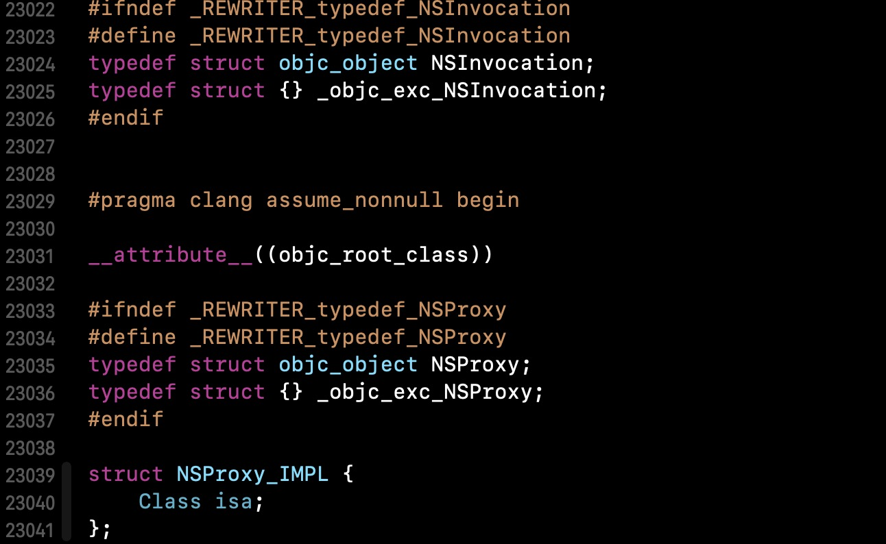

# 前言

##  Clang使用

####  借助clang命令将上层OC代码还原成 `C++`代码

> 打开**终端**， cd 到指定的OC文件所在目录下，键入指令
>
> ```shell
> clang -rewrite-objc 对应OC文件.m -o OC文件同名.cpp
> ```
>
> 也可以指定架构，键入指令
>
> ```shell
> xcrun -sdk iphoneos clang -arch arm64 -rewrite-objc 对应OC文件.m -o OC文件同名.cpp
> ```
>
> 为了更好的观察`底层`的一些`结构` 及 `实现`的逻辑,学会使用clang命令；
>
> ```shell
> clang -rewrite-objc main.m -o main.cpp 
> //UIKit报错
> clang -x objective-c -rewrite-objc -isysroot /Applications/Xcode.app/Contents/Developer/Platforms/iPhoneSimulator.platform/Developer/SDKs/iPhoneSimulator.sdk main.m
> // xcrun命令基于clang基础上进行了封装更好用
> //3、模拟器编译
> xcrun -sdk iphonesimulator clang -arch arm64 -rewrite-objc main.m -o main-arm64.cpp 
> //4、真机编译
> xcrun -sdk iphoneos clang -arch arm64 -rewrite-objc main.m -o main- arm64.cpp 
> 
> ```

#### 借助clang命令将上层OC代码还原成 汇编代码

> 打开**终端**， cd 到指定的OC文件所在目录下，键入指令
>
> ```shell
> clang -S -fobjc-arc -emit-llvm main.m -o main.ll
> ```
>
> 也可以指定架构，键入指令
>
> ```shell
> xcrun -sdk iphonesimulator clang -S -fobjc-arc -emit-llvm main.m -o main.ll	
> ```
>
> 

# 1. OC中的三种对象：

* instance对象
* class对象
* meta-class对象

## 1.1 实例对象（instance对象）

instance对象在内存中存储的信息  包括：

- isa指针

- 其他成员变量

  | 实例对象：（堆区，初始化时指向它的指针在栈区） |
  | ---------------------------------------------- |
  | isa（前8个字节）<br />成员变量值<br />…        |

## 1.2 类对象（class对象）

class对象在内存中存储的信息 主要包括：

- isa指针

- superclass指针

- 类的属性信息（Property）

- 类的成员变量信息（Ivar）

- 对象方法信息（Instance Method）

- 类的协议信息（Protocol）

  | 类对象：（全局区）                                           |
  | ------------------------------------------------------------ |
  | isa （前8个字节）<br />superClass （8个字节）<br />成员变量信息<br />属性信息<br />对象方法信息<br />协议信息<br />.... |

## 1.3 元类对象（meta-class对象）

meta-class对象在内存中存储的信息主要包括：

- isa指针

- superclass指针

- 类方法信息（Class Method）

  | 元类对象：（全局区）                                         |
  | ------------------------------------------------------------ |
  | isa （前8个字节）<br />superClass （8个字节）<br />类方法信息<br />… |

  

## 1.4 经典图isa& super走向



## 1.5 总结：

**isa指向:**

> instance对象 ---> class对象 ----> meta-class对象 ----> NSObject(Meta) ----> NSObject(Meta) 自己
>
> 🌰：person ---> YLPerson ----> YLPerson(Meta) ----> NSObject(Meta) ----> NSObject(Meta) 自己

**super指向:**

> 自定义class对象 ----> NSObject ----> nil
>
> 🌰：YLSon ----> YLPerson ----> NSObject ----> nil 

**调试指令**

> x是读取内存的命令，x/4gx中第一个x是读取内存命令，后面的g是每次读取8字节，x的意思是16进制显示结果，4表示连续打印4段

1. 打印对象内存结构，获取**ISA**指针信息：**x/4gx vc**

   0x7fd03d605730: 0x000000010bb22280 0x0000000000000000

   0x7fd03d605740: 0x0000000000000000 0x0000000000000000

2. 用 **ISA** 与 **ISA_MASK** 做“与”操作，获取类信息： po 0x000000010bb22280 & 0x007ffffffffffff8ULL（**TARGET_OS_SIMULATOR** 下的 **ISA_MASK**）



# 2. 类的结构分析

## 2.1 类的本质

类的本质是一个`objc_class`类型的结构体，`objc_class`继承于`objc_object`;

### 2.1.1 类在底层的定义:

```cpp
struct objc_class : objc_object {
    // Class ISA;
    Class superclass;
    cache_t cache;             // formerly cache pointer and vtable
    class_data_bits_t bits;    // class_rw_t * plus custom rr/alloc flags
    
    class_rw_t *data() { 
        return bits.data();
    }
    ...
}

```

> 内存占用情况：
>
> *  ISA: Class本身就是一个指针，占用8字节
> *  superclass: superclass是Class类型，所以占用8字节
> *  cache： <font color=red>`cache_t`占用16字节？？？</font>
> *  bits:

## 2.2 isa分析

### 2.2.1 isa_t结构解析

```cpp
// 支持arm64之后，之前只有一个class成员变量：
union isa_t {
    isa_t() { }
    isa_t(uintptr_t value) : bits(value) { }

    uintptr_t bits;
    Class cls;
  
};
```

**isa_t** 其实是一个联合体**union :** 一个**8**字节指针**(64**位**) = cls = bits =** 使用位域的**struct** 

联合体**(union)**是一种特殊的数据类型，允许您在相同的内存位置存储不同的数据类型。您可以定义一个带有多成员的共用体，但是任何时候只能有一个成员带有值。(如下，要么cls有值，要么bits有值；两者不可能同时有值)

> **简介：**
>
> ARM64位架构之前，`isa`是一个指针，指向`class/meta-class`对象的地址 ；
>
> ARM64位架构开始(也就是13年5s面世)，`isa`是一个联合体/共用体（`union`），这是苹果对`isa`的优化，结合位域的概念以及位运算的方式来存储更多类相关信息，简单来说就是`isa`指针通过一个叫`ISA_MASK`的值进行二进制&运算，得到真实的`class/meta-class`对象的真实地址。

### 2.2.2 isa源码&各位代表含义

```objc
// x86_64 架构
struct {
    uintptr_t nonpointer        : 1;  // 0:代表普通指针，1:代表被优化过，使用位域存储更多信息
    uintptr_t has_assoc         : 1;  // 对象是否含有或曾经含有关联引用
    uintptr_t has_cxx_dtor      : 1;  // 表示是否有C++析构函数或OC的dealloc
    uintptr_t shiftcls          : 44; // 存放着 Class、Meta-Class 对象的内存地址信息
    uintptr_t magic             : 6;  // 用于在调试时分辨对象是否未完成初始化
    uintptr_t weakly_referenced : 1;  // 是否被弱引用指向
    uintptr_t deallocating      : 1;  // 对象是否正在释放
    uintptr_t has_sidetable_rc  : 1;  // 是否需要使用 sidetable 来存储引用计数
    uintptr_t extra_rc          : 8;  // 引用计数能够用 8 个二进制位存储时，直接存储在这里
};

// arm64 架构
struct {
    uintptr_t nonpointer        : 1;  // 0:代表普通指针，1:代表被优化过，使用位域存储更多信息
    uintptr_t has_assoc         : 1;  // 对象是否含有或曾经含有关联引用
    uintptr_t has_cxx_dtor      : 1;  // 表示是否有C++析构函数或OC的dealloc
    uintptr_t shiftcls          : 33; // 存放着 Class、Meta-Class 对象的内存地址信息
    uintptr_t magic             : 6;  // 用于在调试时分辨对象是否未完成初始化
    uintptr_t weakly_referenced : 1;  // 是否被弱引用指向
    uintptr_t deallocating      : 1;  // 对象是否正在释放
    uintptr_t has_sidetable_rc  : 1;  // 是否需要使用 sidetable 来存储引用计数
    uintptr_t extra_rc          : 19;  // 引用计数能够用 19 个二进制位存储时，直接存储在这里
};
```

注： 在 64 位环境下，优化的 isa 指针并不是就一定会存储引用计数，毕竟用 19bit （iOS 系统）保存引用计数不一定够。需要注意的是这 19 位保存的是引用计数的值减一。has_sidetable_rc 的值如果为 1，那么引用计数会存储在一个叫 SideTable 的类的属性中。（源码实现：如果是优化过的isa，extra_rc+1就是引用计数，如果有SideTable，就从SideTable拿到引用计数，从SideTable拿到的引用计数加上extra_rc+1就是总的引用计数。）

#### 2.2.2.1 几个比较重要的字段

* nonpointer （标记是否开启指针优化）

  > - 0，代表普通的指针，存储着`Class`、`Meta-Class`对象的内存地址 ---- （**<font color=red>未开启isa优化</font>** ）
  >
  >   如果nonpointer为0，代表raw isa，也就是没有结构体的部分，访问对象的 isa 会直接返回一个指向 cls 的指针，也就是在 iPhone 迁移到 64 位系统之前时 isa 的类型。
  >
  > - 1，代表优化过，使用位域存储更多的信息 -----（<font color=red>**开启isa优化**</font> ）

* has_sidetable_rc (标记是否使用SideTable存储引用计数)

  > * 0，那么引用计数会存储在`extra_rc`中,`extra_rc）就是总的引用计数。（<font color=red>开启指针优化 && extra_rc字段移未溢出的情况下</font>）
  > * 1 ，引用计数会存储在一个叫 SideTable 的类的RefcountMap属性中; 从SideTable拿到的引用计数加上`extra_rc`+`1`就是总的引用计数。（<font color=red> 1.未开启指针优化 ; 2.开启指针优化 &&  extra_rc字段移溢出的情况下</font>）

* extra_rc (开启指针优化的对象，存放其引用计数)

  > <font color='red'>注意：objc4-818版本之后extra_rc 值就是有效引用计数值不加1；alloc 初始化时`extra_rc`==1；,之前是在rootRetainCount里+1</font>

* shiftcls (存放着 Class、Meta-Class 对象的内存地址信息)

  > `isa`&`ISA_MASK` : 结果显示`高17位`是`0`，`低3位`是`0`，中间的`44位`是`1`，用来显示`isa`中的`shiftcls`。`ISA_MASK` 就像一个面具把露出来的显示，其它的全部抹掉。

### 2.2.3 isa实例化方式

> 由isa源码得知，isa_t提供了两个成员，`cls`  和 ` bits`，由联合体的定义所知，这两个成员是**互斥**的，也就意味着，当初始化isa指针时，有两种初始化方式
>
> - 通过`cls`初始化，`bits`无默认值
> - 通过`bits`初始化，`cls` 有默认值

### 2.2.4 验证isa_t位域

方法：使用objc源码构建可编译工程，然后在main中的`[YLPerson alloc]` (注：YLPerson未开启`+load`方法)断点 --> `initInstanceIsa` --> `initIsa` --> 走到`else`中的 `isa`初始化;

```objective-c
// isa初始化底层代码
inline void 
objc_object::initIsa(Class cls, bool nonpointer, UNUSED_WITHOUT_INDEXED_ISA_AND_DTOR_BIT bool hasCxxDtor)
{ 
    ASSERT(!isTaggedPointer()); 
    
    isa_t newisa(0);

    if (!nonpointer) { // 通过cls初始化，不设置bits默认值
        newisa.setClass(cls, this);
    } else {
        ASSERT(!DisableNonpointerIsa);
        ASSERT(!cls->instancesRequireRawIsa());
      
#if SUPPORT_INDEXED_ISA
        ASSERT(cls->classArrayIndex() > 0);
        newisa.bits = ISA_INDEX_MAGIC_VALUE;
        // isa.magic is part of ISA_MAGIC_VALUE
        // isa.nonpointer is part of ISA_MAGIC_VALUE
        newisa.has_cxx_dtor = hasCxxDtor;
        newisa.indexcls = (uintptr_t)cls->classArrayIndex();
#else
        newisa.bits = ISA_MAGIC_VALUE; 
        // isa.magic is part of ISA_MAGIC_VALUE
        // isa.nonpointer is part of ISA_MAGIC_VALUE
#   if ISA_HAS_CXX_DTOR_BIT
        newisa.has_cxx_dtor = hasCxxDtor;
#   endif
        newisa.setClass(cls, this); // 通过bits初始化，设置cls默认值
#endif
        newisa.extra_rc = 1;
    }

    // This write must be performed in a single store in some cases
    // (for example when realizing a class because other threads
    // may simultaneously try to use the class).
    // fixme use atomics here to guarantee single-store and to
    // guarantee memory order w.r.t. the class index table
    // ...but not too atomic because we don't want to hurt instantiation
    isa = newisa;
}

```

通过bits初始化前后对比：



其中`magic`是`59`是由于将`isa`指针地址转换为`二进制`，从`47`（因为前面有4个位域，共占用47位，地址是从0开始）位开始读取`6`位，再转换为`十进制`，如下图所示



### 2.2.5 isa 与 类 的关联

`cls` 与 `isa` 关联`原理`就是`isa`指针中的`shiftcls`位域中存储了`类信息`，其中`initInstanceIsa`的过程是将 `calloc` 指针 和当前的 `类cls` 关联起来，有以下几种验证方式：

- 【方式一】通过以上`initIsa`方法中的`newisa.shiftcls = (uintptr_t)cls >> 3;`验证
- 【方式二】通过`isa指针地址`与`ISA_MSAK` 的值 `&` 来验证
- 【方式三】通过runtime的方法`object_getClass`验证
- 【方式四】通过`位运算`验证

参考：链接：https://juejin.cn/post/6949580932479189029


## 2.3 chceh_t分析

### 2.3.1 chceh_t底层源码

objc790,：

```cpp
struct cache_t {
    struct bucket_t  * _buckets;  //  散列表, 是一个数组, 数组里面的每一个元素就是一个bucket_t, bucket_t里面存放着 SEL 和一个IMP。IMP是一个函数指针，指向了一个方法的具体实现。
    mask_t _mask;         //  _mask是指掩码数据，用于在哈希算法或者哈希冲突算法中计算哈希下标，其中mask 等于capacity - 1
    mask_t _occupied;  // 表示哈希表中 sel-imp 的占用大小 (即可以理解为分配的内存中已经存储了sel-imp的的个数)
}

```

objc818，：

```cpp
struct cache_t {
private:
    explicit_atomic<uintptr_t> _bucketsAndMaybeMask;            // 8
    union {
        struct {
            explicit_atomic<mask_t>    _maybeMask;              // 4 
#if __LP64__
            uint16_t                   _flags;                  // 2
#endif
            uint16_t                   _occupied;               // 2
        };
        explicit_atomic<preopt_cache_t *> _originalPreoptCache; // 8
    };
}
```

#### **bucket_t结构**

bucket_t 中sel，imp的顺序对应在不同平台先后顺序不一样；

```


### 3.3.2 cache_t 的 insert 操作主要分为以下几步：

> - 【第一步】计算出当前的缓存占用量
>
> ​    根据occupied的值计算出当前的缓存占用量，关于缓存占用量的计算，有以下几点说明：
>
> - - alloc申请空间时，此时的对象已经创建，如果再调用init方法，occupied也会+1
>   - 当有属性赋值时，会隐式调用set方法，occupied也会增加，即有几个属性赋值，occupied就会在原有的基础上加几个
>   - 当有方法调用时，occupied也会增加，即有几次调用，occupied就会在原有的基础上加几个
>
> - 【第二步】根据 缓存占用量 判断执行的操作
>
> - - 如果是第一次创建，则默认开辟4个
>   - 如果缓存占用量小于等于3/4（newOccupied + CACHE_END_MARKER <=  capacity * 3 / 4），则不作任何处理
>   - 如果缓存占用量超过3/4，则需要进行两倍扩容以及调用 **realloc**方法 重新开辟空间
>
> - 【第三步】针对需要存储的bucket进行内部imp和sel赋值
>
> ​    这部分主要是根据cache_hash方法，即哈希算法 ，计算sel-imp存储的哈希下标，分为以下三种情况：
>
> - - 如果哈希下标的位置未存储sel，即该下标位置获取sel等于0，此时将sel-imp存储进去，并将occupied占用大小加1
>   - 如果当前哈希下标存储的sel 等于 即将插入的sel，则直接返回
>   - 如果当前哈希下标存储的sel 不等于 即将插入的sel，则重新经过cache_next方法 即哈希冲突算法，重新进行哈希计算，得到新的下标，再去对比进行存储

### 3.3.3 面试题

> _mask是什么？
>
> 答： _mask是指掩码数据，用于在哈希算法或者哈希冲突算法中计算哈希下标，其中mask 等于capacity - 1。
>
> 
>
> occupied 是什么？
>
> 答：_occupied表示哈希表中 sel-imp 的占用大小 (即可以理解为分配的内存中已经存储了sel-imp的的个数)，
>
> > * init会导致occupied变化
> > * 属性赋值，也会隐式调用，导致occupied变化
> > * 方法调用，导致occupied变化
>
> 为什么随着方法调用的增多，其打印的occupied 和 mask会变化？
>
> 答： 因为在cache初始化时，分配的空间是4个，随着方法调用的增多，当存储的sel-imp个数，即newOccupied + CACHE_END_MARKER（等于1）的和 超过 总容量的3/4时，例如总容量为4，当occupied 等于2时，就需要对cache的内存进行两倍扩容。

参考：

https://juejin.cn/post/6976938077822386190#heading-3

https://juejin.cn/post/6978501444911497247#heading-1

- 

## 3.4 TODO： class_data_bits_t分析（理解了runtime方法加载过程再来补充）

### 3.4.3  ivar解析

#### 3.4.3.1 **ivarLayout** 与 **weakIvarLayout** 规则解析

ivarLayout 和 weakIvarLayout 分别记录了哪些 ivar 是 strong 或是 weak，都未记录的就是基本类型和 __unsafe_unretained 的对象类型。

具体记录规则：

- 首先由于 ivarLayout 与 weakIvarLayout 都是 uint8_t 类型，在 16 进制下是两位，所以编码的值每两位一对儿
- ivarLayout：数据可拆解为 每两位为一组，一组中第一位表示连续的 非Strong修饰的数量，第二位为 Strong 修饰的数量，最后两位 **00** 为结束符，就像 cstring 的 **\0** 一样
- weakIvarLayout：数据可拆解为 每两位为一组，一组中第一位表示连续的 非Weak修饰的数量，第二位为 Weak 修饰的数量，最后两位 **00** 为结束符，就像 cstring 的 **\0** 一样


🌰代码 1：

​```objc
@interface Foo : NSObject {
  __strong id ivar0;
  __weak id ivar1;
  __weak id ivar2;
}
@end
```

则储存 strong ivar 的 ivarLayout 的值为 **0x012000**

储存 weak ivar 的 weakIvarLayout 的值为 **0x1200**


🌰代码 2：

```objc
@interface Bar : NSObject {
  __weak id ivar0;
  __strong id ivar1;
  __unsafe_unretained id ivar2;
  __weak id ivar3;
  __strong id ivar4;
}
@end
```

则储存 strong ivar 的 ivarLayout 的值为 **0x112100**

储存 weak ivar 的 weakIvarLayout 的值为 **0x01211000**

## 2.4  类、分类的加载过程

#### 2.4.1 分类如何关联对象

关联对象在内存中的存储形式


> 问题：
>
> 为什么分类中不能创建属性Property（runtime除外）？
>
> - 分类的实现原理是将category中的方法，属性，协议数据放在category_t结构体中，然后将结构体内的方法列表拷贝到类对象的方法列表中。 Category可以添加属性，但是并不会自动生成成员变量及set/get方法。因为category_t结构体中并不存在成员变量。通过之前对对象的分析我们知道成员变量是存放在实例对象中的，并且编译的那一刻就已经决定好了。而分类是在运行时才去加载的。那么我们就无法再程序运行时将分类的成员变量中添加到实例对象的结构体中。因此分类中不可以添加成员变量。
> - 在往深一点的回答就是 类在内存中的位置是编译时期决定的， 之后再修改代码也不会改变内存中的位置，class_ro_t 的属性在运行期间就不能再改变了， 再添加方法是会修改class_rw_t 的methods 而不是class_ro_t 中的 baseMethods
>
> ##### 引伸：关联对象的原理？
>
> - 关联对象并不是存储在关联对象本身内存中，而是存储在全局统一的一个容器中；
> - 由 AssociationsManager 管理并在它维护的一个单例 Hash 表 AssociationsHashMap 中存储；
> - 使用 AssociationsManagerLock 自旋锁保证了线程安全
>
> ##### 引伸：分类可以添加那些内容？
>
> - 实例方法，类方法，协议，属性
>
> ##### 引伸：Category 的实现原理？
>
> - Category 在刚刚编译完成的时候， 和原来的类是分开的，只有在程序运行起来的时候， 通过runtime合并在一起。
>
> ##### 引申 使用runtime Associate方法关联的对象，需要在主对象dealloc的时候释放么？
>
> - 不需要，被关联的对象的生命周期内要比对象本身释放晚很多， 它们会在被 NSObject -dealloc 调用的 object_dispose() 方法中释放。
>
> ##### 引申 能否向编译后得到的类中增加实例变量， 能否向运行时创建的类中添加实力变量？
>
> - 不能再编译后得到的类中增加实例变量。因为编译后的类已经注册在runtime中， 类结构体中objc_ivar_list 实例变量的链表和objc_ivar_list 实例变量的内存大小已经确定，所以不能向存在的类中添加实例变量
> - 能在运行时创建的类中添加实力变量。调用class_addIvar 函数
>
> ##### 引申 主类执行了foo方法，分类也执行了foo方法，在执行的地方执行了foo方法，主类的foo会被覆盖么？    如果想只想执行主类的foo方法，如何去做？
>
> - 主类的方法被分类的foo覆盖了，其实分类并没有覆盖主类的foo方法，只是分类的方法排在方法列表前面，主类的方法列表被挤到了后面， 调用的时候会首先找到第一次出现的方法。
> - 如果想要只是执行主类的方法，可逆序遍历方法列表，第一次遍历到的foo方法就是主类的方法
>
> ```objective-c
> - (void)foo{   
>   [类 invokeOriginalMethod:self selector:_cmd];
> }
> 
> + (void)invokeOriginalMethod:(id)target selector:(SEL)selector {
>     uint count;
>     Method *list = class_copyMethodList([target class], &count);
>     for ( int i = count - 1 ; i >= 0; i--) {
>         Method method = list[i];
>         SEL name = method_getName(method);
>         IMP imp = method_getImplementation(method);
>         if (name == selector) {
>             ((void (*)(id, SEL))imp)(target, name);
>             break;
>         }
>     }
>     free(list);
> }
> ```
>


## 2.5 weak的实现原理

**weak 的实现原理可以概括一下三步：**

1、初始化时: 初始化一个新的weak指针指向对象。

2、存储引用时：调用 objc_storeWeak() 函数，将weak指针的地址存到SideTable下weak_tabel中。

3、释放时，在弱引用对象释放时，**clearDeallocating**中将weak指针置为nil；

调用clearDeallocating函数。首先根据对象地址获取所有weak指针地址的数组，然后遍历这个数组把其中的数据设为nil，最后把这个entry从weak表中删除，最后清理对象的记录。

## 2.6 消息转发机制

# 3. 对象的结构分析

## 3.1 对象的本质





结合源码分析：

YLPet的底层实现是一个struct。其内容为YLPet_IMPL ：

* NSObject_IVARS： // 继承自 `NSObject` 的`isa`;NSObject 底层只有一个”isa“变量，所以继承来的只有这一个变量
* gender：成员变量ivar
* _name：属性name，自动添加  "__"生成对应的成员变量
* _age：属性age，自动添加  "__"生成对应的成员变量

```cpp
struct objc_object {
  isa_t isa;
  ...
}

union isa_t {
    uintptr_t bits;
private:
    // Accessing the class requires custom ptrauth operations, so
    // force clients to go through setClass/getClass by making this
    // private.
    Class cls;
...
}
```

对象的本质是一个`objc_object`类型的结构体，其内部只有一个isa指针。

## 3.2 Tagged Pointer对象（特例）

### 3.2.1 为什么要使用taggedPointer?

> 假设要存储一个NSNumber对象，其值是一个整数。正常情况下，如果这个整数只是一个NSInteger的普通变量，在64位CPU下是占8个字节的。1个字节有8位，如果我们存储一个很小的值，会出现很多位都是0的情况，这样就造成了内存浪费，苹果为了解决这个问题，引入了taggedPointer的概念。
>
> 以NSNumber为例，对象占用内存空间情况：
>
> arm64之前：指针（8个字节）+ NSNumber对象（16个字节 内存对齐）
>
> arm64之后：TaggedPointer指针（只占8字节）

- **Tagged Pointer**是苹果为了解决32位CPU到64位CPU的转变带来的内存占用和效率问题，针对**NSNumber、NSDate**以及部分**NSString**的内存优化方案。
- **Tagged Pointer指针**的值不再是地址了，而是真正的值。所以，实际上它**不再是一个对象**了，它只是一个披着对象皮的普通变量而已。所以，它的**内存并不存储在堆中（而是在栈上），也**不需要malloc和free**。
- **Tagged Pointer指针**中包含了当前对象的地址、类型、具体数值。因此Tagged Pointer指针在内存读取上有着3倍的效率，创建时比普通需要**malloc**跟**free**的类型**快106倍**。

### 3.2.2 内存结构




注意：与macOS不同，iOS系统采用 `MSB`（`Most Significant Bit`，即最高有效位）为`Tagged Pointer`标志位。

### 3.2.3 各bit含义解释

* _OBJC_TAG_MASK: 占1bit，是`Tagged Pointer`标志位，1意味着该地址是`Tagged Pointer`，0则不是。

* Extended_Tag_Index：占8bit，只有当Tag_Index=7的时候才存在，表示这是一个用于扩展的标志位，会额外占用8位来存储扩展的Tag Index。类标识的基本类型和扩展类型我们可以在`Runtime`源码中的`objc_tag_index_t`查到：

  

* Tag_Index：占3bit，是类标志位，可以在`Runtime`源码中查看`NSNumber`、`NSDate`、`NSString`等类的标志位。

* Payload：对NSNumber而言，最多占56bit，最少占48bit（取决于Tag Index是否为extended tag index），存储具体的数值。

* Type_Index: 占4bit，代表NSNumber具体的数据类型，具体的对应关系：

  | Type_Index | 对应数据类型                                                 |
  | ---------- | ------------------------------------------------------------ |
  | 0          | char                                                         |
  | 1          | usigned char, short                                          |
  | 2          | unsigned short,int                                           |
  | 3          | unsigned int,NSInteger,NSUInteger,long,unsigned long,long long,unsigned long long |
  | 4          | float                                                        |
  | 5          | double                                                       |

  结论：`Tagged Pointer`可表示的数字范围是-2^55+1 ~ 2^55-1，对于超出这个范围的数字，NSNumber会自动转换为普通的内存分配在堆上的OC对象。


### 3.2.4 如何判断指针是否为Tagged Pointer

在 [objc runtime](https://link.juejin.cn?target=https%3A%2F%2Fgithub.com%2FKanthine%2FSourceCode%2Fblob%2F51fd88340a1d76047dcb8bb02e47f14482d00706%2Fobjc4-750%2Fruntime%2Fobjc-internal.h)源码中找到了 _objc_isTaggedPointer()的实现：

```cpp
    static inline bool _objc_isTaggedPointer(const void * _Nullable ptr){
        //将一个指针地址和 _OBJC_TAG_MASK 常量做 & 运算：判断该指针的最高位或者最低位为 1，那么这个指针就是 Tagged Pointer。
        return ((uintptr_t)ptr & _OBJC_TAG_MASK) == _OBJC_TAG_MASK;
    }
```

`_OBJC_TAG_MASK` 的定义：

```cpp
#if OBJC_MSB_TAGGED_POINTERS //MSB 高位优先
#   define _OBJC_TAG_MASK (1UL<<63) //Tagged Pointer 指针
#else //LSB 低位优先
#   define _OBJC_TAG_MASK 1UL //Tagged Pointer 指针
#endif
```

因此` ptr & _OBJC_TAG_MASK` 按位与运算之后如果判断标志位为1则该指针是Tagged Pointer 。

### 3.2.5 TaggedPointer混淆原理：

混淆原理：使用一个随机数`objc_debug_taggedpointer_obfuscator`对真正的内存地址异或操作。根据异或运算的特性，a^b^b=a，因此只需要将混淆后的地址再与`objc_debug_taggedpointer_obfuscator`异或一次就能够完成反混淆。

### 3.2.6 **附**：Tagged Pointer 针对 **obj_msg_send** 的处理

​	•	对于内置Tagged Pointer类型的对象来说，其中的高四位保存的是一个索引值，通过这个索引值可以在objc_debug_taggedpointer_classes数组中查找到对象所属的Class对象；

​	•	对于自定义扩展Tagged Pointer类型的对象来说，其中的高52位到59位这8位bit保存的是一个索引值，通过这个索引值可以在objc_debug_taggedpointer_ext_classes数组中查找到对象所属的Class对象。


## 3.3 非TaggedPointer对象

对象是否不启用Non-pointer目前有这么几个判断条件，这些都可以在runtime源码objc-runtime-new.m中找到逻辑。

> 1：包含swift代码；
> 2：sdk版本低于10.11；
> 3：runtime读取image时发现这个image包含__objc_rawisa段；
> 4：开发者自己添加了OBJC_DISABLE_NONPOINTER_ISA=YES到环境变量中；
> 5：某些不能使用Non-pointer的类，GCD等；
> 6：父类关闭。

我们自己新建一个Person类，通过OBJC_DISABLE_NONPOINTER_ISA=YES/NO来看看isa结构体的具体内容:

### 3.3.1 non-poniter：0 对象

```cpp
isa_t isa = {
    Class class = Person;
    uintptr_t bits = 4294976320;
    struct {
        uintptr_t nonpointer = 0;
        uintptr_t has_assoc  = 0;
        uintptr_t has_cxx_dtor = 0;
        uintptr_t shiftcls = 536872040; 
        uintptr_t magic = 0;
        uintptr_t weakly_referenced = 0;
        uintptr_t deallocating = 0;
        uintptr_t has_sidetable_rc = 0;
        uintptr_t extra_rc = 0;
    }
}
其实可以简化为
isa_t isa = {
    Class class = Person;
}
因为源码中显示不使用Non-pointer则只对isa的class赋值了，其他的都是默认值，而且除了class其他成员也不会在源码中被使用到。
```

### 3.3.2 non-poniter：1 对象

```cpp
isa_t isa = {
    Class class = Person;
    uintptr_t bits = 8303516107940673;
    struct {
        uintptr_t nonpointer = 1;
        uintptr_t has_assoc  = 0;
        uintptr_t has_cxx_dtor = 0;
        uintptr_t shiftcls = 536872040; 
        uintptr_t magic = 59;
        uintptr_t weakly_referenced = 0;
        uintptr_t deallocating = 0;
        uintptr_t has_sidetable_rc = 0;
        uintptr_t extra_rc = 1;
    }
}
extra_rc就是存的引用计数，nonpointer = 1表示启用Non-pointer。
```

# 4. alloc源码探索

## 4.1 alloc调用堆栈：

`+ alloc` ----> `_objc_rootAlloc` ---> `callAlloc(cls, false/*checkNil*/, true/*allocWithZone*/);` ----> `_objc_rootAllocWithZone` ---> `_class_createInstanceFromZone`；


核心代码`_class_createInstanceFromZone`方法内部实现：

```cpp
static ALWAYS_INLINE id
_class_createInstanceFromZone(Class cls, size_t extraBytes, void *zone,
                              int construct_flags = OBJECT_CONSTRUCT_NONE,
                              bool cxxConstruct = true,
                              size_t *outAllocatedSize = nil)// alloc 源码 第五步
{
    ASSERT(cls->isRealized()); //检查是否已经实现

    // Read class's info bits all at once for performance
    //一次性读取类的位信息以提高性能
    bool hasCxxCtor = cxxConstruct && cls->hasCxxCtor();
    bool hasCxxDtor = cls->hasCxxDtor();
    bool fast = cls->canAllocNonpointer();
    size_t size;

    //计算需要开辟的内存大小，传入的extraBytes 为 0
    size = cls->instanceSize(extraBytes);
    if (outAllocatedSize) *outAllocatedSize = size;

    id obj;
    if (zone) {
        obj = (id)malloc_zone_calloc((malloc_zone_t *)zone, 1, size);
    } else {
        //申请内存
        obj = (id)calloc(1, size);
    }
    if (slowpath(!obj)) {
        if (construct_flags & OBJECT_CONSTRUCT_CALL_BADALLOC) {
            return _objc_callBadAllocHandler(cls);
        }
        return nil;
    }

    if (!zone && fast) {
        //将 cls类 与 obj指针（即isa） 关联
        obj->initInstanceIsa(cls, hasCxxDtor);
    } else {
        // Use raw pointer isa on the assumption that they might be
        // doing something weird with the zone or RR.
        obj->initIsa(cls);
    }

    if (fastpath(!hasCxxCtor)) {
        return obj;
    }

    construct_flags |= OBJECT_CONSTRUCT_FREE_ONFAILURE;
    return object_cxxConstructFromClass(obj, cls, construct_flags);
}

```

## 4.2 核心三步：

* 计算instancesize （**这里有一个16字节对齐**）

  > ```cpp
  >  size = cls->instanceSize(extraBytes);
  > ```
  >
  > 为什么需要16字节对齐?
  >
  > ​        需要字节对齐的原因，有以下几点：
  >
  > - 通常内存是由一个个字节组成的，cpu在存取数据时，并不是以字节为单位存储，而是以`块`为单位存取，块的大小为内存存取力度。频繁存取字节未对齐的数据，会极大降低cpu的性能，所以可以通过`减少存取次数`来`降低cpu的开销`
  > - 16字节对齐，是由于在一个对象中，第一个属性`isa`占`8`字节，当然一个对象肯定还有其他属性，当无属性时，会预留8字节，即16字节对齐，如果不预留，相当于这个对象的isa和其他对象的isa紧挨着，容易造成访问混乱
  > - 16字节对齐后，可以`加快CPU读取速度`，同时使`访问更安全`，不会产生访问混乱的情况

* 开辟空间大小，返回对象地址

  > 通过`instanceSize`计算的内存大小，向内存中申请 大小 为 size的内存，并赋值给obj，因此 obj是指向内存地址的指针
  >
  > ```cpp
  > obj = (id)calloc(1, size);
  > ```

* 类与isa关联

  > ```cpp
  > obj->initInstanceIsa(cls, hasCxxDtor);
  > ```
  >
  > _class_createInstanceFromZone 内部:  
  >
  > `obj->initInstanceIsa(cls, hasCxxDtor);` --->   `initIsa(cls, true, hasCxxDtor); `  -->   ` newisa.setClass(cls, this);`

# 5. 关于NSProxy与NSObject





### 5.1 NSProxy的用法

NSProxy实现了包括NSObject协议在内基类所需的基础方法，但是作为一个抽象的基类并没有提供初始化的方法。它接收到任何自己没有定义的方法他都会产生一个异常，所以一个实际的子类必须提供一个初始化方法或者创建方法，并且重载`forwardInvocation:`方法和`methodSignatureForSelector:`方法来处理自己没有实现的消息。这也是NSProxy的主要功能，负责把消息转发给真正的target的代理类，NSProxy正是代理的意思。

1. 解决NSTimer/CADisplayLink的循环引用问题

2. 模拟多继承


###5.2  NSProxy和NSObject的区别

虽然NSProxy和class NSObject都定义了`-forwardInvocation:`和`-methodSignatureForSelector:`，但这两个方法并没有在protocol NSObject中声明；两者对这俩方法的调用逻辑更是完全不同。

对于class NSObject而言，接收到消息后先去自身的方法列表里找匹配的selector，如果找不到，会沿着继承体系去superclass的方法列表找；如果还找不到，先后会经过`+resolveInstanceMethod:`和`-forwardingTargetForSelector:`处理，处理失败后，才会到`-methodSignatureForSelector:`/`-forwardInvocation:`进行最后的挣扎.

但对于NSProxy，接收unknown selector后，直接回调`-methodSignatureForSelector:`/`-forwardInvocation:`，消息转发过程比class NSObject要简单得多。

相对于class NSObject，NSProxy的另外一个非常重要的不同点也值得注意：NSProxy会将自省相关的selector直接forward到`-forwardInvocation:`回调中，这些自省方法包括：

```objc
- (BOOL)isKindOfClass:(Class)aClass;
- (BOOL)isMemberOfClass:(Class)aClass;
- (BOOL)conformsToProtocol:(Protocol *)aProtocol;
- (BOOL)respondsToSelector:(SEL)aSelector;
```

简单来说，这4个selector的实际接收者realObject，而不是NSProxy对象本身。但另一方面，NSProxy并没有将performSelector系列selector也forward到`-forwardInvocation:`，换句话说，`[proxy performSelector:someSelector]`的真正处理者仍然是proxy自身，只是后续会将someSelector给forward到`-forwardInvocation`:回调，然后经由realObject处理。

# 6. 面试题

#### 什么是类？什么是对象？

答：在面向对象中，我们使用<font color="red">**类**</font>来描述<font color="red">**具有特定属性和行为的一类事物**</font>，它是一个模板；而对象是模板的一个具象实体。

#### NSObject对象的本质是什么？

答：本质是一个objc_object的结构体，其成员变量只有一个isa指针；

#### objc_object 与 对象的关系

答：**OC中所有继承自`NSObject`类生成的对象，都是`struct objc_object`类型**。

**OC中所有继承自`NSObject`的类生成的对象，都具有Class类型的`isa`成员**

> ```cpp
> /// Object.mm line 34
> typedef struct objc_object *id;
> ```
>
> 从这里我们可以知道，**`id`是一个指向`struct objc_object`的指针类型；**
>
> OC中所有继承自`NSObject`类生成的对象，都是`struct objc_object`类型**。**
>
> OC中所有继承自`NSObject`的类生成的对象，都具有Class类型的`isa`成员**
>
> 那么`Class`又是什么东西？其实在查看`id`类型的原始声明时，就看到了下面这句：
>
> ```cpp
> /// Object.mm line 33
> typedef struct objc_class *Class;
> ```
>
> 原来`Class`就是一个指向`struct objc_class`的指针类型。所以我们平时定义的`类`也就是以`struct objc_class`作为支撑。再瞅瞅`objc_class`结构体：
>
> ```cpp
> /// objc-runtime-new.h line 1145
> struct objc_class : objc_object {
>  // Class ISA;
>  Class superclass;
>  cache_t cache;             // formerly cache pointer and vtable
>  class_data_bits_t bits;    // class_rw_t * plus custom rr/alloc flags
>  
>  class_rw_t *data() const {
>      return bits.data();
>  }
>  ...
> } 
> 
> ```
>
> 这里是一个`C++`定义的结构体，可以继承以及定义方法。根据这个实现，我们可以知道：
>
> 1. `Class`也是对象，因为它继承自`objc_object`。
> 2. `Class`也有`isa`成员，继承自`objc_object`，这点很重要，在方法的调用过程时会用到。`
> 3. 除了`isa`，该结构体还包含了父类指针`superclass`，和该类相关联的缓存`cache`以及该类的具体信息`bits`;

#### 类的本质

答：类的本质是一个`objc_class`类型的结构体，`objc_class`继承于`objc_object`。

#### id、instancetype、NSObject * 的区别

答：

| 类型           | 使用范围                                                     | 静态or动态                                                   |
| -------------- | ------------------------------------------------------------ | ------------------------------------------------------------ |
| id             | * 定义变量； <br />* 定义方法返回值；<br />*  定义方法参数。 | 动态类型对象；<br />编译时编译器不会检查id对象的类型，<br />只有在运行时动态检查后会报错。<br /> |
| instancetype   | * 只可作为函数返回值                                         | 动态类型 <br/>（扩大关联返回类型的方法范围，<br>不再只是cocoa定义的特定关键字开头）<br />作用：可以使那些<font color="red">**非关联返回类型**</font>的方法返回所在类的类型 |
| NSObject *     | * 定义变量； <br />* 定义方法返回值；<br />*  定义方法参数。 | 静态类型<br />编译时会进行类型检查。                         |
| id<NSObject> * |                                                              | 只要遵循<NSObject>协议的任何一种类型；                       |

> Objective-C中的动态类型和静态类型**
>
> * 动态类型
>
>   动态类型指的是对象指针类型的动态性，具体是指使用`id`修饰后将对象的类型确定推迟到运行时，由赋给它的对象类型决定对象指针的类型。也就是说`id`修饰的对象为动态类型对象，其他在编译器指明类型的为静态类型对象，通常如果不需要涉及到多态的话还是要尽量使用静态类型（原因：错误可以在编译器提前查出，可读性好）。
>
> * 静态类型
>
>   一个指针变量指向特定类的对象时，使用的是静态类型，在编译的时候就知道这个指针变量所属的类。使用静态类型时，编译器在编译期间，会做许多的类型检查：因为编译器需要知道哪个对象该如何使用。
>
> **关联返回类型和非关联返回类型**
>
> * 关联返回类型涉及的方法
>
>   * 类方法：以alloc、new 开头的
>
>   * 实例方法：以`autorelease`，`init`，`retain`或`self`开头
>
>     当这些方法返回值为`id`类型时，编译器不会返回一个类型不明的对象，会返回一个方法所在类类型的对象，这些方法就被称为是关联返回类型的方法。换句话说，这些方法的返回结果以方法所在的类为类型。
>
>     🌰：
>
>     ```objective-c
>     @interface YLAnimal : NSObject
>                               
>     + (id)newTestObject;  // 返回一个自动关联为YLAnimal类型的对象
>     + (id)allocTestObject;// 返回一个自动关联为YLAnimal类型的对象
>     + (id)testObject;// 返回一个类型不明的对象
>     @end
>     ```
>
>     
>
> * 非关联返回类型
>
>   * 非以上关键字开头的方法,返回值不关联所属类的类型，会返回一个类型不明的对象;

###