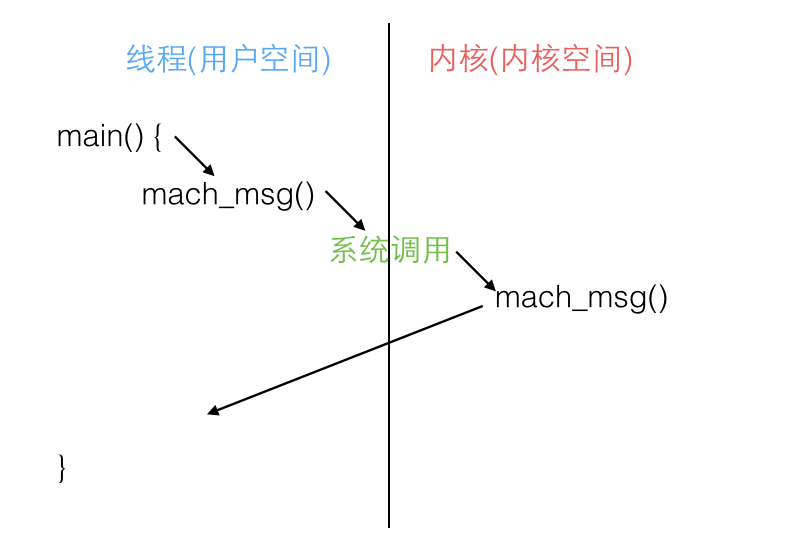

# 1. Runloop简介

## 1.1 概念

RunLoop 实际上就是一个对象，这个对象管理了其需要处理的事件和消息，并提供了一个入口函数来执行上面 Event Loop 的逻辑。线程执行了这个函数后，就会一直处于这个函数内部 “接受消息->等待->处理” 的循环中，直到这个循环结束（比如传入 quit 的消息），函数返回。

```cpp
// Event Loop：
function loop() {
    initialize();
    do {
        var message = get_next_message();
        process_message(message);
    } while (message != quit);
}

```

> A run loop is a piece of infrastructure used to manage events arriving asynchronously on a thread. A run loop works by monitoring one or more event sources for the thread. As events arrive, the system wakes up the thread and dispatches the events to the run loop, which then dispatches them to the handlers you specify. If no events are present and ready to be handled, the run loop puts the thread to sleep.
>
> 【译】一个运行循环是一个处理线程上所接收到的异步的事件的结构。运行循环管理线程上的一个或多个事件源。当事件到达时，系统将唤醒线程并将事件分配给运行循环，然后运行循环将其分配给你指定的处理程序。如果不存在任何事件或有待处理的事件，则运行循环会将线程置于睡眠状态。
>
> You are not required to use a run loop with any threads you create but doing so can provide a better experience for the user. Run loops make it possible to create long-lived threads that use a minimal amount of resources. Because a run loop puts its thread to sleep when there is nothing to do, it eliminates the need for polling, which wastes CPU cycles and prevents the processor itself from sleeping and saving power.
>
> 【译】<font color='red'>你不需要对你所创建的线程使用运行循环，但是使用运行循环可以提高用户体验。运行循环可以创建使用最少资源的常驻线程。因为当没事做的时候，运行循环会让线程休眠，这样就不许需要通过轮询这种需要消耗 CPU 的低效操作从而节能。</font>
>
> To configure a run loop, all you have to do is launch your thread, get a reference to the run loop object, install your event handlers, and tell the run loop to run. The infrastructure provided by OS X handles the configuration of the main thread’s run loop for you automatically. If you plan to create long-lived secondary threads, however, you must configure the run loop for those threads yourself.
>
> 【译】要配置运行循环，你要做的就是启动线程，获取运行循环对象的引用，安装事件处理程序，并告诉运行循环运行。 OS X 提供的基础结构会自动为你处理主线程运行循环的。但是，如果计划创建寿命长的辅助线程，则必须自己为这些线程配置运行循环。

通过上面官方文档的描述，runloop 其实和线程是紧密关联的，通过 runloop 可以让子线程一直存活而不被系统回收。同时，runloop 还能提升用户体验，可以重复的在子线程工作而无需为了执行任务多次开同样工作内容的线程。


## 1.2 RunLoop与线程的关系

线程和 RunLoop 之间是一一对应的，其关系是保存在一个全局的 Dictionary 里。

线程刚创建时并没有 RunLoop，如果你不主动获取，那它一直都不会有。RunLoop 的创建是发生在第一次获取时，RunLoop 的销毁是发生在线程结束时。你只能在一个线程的内部获取其 RunLoop（主线程除外）。

# 2. Runloop的组成结构

学习Runloop结构之前，需要预先了解一下底层系统架构；

## 2.1  OSX/iOS 的系统架构

苹果官方将整个系统大致划分为4个层次，如图：


**RunLoop 的核心是基于 mach port (Darwin层) 的，其进入休眠时调用的函数是 `mach_msg()`。**

Darwin 核心架构，如图：


其中，在硬件层上面的三个组成部分：Mach、BSD、IOKit (还包括一些上面没标注的内容)，共同组成了 XNU 内核：

- XNU 内核的内环被称作 Mach，其作为一个微内核，仅提供了诸如处理器调度、IPC (进程间通信)等非常少量的基础服务。
- BSD 层可以看作围绕 Mach 层的一个外环，其提供了诸如进程管理、文件系统和网络等功能。
- IOKit 层是为设备驱动提供了一个面向对象(C++)的一个框架。

**RunLoop 的核心就是一个 `mach_msg()`** (参考：**[CFRunLoopRunSpecific函数第7步](#jump)**)，RunLoop 调用这个函数去接收消息，如果没有别人发送 port 消息过来，内核会将线程置于等待状态。例如你在模拟器里跑起一个 iOS 的 App，然后在 App 静止时点击暂停，你会看到主线程调用栈是停留在 mach_msg_trap() 这个地方。

为了实现消息的发送和接收，mach_msg() 函数实际上是调用了一个 Mach 陷阱 (trap)，即函数mach_msg_trap()，陷阱这个概念在 Mach 中等同于系统调用。当你在用户态调用 mach_msg_trap() 时会触发陷阱机制，切换到内核态；内核态中内核实现的 mach_msg() 函数会完成实际的工作，如下图：



## 2.2 Runloop 结构


OSX/iOS 系统中，提供了两个这样的对象：NSRunLoop 和 CFRunLoopRef。

- CFRunLoopRef 是在 **CoreFoundation** 框架内的，它提供了纯 C 函数的 API，所有这些 API 都是线程安全的。

- NSRunLoop 是在 **Foundation** 框架内的，是基于 CFRunLoopRef 的封装，提供了面向对象的 API，但是这些 API 不是线程安全的。

  > 在 CoreFoundation 里面关于 RunLoop 有5个类:
  >
  > * CFRunLoopRef
  > * CFRunLoopModeRef（该类并没有对外暴露，只是通过 CFRunLoopRef 的接口进行了封装）
  > * CFRunLoopSourceRef
  > * CFRunLoopTimerRef
  > * CFRunLoopObserverRef

一个Runloop内部的结构，如图：


概括：

1. 一个 RunLoop 包含<font color='red'>**N**</font>个 **Mode**，每个 **Mode** 又包含若干个 **ModeItem **(Source/Timer/Observer)。
2. 上面的 Source/Timer/Observer 被统称为 **mode item**，一个 item 可以被同时加入多个 mode。但一个 item 被重复加入同一个 mode 时是不会有效果的。如果一个 mode 中一个 item 都没有，则 RunLoop 会直接退出，不进入循环。
3. 每次调用 RunLoop 的主函数时，只能指定其中一个 Mode，这个Mode被称作 CurrentMode。
4. 如果需要切换 Mode，只能退出 Loop，再重新指定一个 Mode 进入。

<font color='red'>能够保持Runloop不退出的前提是Runloop中存在source或者timer；</font>

## 2.2.1 **RunLoop** 的 Mode

CFRunLoopMode 和 CFRunLoop 的结构大致如下:

```cpp
struct __CFRunLoop {
    ...
    CFMutableSetRef _commonModes;
    CFMutableSetRef _commonModeItems;
    CFRunLoopModeRef _currentMode;
    CFMutableSetRef _modes;
    .
    .
    .
};
```

```cpp
typedef struct __CFRunLoopMode *CFRunLoopModeRef;

struct __CFRunLoopMode {
    ...
    CFStringRef _name;
    CFMutableSetRef _sources0;
    CFMutableSetRef _sources1;
    CFMutableArrayRef _observers;
    CFMutableArrayRef _timers;
  .
  .
  .
};
```

这里有个概念叫 “**CommonModes**”：

一个 Mode 可以将自己标记为”Common”属性（通过将其 ModeName 添加到 RunLoop 的 “commonModes” 中）。

每当 RunLoop 的内容发生变化时，RunLoop 都会自动将 _commonModeItems 里的 Source/Observer/Timer 同步到具有 “Common” 标记的所有Mode里。

**CFRunLoop对外暴露的管理 Mode 接口只有下面2个:**

`CFRunLoopAddCommonMode(CFRunLoopRef runloop, CFStringRef modeName);`

`CFRunLoopRunInMode(CFStringRef modeName, ...);`

## 2.2.2 **CFRunLoopMode** 中 的 ModeItem

###  CFRunLoopSourceRef（可用于保活线程）

是事件产生的地方。Source有两个版本：Source0 和 Source1。

* Source0 只包含了一个回调（函数指针），它并不能主动触发事件。

  使用时，你需要先调用 CFRunLoopSourceSignal(source)，将这个 Source 标记为待处理，然后手动调用 CFRunLoopWakeUp(runloop) 来唤醒 RunLoop，让其处理这个事件。（<font color='red'>需手动唤醒Runloop</font>）

* Source1 包含了一个 mach_port 和一个回调（函数指针），被用于通过内核和其他线程相互发送消息。这种 Source 能主动唤醒 RunLoop 的线程。

### CFRunLoopTimerRef（可用于保活线程）

是基于时间的触发器，它和 NSTimer 是toll-free bridged 的，可以混用（toll-free bridged：指的是能够在Core Foundation和Foundation之间可被互换使用的数据类型）。

其包含一个时间长度和一个回调（函数指针）。

当其加入到 RunLoop 时，RunLoop会注册对应的时间点，当时间点到时，RunLoop会被唤醒以执行那个回调。

### CFRunLoopObserverRef**

是观察者，每个 Observer 都包含了一个回调（函数指针），当 RunLoop 的状态发生变化时，观察者就能通过回调接受到这个变化。

**可以观测的时间点**有以下几个（typedef CF_OPTIONS(CFOptionFlags, CFRunLoopActivity) ）：

 - kCFRunLoopEntry         = (1UL << 0), // 即将进入Loop
 - kCFRunLoopBeforeTimers  = (1UL << 1), // 即将处理 Timer
 - kCFRunLoopBeforeSources = (1UL << 2), // 即将处理 Source
 - kCFRunLoopBeforeWaiting = (1UL << 5), // 即将进入休眠
 - kCFRunLoopAfterWaiting  = (1UL << 6), // 刚从休眠中唤醒
 - kCFRunLoopExit          = (1UL << 7), // 即将退出Loop


**Mode 暴露的管理 mode item 的接口有下面几个：**

`CFRunLoopAddSource(CFRunLoopRef rl, CFRunLoopSourceRef source, CFStringRef modeName);`

`CFRunLoopAddObserver(CFRunLoopRef rl, CFRunLoopObserverRef observer, CFStringRef modeName);`

`CFRunLoopAddTimer(CFRunLoopRef rl, CFRunLoopTimerRef timer, CFStringRef mode);`

`CFRunLoopRemoveSource(CFRunLoopRef rl, CFRunLoopSourceRef source, CFStringRef modeName);`

`CFRunLoopRemoveObserver(CFRunLoopRef rl, CFRunLoopObserverRef observer, CFStringRef modeName);`

`CFRunLoopRemoveTimer(CFRunLoopRef rl, CFRunLoopTimerRef timer, CFStringRef mode);`


# 3. Runloop 源码探索

## 3.1 Runloop创建（获取）

苹果没有提供直接创建 **RunLoop的接口，而是提供了两个获取runloop的接口：**CFRunLoopGetMain()** 和 **CFRunLoopGetCurrent()**。 

分别在Foundation和CoreFoundation中如下:

**Foundation:**

```objective-c
NSRunLoop *mainRunloop = [NSRunLoop mainRunLoop]; // 获得主线程对应的 runloop对象
NSRunLoop *currentRunloop = [NSRunLoop currentRunLoop]; // 获得当前线程对应的runloop对象
```

**CoreFoundation:**

```c++
CFRunLoopRef maiRunloop = CFRunLoopGetMain(); // 获得主线程对应的 runloop对象
CFRunLoopRef maiRunloop = CFRunLoopGetCurrent(); // 获得当前线程对应的runloop对象
```

获取Runloop源码：


总结：

* Runloop 对象是利用一个全局字典来进行存储，而且 Key:线程 -- Value:线程对应的 runloop。
* 主线程的RunLoop已经自动创建，子线程的RunLoop需要主动创建。
* RunLoop在第一次获取时创建，在线程结束时销毁。

## 3.2 Runloop 启动

源码，内部代码实现简化如下：

**CFRunLoopRun函数**

```cpp
/// 用DefaultMode启动
void CFRunLoopRun(void) {
    CFRunLoopRunSpecific(CFRunLoopGetCurrent(), kCFRunLoopDefaultMode, 1.0e10, false);
}
```

**CFRunLoopRunInMode函数**

```cpp
/// 用指定的Mode启动，允许设置RunLoop超时时间
int CFRunLoopRunInMode(CFStringRef modeName, CFTimeInterval seconds, Boolean stopAfterHandle) {
    return CFRunLoopRunSpecific(CFRunLoopGetCurrent(), modeName, seconds, returnAfterSourceHandled);
}	
```

<span id="jump">**CFRunLoopRunSpecific**函数</span>

```cpp
/// RunLoop的实现
int CFRunLoopRunSpecific(runloop, modeName, seconds, stopAfterHandle) {
    
    /// 首先根据modeName找到对应mode
    CFRunLoopModeRef currentMode = __CFRunLoopFindMode(runloop, modeName, false);
    /// 如果mode里没有source/timer/observer, 直接返回。
    if (__CFRunLoopModeIsEmpty(currentMode)) return;
    
    /// 1. 通知 Observers: RunLoop 即将进入 loop。
    __CFRunLoopDoObservers(runloop, currentMode, kCFRunLoopEntry);
    
    /// 内部函数，进入loop
    __CFRunLoopRun(runloop, currentMode, seconds, returnAfterSourceHandled) {
        
        Boolean sourceHandledThisLoop = NO;
        int retVal = 0;
        do {
 
            /// 2. 通知 Observers: RunLoop 即将触发 Timer 回调。
            __CFRunLoopDoObservers(runloop, currentMode, kCFRunLoopBeforeTimers);
            /// 3. 通知 Observers: RunLoop 即将触发 Source0 (非port) 回调。
            __CFRunLoopDoObservers(runloop, currentMode, kCFRunLoopBeforeSources);
            /// 执行被加入的block
            __CFRunLoopDoBlocks(runloop, currentMode);
            
            /// 4. RunLoop 触发 Source0 (非port) 回调。
            sourceHandledThisLoop = __CFRunLoopDoSources0(runloop, currentMode, stopAfterHandle);
            /// 执行被加入的block
            __CFRunLoopDoBlocks(runloop, currentMode);
 
            /// 5. 如果有 Source1 (基于port) 处于 ready 状态，直接处理这个 Source1 然后跳转去处理消息。
            if (__Source0DidDispatchPortLastTime) {
                Boolean hasMsg = __CFRunLoopServiceMachPort(dispatchPort, &msg)
                if (hasMsg) goto handle_msg;
            }
            
            /// 通知 Observers: RunLoop 的线程即将进入休眠(sleep)。
            if (!sourceHandledThisLoop) {
                __CFRunLoopDoObservers(runloop, currentMode, kCFRunLoopBeforeWaiting);
            }
            
            /// 7. 调用 mach_msg 等待接受 mach_port 的消息。线程将进入休眠, 直到被下面某一个事件唤醒。
            /// • 一个基于 port 的Source 的事件。
            /// • 一个 Timer 到时间了
            /// • RunLoop 自身的超时时间到了
            /// • 被其他什么调用者手动唤醒
            __CFRunLoopServiceMachPort(waitSet, &msg, sizeof(msg_buffer), &livePort) {
                mach_msg(msg, MACH_RCV_MSG, port); // thread wait for receive msg
            }
 
            /// 8. 通知 Observers: RunLoop 的线程刚刚被唤醒了。
            __CFRunLoopDoObservers(runloop, currentMode, kCFRunLoopAfterWaiting);
            
            /// 收到消息，处理消息。
            handle_msg:
 
            /// 9.1 如果一个 Timer 到时间了，触发这个Timer的回调。
            if (msg_is_timer) {
                __CFRunLoopDoTimers(runloop, currentMode, mach_absolute_time())
            } 
 
            /// 9.2 如果有dispatch到main_queue的block，执行block。
            else if (msg_is_dispatch) {
                __CFRUNLOOP_IS_SERVICING_THE_MAIN_DISPATCH_QUEUE__(msg);
            } 
 
            /// 9.3 如果一个 Source1 (基于port) 发出事件了，处理这个事件
            else {
                CFRunLoopSourceRef source1 = __CFRunLoopModeFindSourceForMachPort(runloop, currentMode, livePort);
                sourceHandledThisLoop = __CFRunLoopDoSource1(runloop, currentMode, source1, msg);
                if (sourceHandledThisLoop) {
                    mach_msg(reply, MACH_SEND_MSG, reply);
                }
            }
            
            /// 执行加入到Loop的block
            __CFRunLoopDoBlocks(runloop, currentMode);
            
 
            if (sourceHandledThisLoop && stopAfterHandle) {
                /// 进入loop时参数说处理完事件就返回。
                retVal = kCFRunLoopRunHandledSource;
            } else if (timeout) {
                /// 超出传入参数标记的超时时间了
                retVal = kCFRunLoopRunTimedOut;
            } else if (__CFRunLoopIsStopped(runloop)) {
                /// 被外部调用者强制停止了
                retVal = kCFRunLoopRunStopped;
            } else if (__CFRunLoopModeIsEmpty(runloop, currentMode)) {
                /// source/timer/observer一个都没有了
                retVal = kCFRunLoopRunFinished;
            }
            
            /// 如果没超时，mode里没空，loop也没被停止，那继续loop。
        } while (retVal == 0);
    }
    
    /// 10. 通知 Observers: RunLoop 即将退出。
    __CFRunLoopDoObservers(rl, currentMode, kCFRunLoopExit);
}
```

附图：


### 总结：

> 在  App 启动后，系统在 Runloop 中默认注册了5个Mode:
>
> 1. kCFRunLoopDefaultMode: App的默认 Mode，通常主线程是在这个 Mode 下运行的。
> 2. UITrackingRunLoopMode: 界面跟踪 Mode，用于 ScrollView 追踪触摸滑动，保证界面滑动时不受其他 Mode 影响。
> 3. UIInitializationRunLoopMode: 在刚启动 App 时第进入的第一个 Mode，启动完成后就不再使用。
> 4. GSEventReceiveRunLoopMode: 接受系统事件的内部 Mode，通常用不到。
> 5. kCFRunLoopCommonModes: 这是一个占位的 Mode，没有实际作用。
>
> 当 RunLoop 进行回调时，一般都是通过一个很长的函数调用出去 (call out), 当你在你的代码中下断点调试时，通常能在调用栈上看到这些函数。下面是这几个函数的整理版本，如果你在调用栈中看到这些长函数名，在这里查找一下就能定位到具体的调用地点了：
>
> 
>
> 参考链接：https://www.jianshu.com/p/6773330dac47


## 3.3 Runloop销毁

```cpp
// Called for each thread as it exits //线程退出时调用
CF_PRIVATE void __CFFinalizeRunLoop(uintptr_t data) {
    CFRunLoopRef rl = NULL;
    if (data <= 1) {
	__CFLock(&loopsLock);
	if (__CFRunLoops) {
	    rl = (CFRunLoopRef)CFDictionaryGetValue(__CFRunLoops, pthreadPointer(pthread_self()));
	    if (rl) CFRetain(rl);
	    CFDictionaryRemoveValue(__CFRunLoops, pthreadPointer(pthread_self()));
	}
	__CFUnlock(&loopsLock);
    } else {
        _CFSetTSD(__CFTSDKeyRunLoopCntr, (void *)(data - 1), (void (*)(void *))__CFFinalizeRunLoop);
    }
    if (rl && CFRunLoopGetMain() != rl) { // protect against cooperative threads
        if (NULL != rl->_counterpart) {
            CFRelease(rl->_counterpart);
	    rl->_counterpart = NULL;
        }
	// purge all sources before deallocation
        CFArrayRef array = CFRunLoopCopyAllModes(rl); 
        for (CFIndex idx = CFArrayGetCount(array); idx--;) { 
            CFStringRef modeName = (CFStringRef)CFArrayGetValueAtIndex(array, idx);
            __CFRunLoopRemoveAllSources(rl, modeName);
        }
        __CFRunLoopRemoveAllSources(rl, kCFRunLoopCommonModes);
        CFRelease(array);
    }
    if (rl) CFRelease(rl);
}

```

总结：

* runloop的销毁是在每个线程退出的时候销毁的
* 先清理所有mode，然后清理commonModesSet;然后release(runloop）;


## 

# 4. RunLoop的正确使用

## 4.1 如何正确调用接口来启动runloop

注意：

1. runloop 必须添加 source 或 timer 后才能 run，否则直接退出
2. runloop 相关 Run 方法会开启事件循环，同时 block 住 Run 后续的代码执行，直到 Runloop 退出

系统提供开启Runloop的接口有：

* \- (void)run; 
* \- (void)runUntilDate:(NSDate *)limitDate;
* \- (BOOL)runMode:(NSRunLoopMode)mode beforeDate:(NSDate *)limitDate;

### 4.1.1 run 方法解析：

- 运行模式为默认的NSDefaultRunLoopMode模式
- 没有超时限制，因为无条件运行
- 接口文档上标明：<font color='red'>该方法本质是无限调用 runMode:beforeDate: 方法</font>
- 不建议使用：因为这个接口会导致Run Loop永久性的运行在NSDefaultRunLoopMode模式，即使使用 CFRunLoopStop(runloopRef) 也无法停止Run Loop的运行，最终造成内存泄露。

### 4.1.2 runUntilDate:方法解析：

- limitDate：超时时间
- 运行在NSDefaultRunLoopMode模式
- 接口文档上标明：<font color='red'>该方法本质是无限调用 runMode:beforeDate: 方法</font>
- 不建议使用：CFRunLoopStop(runloopRef) 也无法停止Run Loop的运行，因此最好设置一个合理的 Run Loop 运行时间

### 4.1.3 runMode: beforeDate: 方法解析：

- 表示的是 runloop 的单次调用
- 在非Timer事件触发、显式调用 CFRunLoopStop、到达limitDate后会退出返回
- 如果仅是Timer事件触发并不会让Run Loop退出返回
- 如果因为没有 source 或 timer 造成的直接退出，返回 NO
- 如果是 PerfromSelector 事件或者其他Input Source事件触发处理后，Run Loop会退出返回 YES

### 4.1.4 CFRunLoopStop()

**使用 CFRunLoopStop() 无法停止 - (void)run 与 - (void)runUntilDate:(NSDate *)limitDate 的原因：**

> CFRunLoopStop() 方法只会结束当前的 runMode:beforeDate: 调用，而不会结束后续的调用。 这也就是为什么 Runloop 的文档中说 CFRunLoopStop() 可以 exit(退出) 一个 runloop，而在 run 等方法的文档中又说这样会导致 runloop 无法 terminate(终结)。

## 4.2  保活线程有几种方式

**前情提要：**

* 进入休眠的 run loop 仅能通过 mach port 和 mach_msg 来唤醒;
* CFRunLoopWakeUp 函数内部是通过 run loop 实例的 _wakeUpPort 成员变量来唤醒 run loop 的;

### 4.2.1 添加事件源（source0/source1）

#### CFRunLoopSourceRef底层源码分析

```c
typedef struct __CFRunLoopSource * CFRunLoopSourceRef;

struct __CFRunLoopSource {
    CFRuntimeBase _base;
    uint32_t _bits;
    pthread_mutex_t _lock;
    CFIndex _order;			/* immutable */
    CFMutableBagRef _runLoops;
    union {
      CFRunLoopSourceContext version0;	/* immutable, except invalidation */
      CFRunLoopSourceContext1 version1;	/* immutable, except invalidation */
    } _context;
};
```

#### source0 和 source1 的区别


Source0 解读：

* source0 仅包含一个回调函数（perform），它并不能主动唤醒 run loop（进入休眠的 run loop 仅能通过 mach port 和 mach_msg 来唤醒）。
* 你需要先调用 CFRunLoopSourceSignal(rls) 将这个 source 标记为待处理，然后手动调用 CFRunLoopWakeUp(rl) 来唤醒 run loop（CFRunLoopWakeUp 函数内部是通过 run loop 实例的 _wakeUpPort 成员变量来唤醒 run loop 的）
* 唤醒后的 run loop 继续执行 __CFRunLoopRun 函数内部的外层 do while 循环来执行 timers（执行到达执行时间点的 timer 以及更新下次最近的时间点） 和 sources 以及 observer 回调 run loop 状态，其中通过调用 __CFRunLoopDoSources0 函数来执行 source0 事件，执行过后的 source0 会被 __CFRunLoopSourceUnsetSignaled(rls) 标记为已处理，后续 run loop 循环中不会再执行标记为已处理的 source0。
* source0 不同于不重复执行的 timer 和 run loop 的 block 链表中的 block 节点，source0 执行过后不会自己主动移除，不重复执行的 timer 和 block 执行过后会自己主动移除，执行过后的 source0 可手动调用 CFRunLoopRemoveSource(CFRunLoopGetCurrent(), rls, kCFRunLoopDefaultMode) 来移除。

参考链接：https://juejin.cn/post/6913094534037504014

####  添加source0 保活线程

```objective-c
#pragma mark - 手动终止runloop
- (void)stopLoop {
    CFRunLoopRef cf = [NSRunLoop currentRunLoop].getCFRunLoop;
    NSLog(@"-：CFRunLoopStop()终止当前线程的runloop");
    CFRunLoopStop(cf);
}
```

```objc
#pragma mark - 自定义source
/// 终止子线程的runloop
- (void)testSource0_stop {
    [self performSelector:@selector(stopLoop) onThread:self.myThread withObject:nil waitUntilDone:YES];
}

/// 开启子线程
- (void)testSource0 {
    YLThread *thread = [[YLThread alloc] initWithTarget:self selector:@selector(taskSource0) object:nil];
    self.myThread = thread;
    thread.name = @"YLThread.source0";
    [thread start];
}

/// 子线程任务
- (void)taskSource0 {
    CFRunLoopSourceContext  context = {0, (__bridge void *)(self), NULL, NULL, NULL, NULL, NULL,NULL,NULL,RunLoopSourcePerformRoutine};
    // 创建&添加事件源source0
    CFRunLoopSourceRef source0 = CFRunLoopSourceCreate(NULL, 0, &context);
    CFRunLoopAddSource(CFRunLoopGetCurrent(), source0, kCFRunLoopDefaultMode);
    NSLog(@"🍑 runloop start：%@",[NSThread currentThread].name);
    // 将source0任务标记为待处理事件
    CFRunLoopSourceSignal(source0);
    CFRunLoopRun(); //这里启动runloop可以参考下面source1的五种方式，以及是否能成功终止
    NSLog(@"🍑 runloop finished：%@",[NSThread currentThread].name);
}
```

#### 添加source1保活线程

* 在 Cocoa Foundation 中，我们根本不需要直接创建 source1，只需创建一个端口对象，并使用 NSRunLoop  的实例方法将该端口添加到 run loop 中。port 对象会处理所需 source1 的创建和配置。如下代码在子线程中:

  ```cpp
  NSPort *port = [NSPort port];
  [[NSRunLoop currentRunLoop] addPort:port forMode:NSDefaultRunLoopMode];		
  ```

*  在 Core Foundation 中则必须手动创建端口及其 source1。

使用举例🌰：


附源码：

```objective-c
#pragma mark- mach port （Foundation 下只能通过port自动完成source1的创建和配置；CoreFoundation下则需要手动创建port和source1
/// 开启子线程
- (void)testMachPort {
    YLThread *thread = [[YLThread alloc] initWithTarget:self selector:@selector(taskPort) object:nil];
    self.myThread = thread;
    thread.name = @"YLThread.mach_port";
    [thread start];
}

/// 终止子线程runloop
- (void)testMachPort_stop {
    [self performSelector:@selector(stopLoop) onThread:self.myThread withObject:nil waitUntilDone:YES];
}

/// 子线程任务（备注：❌：代表无法手动终止runloop（原因是：会无限执行一个无事件源的runMode方法）； ✅：代表可以手动终止runloop）
- (void)taskPort {
    NSRunLoop *runLoop = [NSRunLoop currentRunLoop];
    [runLoop addPort:[NSPort port] forMode:NSDefaultRunLoopMode];
    NSLog(@"🍎 runloop start：%@", [NSThread currentThread].name);
    NSLog(@"do things what you want");
    // 方式1：使用Foundation接口开启runloop
    //            [runLoop run]; // run: ❌
    //            [runLoop runUntilDate:[NSDate distantFuture]]; // runUntilDate: ❌
    [runLoop runMode:NSDefaultRunLoopMode beforeDate:[NSDate distantFuture]]; // runMode: ✅
    
    // 方式2：使用Core Foundation接口开启runloop
    //            CFRunLoopRun(); // CFRunLoopRun: ✅
    //            CFRunLoopRunInMode(kCFRunLoopDefaultMode, 1000000, YES); // CFRunLoopRunInMode: ✅
    NSLog(@"🍎 finished： %@",[NSThread currentThread].name);
}
```

### 4.2.2 添加时间源（timer）

根据timer初始化方式不同分几种情况如下：

* 以下方式会自动创建一个timer加入**<font color='red'>已开启</font>**的runloop中（注意：只是添加进runloop，并没有run起来，还是必须得手动run才行）

  * `scheduledTimerWithTimeInterval:(NSTimeInterval)interval repeats:(BOOL)repeats block:(void (^)(NSTimer *timer))block;`
  * `scheduledTimerWithTimeInterval:(NSTimeInterval)ti target:(id)aTarget selector:(SEL)aSelector userInfo:(nullable id)userInfo repeats:(BOOL)yesOrNo;`
  * `scheduledTimerWithTimeInterval:(NSTimeInterval)ti invocation:(NSInvocation *)invocation repeats:(BOOL)yesOrNo;`
  * `performSelector:(SEL)aSelector withObject:(nullable id)anArgument afterDelay:(NSTimeInterval)delay;`
  * `performSelector:(SEL)aSelector withObject:(nullable id)anArgument afterDelay:(NSTimeInterval)delay inModes:(NSArray<NSRunLoopMode> *)modes;`

  注意：子线程的runloop默认是不开启的，需要手动`run`起来，以上接口的timer才会被自动加入到runloop中；

* 需要手动添加入runloop中

  * `timerWithTimeInterval:(NSTimeInterval)ti invocation:(NSInvocation *)invocation repeats:(BOOL)yesOrNo;`
  * `timerWithTimeInterval:(NSTimeInterval)ti target:(id)aTarget selector:(SEL)aSelector userInfo:(nullable id)userInfo repeats:(BOOL)yesOrNo;`
  * `timerWithTimeInterval:(NSTimeInterval)interval repeats:(BOOL)repeats block:(void (^)(NSTimer *timer))block;`
  * `initWithFireDate:(NSDate *)date interval:(NSTimeInterval)interval repeats:(BOOL)repeats block:(void (^)(NSTimer *timer))block;`
  * `initWithFireDate:(NSDate *)date interval:(NSTimeInterval)ti target:(id)t selector:(SEL)s userInfo:(nullable id)ui repeats:(BOOL)rep ;`

  以上timer需要`[NSRunLoop addTimer:]` 手动加入runloop才可；

  

  <font color='red'> 有个疑问，为什么在外部终止timer runloop不会退出？</font>

  答：[timer invalid]之后，timer源从runloop中移除，如果是通过`run`或`runUntilData:futrue`开启的会无限重复start->exit这个过程（因为这个runloop中没有事件源也没有timer），并不是没有退出，而是每次runloop都是开启后立即退出！！！

实例：


<font color='red'>重点结论：当前时刻未超过多个 timerInterval 时，timer 触发只会延迟执行，不会丢失。若超过多个 timerInterval 时，只会执行 最早应该触发的那次 timer，它之后的 与 当前时刻之间的其他 触发时机 都会舍弃掉</font>

#### TODO： NSTimer实现原理 


# 5.Runloop 与其他

## 5.1 Runloop 与 AutoReleasePool

前言

理解AutoReleasePool与AutoReleasePoolPage：

> - AutoreleasePool并没有单独的结构，而是由若干个AutoreleasePoolPage以双向链表的形式组合而成（分别对应结构中的parent指针和child指针）
>
> - AutoreleasePool 的释放（不是销毁，虚拟名词不存在销毁一说）是指：
>
>   1. 根据传入的哨兵对象地址找到哨兵对象所处的page
>   2. 从最新加入的对象一直向前清理，可以向前跨越若干个page，直到哨兵所在的page，将晚于哨兵对象插入的所有autorelease对象都发送一次- release消息，并移动next指针到正确位置
>
> - 自动释放池的压栈和出栈主要是通过结构体的构造函数和析构函数调用底层的objc_autoreleasePoolPush和objc_autoreleasePoolPop，实际上是调用AutoreleasePoolPage的push和pop两个方法
>
>   - push 操作内部调用了 AutoreleasePoolPage 的 autoreleaseFast() 方法，该方法会根据 hot page(通过 TLS 获取 ) 的当前状态，进行对应的处理，并向最终定位的 page 中插入一个POOL_BOUNDARY，并返回插入POOL_BOUNDARY的内存地址。autoreleaseFast()方法的内部处理逻辑有以下三种情况:
>
>   - - 当hot page存在，且不满时，调用add方法将对象添加至page的next指针处，并next递增
>     - 当 hot page存在，且已满时，调用autoreleaseFullPage初始化一个新的page，然后调用add方法将对象添加至page栈中
>     - 当 hot page不存在时，调用autoreleaseNoPage创建一个hotPage，然后调用add方法将对象添加至page栈中
>
>   - 当执行pop操作时，会传入一个值，这个值就是push操作的返回值，即POOL_BOUNDARY的内存地址token。所以pop内部的实现就是根据token找到哨兵对象所处的page中，然后使用 objc_release 释放 token之前的对象，并把next 指针到正确位置

### 5.1.1 主线程的Autoreleasepool与子线程的Autoreleasepool

#### 主线程的Autoreleasepool：

> App启动后，苹果在主线程 RunLoop 里注册了两个 Observer，其回调都是 _wrapRunLoopWithAutoreleasePoolHandler()。
>
> - 第一个 Observer 监视的事件是 Entry(即将进入Loop)，其回调内会调用 _objc_autoreleasePoolPush() 创建自动释放池。其 order 是-2147483647，优先级最高，保证创建释放池发生在其他所有回调之前。
> - 第二个 Observer 监视了两个事件： BeforeWaiting(准备进入休眠) 时调用_objc_autoreleasePoolPop() 和 _objc_autoreleasePoolPush() 释放旧的池并创建新池；Exit(即将退出Loop) 时调用 _objc_autoreleasePoolPop() 来释放自动释放池。这个 Observer 的 order 是 2147483647，优先级最低，保证其释放池子发生在其他所有回调之后。

#### 子线程的Autoreleasepool:

> 子线程会在创建的时候，同时创建一个autoreleasepool（通过调用堆栈可知，无法证明通过什么创建） ，然后在线程kill 掉的时候释放掉；

综上：主线程的runloop系统添加了观察者，会在指定的时机释放池子中的对象，合适的时机创建新的池子插入boundary对象；而子线程只会在首次开启runloop时创建一个池子，并没有加入观察者观察runloop的各个时机，所以子线程中创建的Autorelease对象只能在子线程销毁的时候释放池子中的所有对象。因此这里有一个优化点：当子线程产生大量autorelease对象时通过手动添加Autoreleasepool可以及时释放部分内存开销，从而能够避免出现内存峰值。

例子：

在obj = test处设置断点使用`watchpoint set variable obj`命令观察obj，可以看到obj在释放时的方法调用栈是这样的。


### 5.1.3 main方法为什么会包一层 autoreleasePool？

为了释放 "主线程 runloop 创建 autoreleasepool 之前的对象", 也就是 NSStringFromClass([AppDelegate class]) 内部创建的autorelease对象。

## 5.2 Runloop 与 事件响应 和 手势识别

苹果注册了一个 Source1 (基于 mach port 的) 用来接收系统事件，其回调函数为 __IOHIDEventSystemClientQueueCallback()。

1. 当一个硬件事件(触摸/锁屏/摇晃等)发生后，首先由 IOKit.framework 生成一个 IOHIDEvent 事件并由 SpringBoard 接收。这个过程的详细情况可以参考[这里](http://iphonedevwiki.net/index.php/IOHIDFamily)。SpringBoard 只接收按键(锁屏/静音等)，触摸，加速，接近传感器等几种 Event，随后用 mach port 转发给需要的App进程。随后苹果注册的那个 Source1 就会接收 IOHIDEvent，并在回调 __IOHIDEventSystemClientQueueCallback() 内触发 Source0 ， Source0 再触发 _UIApplicationHandleEventQueue() 进行应用内部的分发。_
2. UIApplicationHandleEventQueue() 会把 IOHIDEvent 处理并包装成 UIEvent 进行处理或分发，其中包括识别 UIGesture/处理屏幕旋转/发送给 UIWindow 等。通常事件比如 UIButton 点击、touchesBegin/Move/End/Cancel 事件都是在这个回调中完成的。
3.  当 _UIApplicationHandleEventQueue() 识别了一个手势时，其首先会调用 Cancel 将当前的 touchesBegin/Move/End 系列回调打断。随后系统将对应的 UIGestureRecognizer 标记为待处理。
4. 苹果注册了一个 Observer 监测 BeforeWaiting (Loop即将进入休眠) 事件，这个Observer 的回调函数是 _UIGestureRecognizerUpdateObserver()，其内部会获取所有刚被标记为待处理的 GestureRecognizer，并执行GestureRecognizer的回调。
5. 当有 UIGestureRecognizer 的变化(创建/销毁/状态改变)时，这个回调都会进行相应处理。

总结：

   用户交互事件首先在 IOHID 层生成 HIDEvent，然后向事件处理线程的 Source1 的 mach port 发送 HIDEvent 消息，Source1 的回调函数将事件转化为 UIEvent 并筛选需要处理的事件推入待处理事件队列，向主线程的事件处理 Source0 发送信号，并唤醒主线程，主线程检查到事件处理 Source0 有待处理信号后，触发 Source0 的回调函数，从待处理事件队列中提取 UIEvent，最后进入 hit-test 等 UIEvent 事件响应流程。

## 5.3 Runloop 与 界面更新

**Runloop** 与 界面更新

1. 当操作 UI 时，比如改变了 Frame、更新了 UIView/CALayer 的层次时，或者手动调用了 UIView/CALayer 的 setNeedsLayout/setNeedsDisplay方法后，这个 UIView/CALayer 就被标记为待处理，并被提交到一个全局的容器去。
2. 苹果注册了一个 Observer 监听 BeforeWaiting(即将进入休眠) 和 Exit (即将退出Loop) 事件，回调去执行一个很长的函数：
    _ZN2CA11Transaction17observer_callbackEP19__CFRunLoopObservermPv()。这个函数里会遍历所有待处理的 UIView/CAlayer 以执行实际的绘制和调整，并更新 UI 界面。这个函数内部的调用栈大概是这样的：

>_ZN2CA11Transaction17observer_callbackEP19__CFRunLoopObservermPv()
>
>  QuartzCore:CA::Transaction::observer_callback:
>
>​    CA::Transaction::commit();
>
>​      CA::Context::commit_transaction();
>
>​        CA::Layer::layout_and_display_if_needed();
>
>​          CA::Layer::layout_if_needed();
>
>​            [CALayer layoutSublayers];
>
>​              [UIView layoutSubviews];
>
>​          CA::Layer::display_if_needed();
>
>​            [CALayer display];
>
>​              [UIView drawRect];

## 5.4 Runloop 与 定时器

重点结论：当前时刻未超过多个 timerInterval 时，timer 触发只会延迟执行，不会丢失。若超过多个 timerInterval 时，只会执行 最早应该触发的那次 timer，它之后的 与 当前时刻之间的其他 触发时机 都会舍弃掉，

添加**timer**的两种方式：

> 第一种写法:
>
> ```objc
>  NSTimer *timer = [NSTimer timerWithTimeInterval:1.0 target:self selector:@selector(timerUpdate) userInfo:nil repeats:YES];
>  [[NSRunLoop currentRunLoop] addTimer:timer forMode:NSDefaultRunLoopMode];
>  [timer fire];
> ```
>
> 注意：
>
> target 参数：timer 将会强引用 target 对象，直到调用 [timer invalidated] 方法；
>
>  [timer invalidated] 方法：从 Runloop 中移除 timer 的唯一方式，移除的同时会去掉 Runloop 对 timer 的强引用，同时还会移除 timer 对 target 的强引用
>
> 第二种写法：
>
> ```objc
> [NSTimer scheduledTimerWithTimeInterval:1.0 target:self selector:@selector(timerUpdate) userInfo:nil repeats:YES];
> ```

## 5.5 Runloop 与 PerformSelecter

当调用 NSObject 的 performSelecter:afterDelay: 后，实际上其内部会创建一个 Timer 并添加到当前线程的 RunLoop 中。所以如果当前线程没有 RunLoop，则这个方法会失效。

⚠️：` performSelecter:afterDelay: `在子线程调用时，必须确保当前线程的runloop已经开启，而且没有终止（处于runMode有效期内或者一直run的状态）。

## TODO：5.6 Runloop 与 **NSPort** 线程通信


## TODO：5.7 Runloop 与 GCD


## TODO：5.8 Runloop 与 网络请求


# 6.Runloop的实际应用

https://juejin.cn/post/6913094534037504014#heading-2

## 卡顿检测

## 事件响应

## 手势识别

