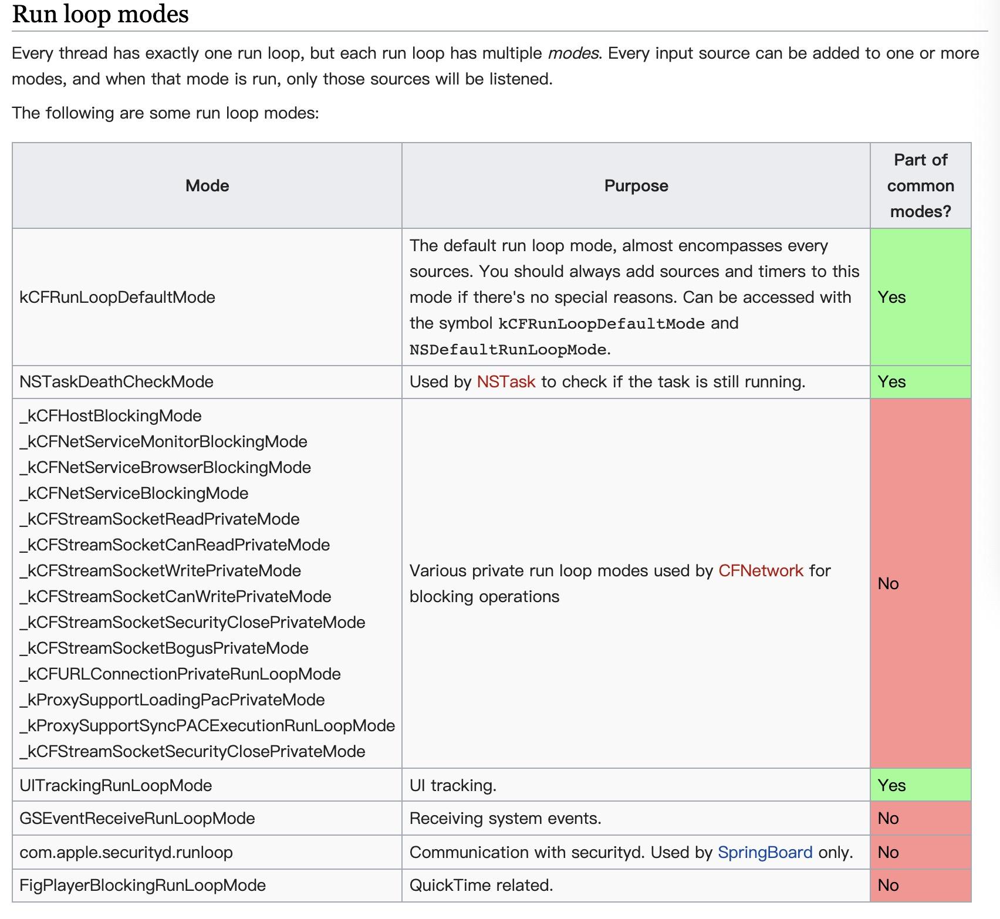

# **1.Runloop**和线程的关系

* 线程和 RunLoop 之间是一一对应的，其关系是保存在一个全局的 Dictionary 里。

  > ```c++
  > /// 全局的Dictionary，key 是 pthread_t， value 是 CFRunLoopRef
  > static CFMutableDictionaryRef loopsDic;
  > /// 访问 loopsDic 时的锁
  > static CFSpinLock_t loopsLock;
  > ```

* 子线程刚创建时并没有 RunLoop，如果你不主动获取，那它一直都不会有。

* 子线程的RunLoop （只能在一个线程的内部获取其 RunLoop）：

  创建：发生在第一次获取时，默认没有开启`RunLoop`；；

  销毁：发生在线程结束时。

* 主线程的Runloop：

  创建：发生在main函数内；（`UIApplicationMain`中通过`[NSRunLoop currentRunLoop]`获取，一旦发现它不存在，就会创建`RunLoop`对象）

  销毁：

# 2.Runloop Mode

## 2.1系统默认注册了哪些运行模式(Mode)？

* 供开发者使用的有：

  > 1.**kCFRunloopDefaultMode**:App的默认 Mode，通常主线程是在这个 Mode 下运行的
  >
  > ** **2.**UITrackingRunloopMode**: 界面跟踪 Mode，用于 ScrollView 追踪触摸滑动，保证界面滑动时不受其他 Mode 影响

* APP启时进入的第一个Mode：**UIInitializationRunLoopMode**；

* 接受系统事件的内部 Mode，通常用不到：**GSEventReceiveRunLoopMode**

<font color='red'>Tip: `kCFRunLoopCommonModes:`这是一个占位的 Mode，代表的不是一种mode 而是一组modes（添加至common mode set 中的所有mode）</font>

## 2.2苹果内部 Runloop 有多少种运行模式？

苹果内部的 Mode，但那些 Mode 在开发中就很难遇到; 如图：



## 2.3 如何创建一个CFRunLoopMode？

我们没有办法直接创建一个CFRunLoopMode对象，但是我们可以调用`CFRunLoopAddCommonMode` 传入一个字符串向 **RunLoop** 中添加 **Mode**，传入的字符串即为 Mode 的名字，Mode对象应该是此时在RunLoop内部创建的。

通过 **mode name** 来操作内部的 mode，当你传入一个新的 mode name 但 RunLoop 内部没有对应 mode 时，RunLoop会自动帮你创建对应的 **CFRunLoopModeRef**。对于一个 RunLoop 来说，其内部的 mode 只能增加不能删除。

```cpp
void CFRunLoopAddCommonMode(CFRunLoopRef rl, CFStringRef modeName) {
    CHECK_FOR_FORK();
    if (__CFRunLoopIsDeallocating(rl)) return;
    __CFRunLoopLock(rl);
    //看rl中是否已经有这个mode，如果有就什么都不做
    if (!CFSetContainsValue(rl->_commonModes, modeName)) {
        CFSetRef set = rl->_commonModeItems ? CFSetCreateCopy(kCFAllocatorSystemDefault, rl->_commonModeItems) : NULL;
        //把modeName添加到RunLoop的_commonModes中
        CFSetAddValue(rl->_commonModes, modeName);
        if (NULL != set) {
            CFTypeRef context[2] = {rl, modeName};
            /* add all common-modes items to new mode */
            //这里调用CFRunLoopAddSource/CFRunLoopAddObserver/CFRunLoopAddTimer的时候会调用
            //__CFRunLoopFindMode(rl, modeName, true)，CFRunLoopMode对象在这个时候被创建
            CFSetApplyFunction(set, (__CFRunLoopAddItemsToCommonMode), (void *)context);
            CFRelease(set);
        }
    } else {
    }
    __CFRunLoopUnlock(rl);
}
```


# 3.Runloop Mode Item

## 3.1 Runloop、Runloop Mode 、mode item三者关系

一个Runloop对象可以对应多个Runloop Mode，一个Mode下可以添加多种（或多个）mode item；

一个Runloop某一时刻只能运行在一个Mode下，切换mode，需要先退出前一个mode，才能进入后一个mode；

一个 item 可以被同时加入多个 mode。但一个 item 被重复加入同一个 mode 时是不会有效果的。

## 3.2 mode item有几种

**Source/Timer/Observer** 被统称为 **mode item**；

* **CFRunLoopSourceRef (输入源)** ; 包含source0 和source1
*  **CFRunLoopTimerRef (定时源)**
* **CFRunLoopObserverRef (观察者)**


# 4.performSelector


# 5.Runloop与Autoreleasepool

## 5.1Autoreleasepool的生命周期

Autoreleasepool第一次创建：runloop启动时

Autoreleasepool销毁：

* runloop循环一圈即将进入休眠时，销毁当前pool，然后新建一个新的pool
* runloop退出时，彻底销毁当前pool。

## 5.2