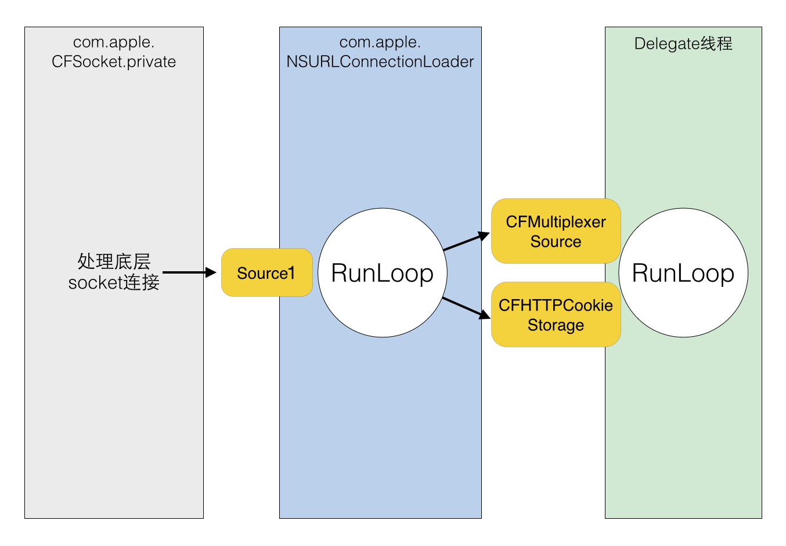

#### iOS 中，关于网络请求的接口自上至下有如下几层:

-  NSURLSession  -> AFNetworking2、Alamofire  ： NSURLSession 是 iOS7 中新增的接口，表面上是和 NSURLConnection 并列的，但底层仍然用到了 NSURLConnection 的部分功能 (比如 com.apple.NSURLConnectionLoader 线程)，AFNetworking2 和 Alamofire 工作于这一层。

-  NSURLConnection -> AFNetworking  ：  NSURLConnection 是基于 CFNetwork 的更高层的封装，提供面向对象的接口，AFNetworking 工作于这一层。

-  CFNetwork    -> ASIHttpRequest  ：  CFNetwork 是基于 CFSocket 等接口的上层封装，ASIHttpRequest 工作于这一层。

-  CFSocket  ：  CFSocket 是最底层的接口，只负责 socket 通信。

#### NSURLConnection 的工作流程：

1. 使用 NSURLConnection 时，首先会传入一个 Delegate，然后调用 [connection start] 后，这个 Delegate 就会不停收到事件回调。实际上，start 这个函数的内部会会获取 CurrentRunLoop，然后在其中的 DefaultMode 添加了4个 Source0 (即需要手动触发的Source)：

2. - CFMultiplexerSource 是负责各种 Delegate 回调的
   - CFHTTPCookieStorage 是处理各种 Cookie 的。

2. 当开始网络传输时，可以看到 NSURLConnection 创建了两个新线程：

1. - com.apple.CFSocket.private：处理底层 socket 连接的
   - com.apple.NSURLConnectionLoader：内部会使用 RunLoop 来接收底层 socket 的事件，并通过之前添加的 Source0 通知到上层的 Delegate

3. NSURLConnectionLoader 中的 RunLoop 通过一些基于 mach port 的 Source 接收来自底层 CFSocket 的通知。当收到通知后，其会在合适的时机向 CFMultiplexerSource 等 Source0 发送通知，同时唤醒 Delegate 线程的 RunLoop 来让其处理这些通知。CFMultiplexerSource 会在 Delegate 线程的 RunLoop 对 Delegate 执行实际的回调。

1. 如图：

