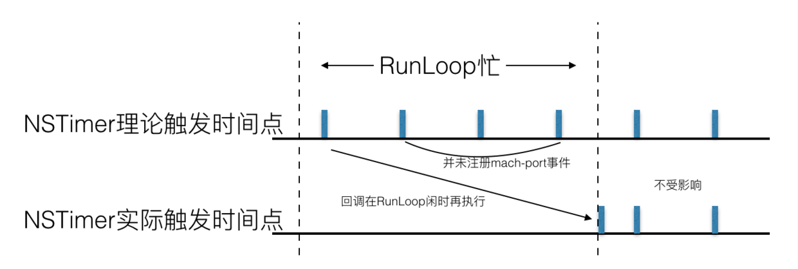

# **Runloop** 与 定时器

参考：

1. [**iOS**刨根问底**-**深入理解**RunLoop**](https://www.cnblogs.com/kenshincui/p/6823841.html)（**RunLoop**应用 **— NSTimer** 部分的代码示例可以看下）
2. [从 RunLoop 源码探索 NSTimer 的实现原理（iOS）](https://toutiao.io/posts/4330zh/preview)（内部包含timer相关源码的详细解读）

重点结论：当前时刻未超过多个 timerInterval 时，timer 触发只会延迟执行，不会丢失。若超过多个 timerInterval 时，只会执行 最早应该触发的那次 timer，它之后的 与 当前时刻之间的其他 触发时机 都会舍弃掉，

## 1. 添加**timer**的两种方式：

#### 第一种写法

- NSTimer *timer = [NSTimer timerWithTimeInterval:1.0 target:self selector:@selector(timerUpdate) userInfo:nil repeats:YES];
- [[NSRunLoop currentRunLoop] addTimer:timer forMode:NSDefaultRunLoopMode];
- [timer fire];

 注意：

- target 参数：timer 将会强引用 target 对象，直到调用 [timer invalidated] 方法
-  [timer invalidated] 方法：从 Runloop 中移除 timer 的唯一方式，移除的同时会去掉 Runloop 对 timer 的强引用，同时还会移除 timer 对 target 的强引用

#### 第二种写法

- [NSTimer scheduledTimerWithTimeInterval:1.0 target:self selector:@selector(timerUpdate) userInfo:nil repeats:YES];

## 2. 添加 **Timer** 部分逻辑实现解析：

- __CFRepositionTimerInMode：先调用__CFRunLoopInsertionIndexInTimerArray 函数，这个函数就是根据timer的_fireTSR时间字段，利用二分查找的算法，将timer插入到已按照时间排列好的timerArray（rlm_timers）中，这个rlm_timers的array是按照fireTSR的升序排列的。然后再调用__CFArmNextTimerInMode函数.

- __CFArmNextTimerInMode：根据mode中的最前面的那个timer的触发时间，将其通过dispatch_source_set_runloop_timer或者mk_timer的方式注册。具体注册机制是根据RunLoopMode中Timer的时间点和 tolerance，计算出timer触发的SoftDeadline（理论触发的时间点）和HardDeadline（最晚的时间点）：

- - 若二者相同（没有tolerance的情况下），则调用底层xnu的mk_timer注册一个mach-port事件（[具体代码实现](https://opensource.apple.com/source/xnu/xnu-3789.51.2/osfmk/kern/mk_timer.c)）；

- - 若不同（有tolerance ），则调用_dispatch_source_set_runloop_timer_4CF 函数，通过查阅libdispatch的源码可知这个函数就是dispatch_source_set_timer，因此对于有tolerance 的 NSTimer，其最终注册成了一个GCD Timer，只不过最终定时器fire的时候，会再通过RunLoop那一层，调用RunLoopTimer中保存的回调。

## 3. **timer**触发 部分逻辑实现解析：

- RunLoop被唤醒后，调用了__CFRunLoopDoTimers函数，这个函数取出所有 _fireTSR(理论触发的时间)小于当前系统时刻的RunLoopTimer，对其分别调用__CFRunLoopDoTimer函数。__CFRunLoopDoTimer函数主要干了两个事情：
  1. 对 timer中存的 callout 进行调用：__CFRUNLOOP_IS_CALLING_OUT_TO_A_TIMER_CALLBACK_FUNCTION__(rlt->_callout, rlt, context_info);
  2. 根据 timer中的间隔 interval信息，和当前这次fire的理论触发时刻_fireTSR，计算得到下一个应该触发的时刻_fireTSR，下一个应该触发的时刻_fireTSR必须晚于系统当前时刻，将_fireTSR设置到timer结构中，然后调用__CFRepositionTimerInMode函数，重新排列这个mode中的所有timer触发时刻。

1. 

- - - 延伸结论：

    - - 对于重复的NSTimer，其多次触发的时刻不是一开始算好的，而是timer触发后计算的。但是计算时参考的是上次应当触发的时间_fireTSR，因此计算出的下次触发的时刻不会有误差。这保证了timer不会出现误差叠加。

- - - - 只要阻塞结束后__CFRunLoopDoTimers依然被调用，就不会影响 timer的回调，这一段逻辑不会去校验timer的回调点是否超出了tolerance，因此也不会阻塞掉 RunLoopTimer的触发，所以：

      - - 对于有tolerance的timer的情况，只要仍然能收到GCD timer的mach-port消息，这次timer的回调就会触发，只不过回调触发的时间变晚了不少。
        - 对于没有tolerance的timer，同样，只要能收到mk_timer发出的mach-port时间，就仍然会触发这次timer的回调。

- - - - 如果RunLoop忙的时间过长，以至于收到mach-port消息时，已经过了下次的理论触发点，则系统在__CFRunLoopDoTimer逻辑中计算_fireTSR的时候，会找到晚于当前时刻的那个理应触发点，作为_fireTSR。就是下面这一小段代码：while (nextFireTSR <= currentTSR) {nextFireTSR += intervalTSR;}。因此，如果RunLoop的忙的时间很长，长度达到了好多个timeInteval，则忙的这段时间内的timer回调只会被触发一次。

## 4. 总结：

- NSTimer 其实就是 CFRunLoopTimerRef，他们之间是 toll-free bridged 的。

- 对于重复的NSTimer，其多次触发的时刻不是一开始算好的，而是timer触发后计算的。但是计算时参考的是上次理论触发的时间 _fireTSR（不考虑阻塞造成的延迟理论上应该触发的时刻），因此计算出的下次触发的时刻不会有误差。

- Timer 有个属性叫做 Tolerance (宽容度)，标示了当时间点到后，容许有多少最大误差。设置了tolerance的NSTimer，对于iOS和MacOS系统，实质上会采用GCD timer 的形式注册到内核中，GCD timer 触发后，再由RunLoop处理其回调逻辑。对于没有设置tolerance的timer，则是用mk_timer的形式注册。

- Runloop 阻塞未超过多个timer 间隔周期时，不会取消timer 触发。RunLoop层在timer触发后进行回调的时候，不会对tolerance进行验证。也就是说，因为RunLoop忙导致的timer触发时刻超出了tolerance的情况下，timer并不会取消，只会延迟执行。

- 对于RunLoop忙时很长（或者timeInteval很短）的情况，会导致本该在这段时间内触发的几次回调中，只触发一次。也就是说，这种情况下还是会损失回调的次数。（具体是由于当触发timer的时候，会计算下一次触发的时刻，具体实现：while (nextFireTSR <= currentTSR) {nextFireTSR += intervalTSR;}，所以从 当次触发时刻 与 当前时刻 之间的触发时机就被舍弃掉了， 如图：）

- 对于RunLoop比较忙的情况，timer的回调时刻有可能不准，且不会受到tolerance的任何限制。tolerance的作用不是决定timer是否触发的标准，而是一个传递给系统的数值，帮助系统合理的规划GCD Timer的mach-port触发时机。设置了tolerance，一定会损失一定的时间精确度，但是可以显著的降低耗电。

- CADisplayLink 是一个执行频率（fps）和屏幕刷新相同（可以修改preferredFramesPerSecond改变刷新频率）的定时器，它也需要加入到RunLoop才能执行。与NSTimer类似，CADisplayLink同样是基于CFRunloopTimerRef实现，底层使用mk_timer（可以比较加入到RunLoop前后RunLoop中timer的变化）。和NSTimer相比它精度更高（尽管NSTimer也可以修改精度），不过和NStimer类似的是如果遇到大任务它仍然存在丢帧现象。通常。如果在两次屏幕刷新之间执行了一个长任务，那其中就会有一帧被跳过去（和 NSTimer 相似），造成界面卡顿的感觉。

- 非主线程的RunLoop并不会自动运行（同时注意默认情况下非主线程的RunLoop并不会自动创建，直到第一次使用），RunLoop运行必须要在加入NSTimer或Source0、Sourc1、Observer输入后运行否则会直接退出。例如上面代码如果**run**放到NSTimer创建之前则既不会执行定时任务也不会执行循环运算。

- 上面的代码也充分说明了RunLoop是一个循环事实，run方法之后的代码不会立即执行，直到RunLoop退出。

注意：

- 子线程添加的 **NSTimer** 只能在对应子线程中进行停止，若在不同线程调用 **invalidate** 方法，只会停止**timer**回调，但不会真正释放**timer**，从而也无法真正停止对应线程的**runloop**，导致在该**runloop**结束前，对应 **timer** 的内存泄露
- 用 **scheduledTimerWithTimeInterval** 方法创建的 **timer** 不需要再执行 **[****NSRunloop** **addTimer****:** **forMode****: ]** 方法，也能添加到 **runloop** 中
- **scheduledTimerWithTimeInterval** 方法 在 **[****NSRunLoop** **currentRunLoop****]** 之前 或 之后 执行都可以
- **NSTimer** 在非 **repeat**的情况下，会在触发后，自动取消对应 **runloop**的注册，使**runloop**缺少事件源退出。
- **[****NSRunloop run****]** 或 **[****NSRunloop** **runUntilDate****:]** 方法在没有 **input** **source** 或 **timer** 时一样会退出**(**例如：**performSelector****:****afterDelay****:** 方式**)**，但是手动移除 **inputSource** 或 **timer** 不一定能保证它们一定会退出**(**例如：[**timer** **invalidate****]** 方式**)**