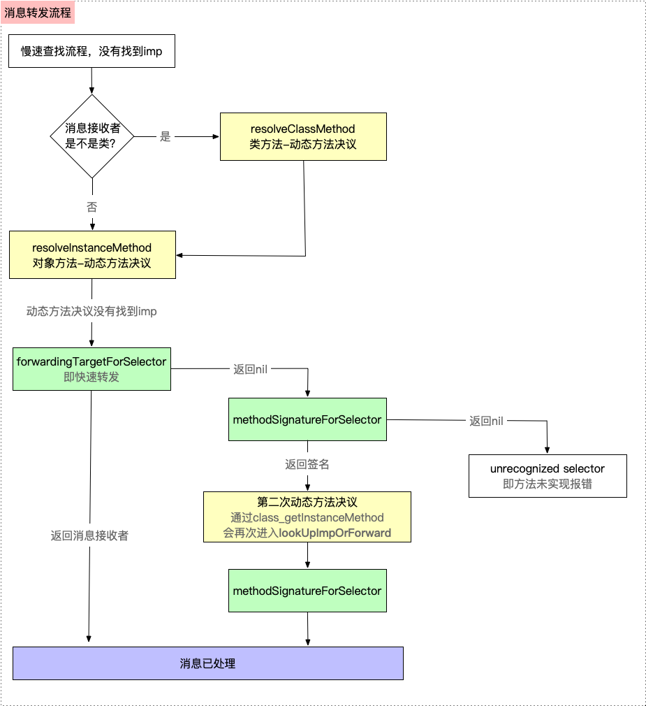
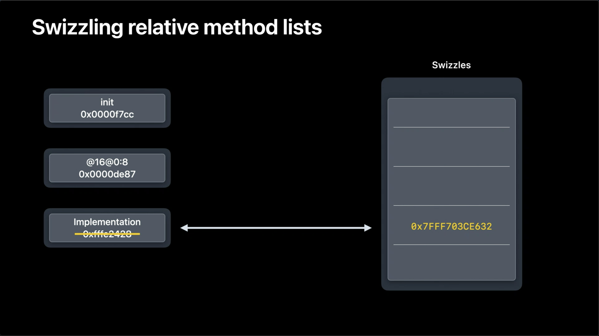
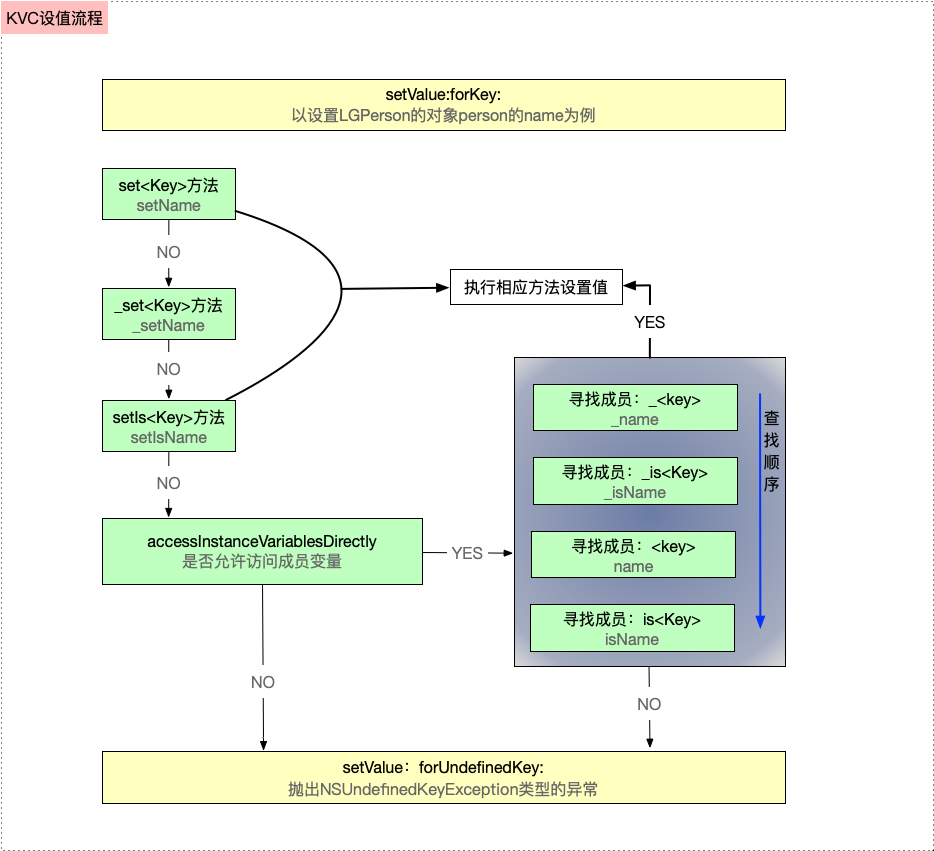
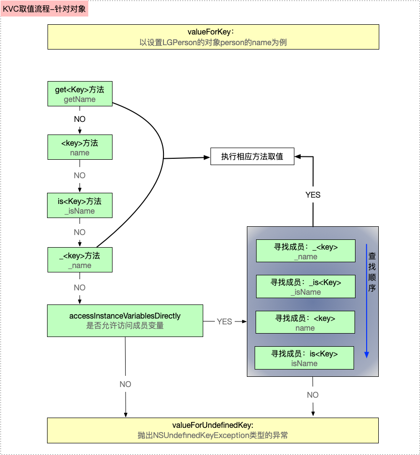
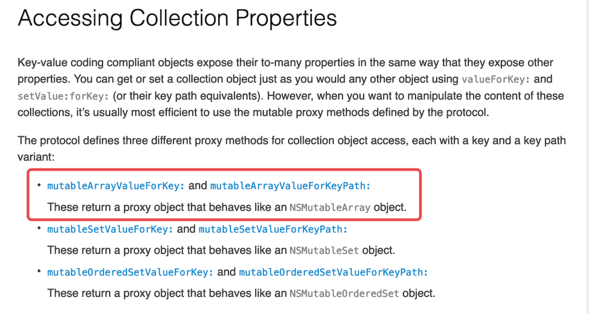

#  1. Runtime 介绍

runtime称为运行时，它区别于编译时

- 运行时 是代码跑起来，被装载到内存中的过程，如果此时出错，则程序会崩溃，是一个动态阶段
- 编译时 是源代码翻译成机器能识别的代码的过程，主要是对语言进行最基本的检查报错，即词法分析、语法分析等，是一个静态的阶段

runtime的使用有以下三种方式，其三种实现方法与编译层和底层的关系如图所示

- 通过OC代码，例如 [person sayNB]
- 通过NSObject方法，例如isKindOfClass
- 通过Runtime API，例如class_getInstanceSize

# 2. IMP

IMP是一个函数指针，它在Runtime中的定义如下：

```objc
  /// A pointer to the function of a method implementation.	
  typedef void (IMP)(void / id, SEL, ... */ ); 
```

IMP这个函数指针指向了方法实现的首地址，当OC发起消息后，最终执行的代码是由IMP指针决定的。利用这个特性，我们可以对代码进行优化：当需要大量重复调用方法的时候，我们可以绕开消息绑定而直接利用IMP指针调起方法，这样的执行将会更加高效，相关的代码示例如下：

```objective-c
   void (*setter)(id, SEL, BOOL);

   int i;

   setter = (void (*)(id, SEL, BOOL))[target methodForSelector:@selector(setFilled:)];

   for ( i = 0 ; i < 1000 ; i++ )

      setter(targetList[i], @selector(setFilled:), YES);
```

注意：这里需要注意的就是函数指针的前两个参数必须是id和SEL。


# 3.**消息流程分析**

## 3.1快速查找(cache_t中查找)

**objc_msgSend**是消息发送的源码的入口，使用的是汇编实现，其主要过程经过以下几步：

1. 【第一步】判断 **objc_msgSend** 方法的第一个参数receiver是否为空

   > * 如果支持tagged pointer，跳转至LNilOrTagged：
   >
   >   > 如果小对象为空，则直接返回空，即LReturnZero;
   >   >
   >   > 如果小对象不为空，则处理小对象的isa，走到【第二步】;
   >   
   > * 如果既不是小对象，receiver也不为空，有以下两步：
   >
   >   > 从receiver中取出isa存入p13寄存器;
   >   >
   >   > 通过 GetClassFromIsa_p16中，arm64架构下通过 isa & ISA_MASK 获取shiftcls位域的类信息，即class，然后走到【第二步】;

 2. 【第二步】获取isa完毕，进入快速查找流程 **CacheLookup（**方法缓存查找，汇编实现）NORMAL状态，主要经过以下几步：

> 【第1步】通过isa 找到 Class 对象首地址，然后平移16字节（isa首地址 占8字节，superClass占8字节）找到cache_t ，cache中高16位存mask，低48位存buckets
> 
> 【第2步】从cache中分别取出buckets和mask，并由mask根据哈希算法计算出哈希下标：

  > 通过cache和掩码（即0x0000ffffffffffff）的 & 运算，将高16位mask抹零，得到buckets指针地址，即p10 = buckets
      - 将cache右移48位，得到mask，即p11 = mask
      - 将objc_msgSend的参数p1（即第二个参数_cmd）& msak，通过哈希算法，得到需要查找存储 sel-imp 的bucket下标 index，即p12 = index = _cmd & mask，为什么通过这种方式呢？因为在存储sel-imp时，也是通过同样哈希算法计算哈希下标进行存储，所以读取也需要通过同样的方式读取

> 【第3步】根据所得的哈希下标index 和 buckets首地址，取出哈希下标对应的 bucket 
> 
    > > * 其中PTRSHIFT等于3，左移4位（即2^4 = 16字节）的目的是计算出一个bucket实际占用的大小,结构体bucket_t中sel占8字节，imp占8字节
    > > * 根据计算的哈希下标index 乘以 单个bucket占用的内存大小，得到buckets首地址在实际内存中的偏移量
    > > * 通过首地址 + 实际偏移量，获取哈希下标 index 对应的 bucket

> 【第4步】根据获取的bucket，取出其中的sel 与 imp
>
> 【第5步】进行递归循环查找（buckets 是一个哈希数组）
>
> > 比较获取的 bucket 中sel 与 objc_msgSend的第二个参数的 _cmd 是否相等：
> >
> > * 如果相等，则直接跳转至CacheHit，即缓存命中，返回imp    
> > * 如果不相等，有以下几种情况：    
> >   * 如果 bucket->sel == 0则 CheckMiss
> >   * 如果 bucket != buckets ，即不是第一个，则向前遍历查找
> >   * 如果 bucket == buckets，即当前为第一个，则人为的将当前bucket设置为buckets的最后一个元素（通过buckets首地址+mask右移44位（等同于左移4位）直接定位到bucker的最后一个元素），然后再进行一次递归循环

> 【第6步】如果循环再次走到 bucket 等于 buckets的第一个元素时，还未找到，则直接跳转至JumpMiss。因为状态是 normal，则无论是 CheckMiss 还是 JumpMiss 都直接跳转至 __objc_msgSend_uncached（汇编实现），即进入慢速查找流程
总结：

* ios 方法调用都是通过objc_msgSend进行的

- objc_msgSend首先会走快速查找流程
- 通过找到类的cache_t，通过哈希算法拿到key，再通过哈希表找到对象的imp
- 如果没有找到，就调用慢速查找流程

## 3.2慢速查找

在快速查找流程中，如果没有找到方法实现，无论是走到CheckMiss 还是 JumpMiss，最终都会走到 __objc_msgSend_uncached 汇编函数

> * ` __objc_msgSend_uncached `方法的核心是 `MethodTableLookup`（即查询方法列表，汇编实现）
> * 搜索`MethodTableLookup `的汇编实现，其中的核心是`_lookUpImpOrForward`（C/C++实现的函数）

注意：

1. C/C++ 中调用 汇编 ，去查找汇编时，C/C++调用的方法需要多加一个下划线 

2. 汇编 中调用 C/C++方法时，去查找C/C++方法，需要将汇编调用的方法去掉一个下划线

`lookUpImpOrForward` 是慢速查找的核心实现，其具体过程如下：

> 【第一步】再次从 cache 缓存中进行查找，即快速查找（目的：防止多线程操作时，刚好调用函数，此时缓存进来了），找到则直接返回 imp，反之，则进行下一步
>
> 【第二步】判断cls
>
> > * 是否是已知类，如果不是，则报错
> > * 类是否实现，如果没有，则需要先实现（ 针对懒加载的类，调用 realizeClassMaybeSwiftAndLeaveLocked 方法完成实现 ），确定其父类链，此时实例化的目的是为了确定父类链、ro、以及rw等，方法后续数据的读取以及查找的循环
> > * 是否初始化，如果没有，则初始化（ 首次接收消息时进行初始化，调用 initializeAndLeaveLocked 方法进行初始化。因为其中可能包含动态添加方法逻辑 ）
>
> 【第三步】for循环，按照类继承链 或者 元类继承链的顺序查找
>
> > 1. 在当前cls的 method_array_t 中，按照从前往后的顺序，先进入第一个 method_list_t 中查找。然后判断该method_list_t 是否已排序（按照 SEL 的 address 排序）：
> >    - 如果已排序，则使用 二分查找 算法查找方法
> >    - 如果未排序，则用简单线性搜索:
> >
> > 2. 如果找到，则进入cache写入流程（在[iOS-底层原理 11：objc_class 中 cache 原理分析](https://link.juejin.cn/?target=https%3A%2F%2Fwww.jianshu.com%2Fp%2F3ad9166c02e5)文章中已经详述过），并返回imp，如果没有找到，则返回nil
> > 3. 在上一步未找到的情况下，将当前cls 赋值为父类，如果父类等于nil，则imp = 消息转发，并终止递归，进入【第四步】
> > 4. 如果父类链中存在循环，则报错，终止循环
> > 5. 如果父类有效，则进入 父类缓存 中查找方法
> >    * 如果未找到，则直接返回nil，继续循环查找
> >    * 如果找到，则直接返回imp，执行cache写入流程
>
> 【第四步】判断是否执行过动态方法解析
>
> > * 如果没有，执行动态方法解析
> > * 如果执行过一次动态方法解析，则走到消息转发流程

**方法列表二分查找原理概括：**

从第一次查找开始，每次都取中间位置，与想查找的key的value值作比较，如果相等，则需要排除 分类方法（ 即如果方法已匹配, 也还是会往前查找一遍看看有没有同名 ( 方法编号 ) 方法 ，如果有 , 则返回的是前面的方法。主要是因为当分类是懒加载的情况下，分类的method_list_t 在程序编译阶段会和主类的 ro 里的 base_methods 合成一个方法列表。所以最终运行时生成的 method_array 里只有一个 method_list_t ，同时包含了主类与分类的 method_t，而且经过排序后，分类与主类的同名方法是连在一起的），然后将查询到的位置的方法实现返回，如果不相等，则需要继续二分查找，如果循环至count = 0还是没有找到，则直接返回nil

总结
* 对于对象方法（即实例方法），即在类中查找，其慢速查找的父类链是：类--父类--根类--nil
* 对于类方法，即在元类中查找，其慢速查找的父类链是：元类--根元类--根类--nil
* 如果快速查找、慢速查找也没有找到方法实现，则尝试动态方法决议
* 如果动态方法决议仍然没有找到，则进行消息转发     

## 3.3 **动态方法决议**&消息转发

* 动态方法决议：慢速查找流程未找到后，会执行一次动态方法决议
* 消息转发：如果动态方法决议仍然没有找到实现，则进行消息转发


1. 【动态方法决议】主要分为以下几步

   > 判断类是否是元类:
   >
   > * 如果是类，执行实例方法的动态方法决议resolveInstanceMethod
   > * 如果是元类，执行类方法的动态方法决议resolveClassMethod，如果在元类中没有找到或者为空，则在元类的实例方法的动态方法决议resolveInstanceMethod中查找，主要是因为类方法在元类中是实例方法，所以还需要查找元类中实例方法的动态方法决议
   > * 如果动态方法决议中，将其实现指向了其他方法，则继续查找指定的imp，即继续慢速查找lookUpImpOrForward流程

2. 【快速转发】当慢速查找，以及动态方法决议均没有找到实现时，进行消息转发，首先是进行快速消息转发，即走到forwardingTargetForSelector方法

   > * 如果返回消息接收者，在消息接收者中还是没有找到，则进入另一个方法的查找流程
   > * 如果返回nil，则进入慢速消息转发

3. 【慢速转发】执行到methodSignatureForSelector方法，该方法的作用是为另一个类实现的消息创建一个有效的方法签名

   > * 如果返回的方法签名为nil，则直接崩溃报错
   > * 如果返回的方法签名不为nil，走到forwardInvocation方法中，对invocation事务进行处理，如果不处理也不会报错


注意：
实例方法的转发方法：

- (id)forwardingTargetForSelector:(SEL)aSelector；
- (NSMethodSignature *)methodSignatureForSelector:(SEL)aSelector；
- (void)forwardInvocation:(NSInvocation *)anInvocation；

类方法的转发方法（非公开方法，resolveClassMethod 后调用）：
+ (id)forwardingTargetForSelector:(SEL)aSelector；
+ (NSMethodSignature *)methodSignatureForSelector:(SEL)aSelector；
+ (void)forwardInvocation:(NSInvocation *)anInvocation；


总结

1. 【快速查找流程】首先，在类的缓存cache中查找指定方法的实现

2. 【慢速查找流程】如果缓存中没有找到，则在类的方法列表中查找，如果还是没找到，则去父类链的缓存和方法列表中查找

3. 【动态方法决议】如果慢速查找还是没有找到时，第一次补救机会就是尝试一次动态方法决议，即重写resolveInstanceMethod/resolveClassMethod 方法

4. 【消息转发】如果动态方法决议还是没有找到，则进行消息转发，消息转发中有两次补救机会：快速转发+慢速转发

5.   如果转发之后也没有，则程序直接报错崩溃unrecognized selector sent to instance

**动态方法决议为什么执行两次？**

在执行了methodSignatureForSelector方法后，返回了一个 NSMethodSignature 对象（函数签名），Runtime 系统就会创建一个 NSInvocation 对象，并通过 forwardInvocation: 消息通知当前对象，给予 此次消息发送 最后一次寻找 IMP 的机会（当方法签名是生效的，苹果在走到invocation之前，给了开发者一次机会再去查询），所以会走到class_getInstanceMethod这里，在 class_getInstanceMethod 里调用了 lookUpImpOrForward 方法

在慢速查找流程中，我们了解到通过以下调用流程 lookUpImpOrForward --> resolveMethod_locked --> resolveInstanceMethod ，最终会走到 resolveInstanceMethod 里，从而通过发送 resolve_sel 消息（ bool resolved = msg(cls, resolve_sel, sel); ）触发动态决议方法。

注意：
1. 第2次调用 resolveInstanceMethod 方法传递的 sel = "_forwardStackInvocation:"
2. 如果在第2次 调用 resolveInstanceMethod  时，添加 addMethod 则不会再走后续慢转发流程的 forwardInvocation




#  4. **load()** **方法与** **initialize()** **方法

参考：[iOS 底层原理04: +load(), +initialize()](https://juejin.cn/post/6955773192543666206)

1. 调用次数
    * 都只会调用一次

2. 调用时机
    * +load(): 在runtime加载类/分类时调用
    * +initialize(): 在类第一次接收到消息时调用(类初始化时)

3. 调用原理
    * +load(): 使用C函数直接调用
    * +initialize(): 由runtime 的 objc_msgSend()进行调用

4. 调用顺序
    * +load(): 所有的类/分类都会调用，父类比子类先调用，先编译的分类先调用
    
    * +initialize() 核心：每个类只初始化一次，通过msgSend查找，子类未实现，会调用父类方法
      
        > 父类的方法只会调用一个(父类或父类的某个分类)，后编译非分类覆盖先编译的分类;
        >
        > 父类比子类先调用:
        >
        > > 子类实现了 initialize() 方法，先调父类，再调子类;
        > >
        > > 子类未实现 initialize() 方法：
        > >
        > > * 父类未初始化过，向子类发消息：调用 两次 父类的  initialize() 方法
        > > * 父类已初始化过，向子类发消息：调用 一次 父类的  initialize() 方法


2. 类的方法是如何被加载的

# 5. Method-Swizzing

参考：

1. [**iOS-底层原理21：Method-Swizzling方法交换**](https://juejin.cn/post/6949586291017121822)
2. [**WWDC20 iOS14 Runtime优化-相关方法列表变化**](https://juejin.cn/post/6846687597478019079#heading-1)

**method-swizzling 是什么**

> * method-swizzling的含义是方法交换，其主要作用是在运行时将一个方法的实现替换成另一个方法的实现;
>
> * 每个类都维护着一个方法列表，即methodList，methodList中有不同的方法即Method，每个方法中包含了方法的sel和IMP，方法交换就是将sel和imp原本的对应断开，并将sel和新的IMP生成对应关系。

**method-swizzling涉及的相关API**：

> - 👇🏻**相关方法中使用的参数 Method 等于结构体 method_t \*（包含SEL、Types、IMP 三个成员）**，**也就是class_rw_t 的 method_array_t** 与 **class_ro_t** 的 **baseMethods** 中存储的数据类型。
>
> - 通过SEL 获取方法Method
>
> - - Method class_getInstanceMethod(Class _Nullable cls, SEL _Nonnull name)：获取实例方法
>   - Method class_getClassMethod(Class _Nullable cls, SEL _Nonnull name)：获取类方法
>
> - IMP method_getImplementation(Method _Nonnull m)：获取一个方法的实现
>
> - IMP method_setImplementation(Method _Nonnull m, IMP _Nonnull imp)：设置一个方法的实现
>
> - const char * method_getTypeEncoding(Method _Nonnull m)：获取方法实现的编码类型
>
> - BOOL class_addMethod(Class _Nullable cls, SEL _Nonnull name, IMP _Nonnull imp, const char * _Nullable types)：添加方法实现
>
> - IMP class_replaceMethod(Class _Nullable cls, SEL _Nonnull name, IMP _Nonnull imp, const char * _Nullable types)：用一个方法的实现，替换另一个方法的实现。如果 name 对应的方法不存在，执行添加操作，类似 class_addMethod；如果方法存在，执行替换操作，类似 method_setImplementation
>
> - void method_exchangeImplementations(Method _Nonnull m1, Method _Nonnull m2)：交换两个方法的实现

注意：

在iOS 14后，苹果会在一个全局表中映射交换的实现。由于交换并不是非常常见的操作，所以这个全局表也不会特别大。



**关于方法替换常见的坑**

> 父类ModelA实现了方法 FuncationA，子类SubModelA新增了 FuncationB，子类实现方法替换 method_exchangeImplementations(FuncationA, FuncationB);
>
> 1. - [ModelA FuncationA]：正常，此方法替换相当于将 SEL: FuncationA —绑定—> IMP: FuncationB，所以没有问题
>
>    - [SubModelA FuncationA]：正常
>
>    - **特殊情况：**新增的FuncationB 为了调用原方法，在内部实现中使用了 [self FuncationB]
>
>    - - [ModelA FuncationA]：**Crash 因为ModelA 中没有SEL：****FuncationB**
>
>      - [SubModelA FuncationA]：正常
>
>      - 修复建议：
>
>      - 1. 可以先尝试 **addMethod****(SEL:old, IMP: new, TypeEncoding:new)**
>        2. 如果添加成功：则 **replaceMethod****(SEL:new, IMP:old, TypeEncoding:old)**
>        3. 如果添加失败：则 **exchangeImp****(old, new)*


# 6.KVC

参考：

1. [**iOS-底层原理 22：KVC 底层原理**](https://juejin.cn/post/6949586778646904840)
2. [**iOS底层--KVC实现原理**](https://www.jianshu.com/p/266e1ad633f2)

**KVC 非常用API**

//默认返回YES，表示如果没有找到Set<Key>方法的话，会按照_key，_iskey，key，iskey的顺序搜索成员，设置成NO就不这样搜索 

> \+ (BOOL)accessInstanceVariablesDirectly; 

//KVC提供属性值正确性验证的API，它可以用来检查set的值是否正确、为不正确的值做一个替换值或者拒绝设置新值并返回错误原因。 

> \- (BOOL)validateValue:(inout id __nullable * __nonnull)ioValue forKey:(NSString *)inKey error:(out NSError **)outError; 

//这是集合操作的API，里面还有一系列这样的API，如果属性是一个NSMutableArray，那么可以用这个方法来返回。 

> \- (NSMutableArray *)mutableArrayValueForKey:(NSString *)key; 

//如果Key不存在，且KVC无法搜索到任何和Key有关的字段或者属性，则会调用这个方法，默认是抛出异常。 

> \- (nullable id)valueForUndefinedKey:(NSString *)key;

//和上一个方法一样，但这个方法是设值。 

> \- (void)setValue:(nullable id)value forUndefinedKey:(NSString *)key;

//如果你在SetValue方法时给Value传nil，则会调用这个方法 

> \- (void)setNilValueForKey:(NSString *)key; 

//输入一组key,返回该组key对应的Value，再转成字典返回，用于将Model转到字典。 

> \- (NSDictionary<NSString *, id> *)dictionaryWithValuesForKeys:(NSArray<NSString *> *)keys;

## 6.1 设值`set<key>`

当调用setValue:forKey:设置属性value时，其底层的执行流程为：

> 【第一步】首先查找是否有这三种setter方法，按照查找顺序为：set<Key>：-> _set<Key> -> setIs<Key>:
>
> > * 如果有其中任意一个setter方法，则直接设置属性的value（主注意：key是指成员变量名，首字符大小写需要符合KVC的命名规范）
> > * 如果都没有，则进入【第二步】
>
> 【第二步】：如果没有第一步中的三个简单的setter方法，则查找accessInstanceVariablesDirectly是否返回YES; 
>
> > * 如果返回YES，则查找间接访问的实例变量进行赋值，查找顺序为：_<key> -> _is<Key> -> <key> -> is<Key>：
>>
>   >   如果找到其中任意一个实例变量，则赋值。
>>
> >   如果都没有，则进入【第三步】。
> >
>> * 如果返回NO，则进入【第三步】。
> 
>【第三步】如果setter方法 或者 实例变量都没有找到，系统会执行该对象的setValue：forUndefinedKey:方法，默认抛出NSUndefinedKeyException类型的异常




## 6.2取值`get<key>`

当调用valueForKey：时，其底层的执行流程如下（下面洋红色相关步骤未进行验证，个人感觉描述流程时可以忽略掉）：

- 【第一步】首先查找getter方法，按照 get<Key> -> <key> -> is<Key> -> _<key> 的方法顺序查找，

- - 如果找到，则进入【第五步】
  - 如果没有找到，则进入【第二步】（个人感觉描述时可以从这里直接跳到第四步）

- 【第二步】如果第一步中的getter方法没有找到，KVC会查找countOf <Key>和objectIn <Key> AtIndex :和<key> AtIndexes :

- - 如果找到countOf <Key>和其他两个中的一个，则会创建一个响应所有NSArray方法的集合代理对象，并返回该对象，即NSArray的子类 NSKeyValueArray。代理对象随后将接收到的所有NSArray消息转换为countOf<Key>，objectIn<Key> AtIndex：和<key>AtIndexes：消息的某种组合，用来创建键值编码对象。如果原始对象还实现了一个名为get<Key>：range：之类的可选方法，则代理对象也将在适当时使用该方法（注意：方法名的命名规则要符合KVC的标准命名方法，包括方法签名。）
  - 如果没有找到这三个访问数组的，请继续进入【第三步】

- 【第三步】如果没有找到上面的几种方法，则会同时查找countOf <Key>，enumeratorOf<Key>和memberOf<Key>这三个方法

- - 如果这三个方法都找到，则会创建一个响应所有NSSet方法的集合代理对象，并返回该对象，此代理对象随后将其收到的所有NSSet消息转换为countOf<Key>，enumeratorOf<Key>和memberOf<Key>：消息的某种组合，用于创建它的对象
  - 如果还是没有找到，则进入【第四步】

- 【第四步】如果还没有找到，检查类方法InstanceVariablesDirectly是否YES，依次搜索_<key>，_is<Key>，<key>或is<Key>的实例变量

- - 如果搜到，直接获取实例变量的值，进入【第五步】

- 【第五步】根据搜索到的属性值的类型，返回不同的结果

- - 如果是对象指针，则直接返回结果
  - 如果是NSNumber支持的标量类型，则将其存储在NSNumber实例中并返回它
  - 如果是是NSNumber不支持的标量类型，请转换为NSValue对象并返回该对象

- 【第六步】如果上面5步的方法均失败，系统会执行该对象的valueForUndefinedKey:方法，默认抛出NSUndefinedKeyException类型的异常




## 6.3 KVC的实际应用

### 6.3.1 KVC如何处理异常

### 6.3.2 应用场景

1. #### 动态地取值和设值

   利用KVC动态的取值和设值是最基本的用途了。相信每一个iOS开发者都能熟练掌握，

2. #### 用KVC来访问和修改私有变量

   对于类里的私有属性，Objective-C是无法直接访问的，但是KVC是可以的，请参考本文前面的Dog类的例子。

3. #### Model和字典转换

4. #### 修改一些控件的内部属性

5. #### 操作集合

6. ##### 用KVC实现高阶消息传递

7. ##### 用KVC中的函数操作集合

# 7. KVO

参考：[**iOS-底层原理 23：KVO 底层原理**](https://juejin.cn/post/6949586633830187045)

KVO，全称为Key-Value observing，中文名为键值观察，KVO是一种机制，它允许将其他对象的指定属性的更改通知给对象。

**KVO与NSNotificatioCenter 的异同点：**

相同点

- 两者的实现原理都是观察者模式，都是用于监听

不同点

- KVO只能用于监听对象属性的变化，并且属性名都是通过NSString来查找，编译器不会帮你检测对错和补全，纯手敲会比较容易出错
- NSNotification的发送监听（post）的操作我们可以控制，kvo由系统控制。
- KVO可以记录新旧值变化

## **7.1 KVO**的实现原理

### **KVO只对属性观察**

  KVO对成员变量不观察，只对属性观察，属性和成员变量的区别在于属性多一个 setter 方法，而触发监听通知的实现是在 setter 方法中的

### **中间类**

 根据官方文档所述，在注册KVO观察者后，观察对象的isa指针指向会发生改变

- 注册观察者之前：实例对象 person 的 isa 指针指向LGPerson

- 注册观察者之后：实例对象 person 的 isa指针指向了中间类 NSKVONotifying_LGPerson

- 新创建的中间类 NSKVONotifying_LGPerson 是 LGPerson 的子类

- 中间类 NSKVONotifying_LGPerson 重写了父类LGPerson的 set 方法

- 中间类 NSKVONotifying_LGPerson 还重写了基类 NSObject 的class 、 dealloc 、 _isKVOA方法

- - class 方法：返回对象原来的 类型，非中间类
  - delloc 方法：实例对象 isa 指向由中间类更改为原有类
  - _isKVOA 方法：判断当前是否是kvo类

总结：

1. 实例对象isa的指向在注册KVO观察者之后，由原有类更改为指向中间类
2. 中间类重写了观察属性的setter方法、class、dealloc、_isKVOA方法
3. dealloc方法中，移除KVO观察者之后，实例对象isa指向由中间类更改为原有类
4. 中间类从创建后，就一直存在内存中，不会被销毁

注意：

- 当为对象的属性注册观察者时，会修改被观察对象的isa指针，指向中间类而不是真实类。此时，被观察对象的 isa 指针的值不一定反映该对象真实的类
- 永远不应依靠isa指针来确定类成员身份。相反，您应该使用class方法来确定对象实例的类


- 对于重写 **set** 方法的类，添加**KVO**后，仍然可以正常触发通知。
- 如果对属性赋一个相同的值，仍然可以正常触发通知。
- 猜测：**KVO**的**set**实现，是在**willChange** 与 **didChange** 方法之间，插入旧的 **set** 方法实现。

## 7.2 **KVO** **使用**

### 7.2.1 使用步骤

- 基本使用主要分为3步：

- 1. 注册观察者addObserver:forKeyPath:options:context
  2. 实现KVO回调 observeValueForKeyPath:ofObject:change:context
  3. 移除观察者 removeObserver:forKeyPath:context

>  **context使用**
>
>  context 主要是用于区分不同对象的同名属性，从而在KVO回调方法中可以不使用keyPath，而直接使用context进行区分，可以大大提升性能，以及代码的可读性。
>
>  使用总结：
>
>  使用context区分通知来源：
>
>  ```objc
>  //定义context 
>    static void *PersonNickContext = &PersonNickContext; 
>    static void *PersonNameContext = &PersonNameContext; 
>   
>  //注册观察者
>       [self.person addObserver:self forKeyPath:@"nick" options:NSKeyValueObservingOptionNew context:PersonNickContext];
>       [self.person addObserver:self forKeyPath:@"name" options:NSKeyValueObservingOptionNew context:PersonNameContext]; 
>  
>      //KVO回调 
>      - (void)observeValueForKeyPath:(NSString *)keyPath ofObject:(id)object change:(NSDictionary<NSKeyValueChangeKey,id> *)change context:(void *)context{
>  
>          if (context == PersonNickContext) {
>  
>            NSLog(@"%@",change);
>  
>          }else if (context == PersonNameContext){
>  
>            NSLog(@"%@",change);
>  
>          }
>  
>  }
>  
>  ```
>
>  

### 7.2.2 **移除KVO通知的必要性**

> 1. KVO注册观察者 和移除观察者是需要成对出现的，如果只注册，不移除，会出现类似野指针的崩溃（EXEC_BAD_ACCESS）
>
> ​      崩溃原因：由于第一次注册KVO观察者后没有移除，再次进入界面，会导致第二次注册KVO观察者，导致KVO观察的重复注册，而且第一次的通知对象还在内存中，没有进行释放，此时接收到属性值变化的通知，会出现找不到原有的通知对象，只能找到现有的通知对象，即第二次KVO注册的观察者，所以导致了类似野指针的崩溃，即一直保持着一个野通知，且一直在监听。
>
> 2. KVO 移除未添加过的监听者，或者重复移除同一个监听者也会导致崩溃。

### 7.2.3 **KVO的自动触发与手动触发**

>  KVO观察的开启和关闭有两种方式，自动和手动
>
>  - 自动开关，返回NO，就监听不到，返回YES，表示监听
>
>   ```objective-c
>   // 自动开关
>  
>        + (BOOL) automaticallyNotifiesObserversForKey:(NSString *)key{
>            return YES;
>         }
>   ```
>
>  - 自动开关关闭的时候，可以通过手动触发监听
>
>    ```objective-c
>    // 手动触发
>         - (void)setName:(NSString *)name{  
>             [self willChangeValueForKey:@"name"]; 
>             _name = name; 
>             [self didChangeValueForKey:@"name"]; 
>         }
>    ```
>

### 7.2.4 **KVO观察：一对多**

​    KVO观察中的一对多，意思是通过注册一个KVO观察者，可以监听多个属性的变化。实现方式（以监控 firstName、middleName 或 lastName 任一值变化为例）：

> 1. 使用 keyPathsForValuesAffectingValueForKey方法：
>
>    > ```objective-c
>    >  // 注册KVO观察者
>    >                [self addObserver:self forKeyPath:@"fullName" options:(NSKeyValueObservingOptionNew) context:NULL];
>    >    
>    >   // 合二为一的观察方法
>    >   + (NSSet<NSString *> *)keyPathsForValuesAffectingValueForKey:(NSString *)key{ 
>    >           NSSet *keyPaths = [super keyPathsForValuesAffectingValueForKey:key]; 
>    >           if ([key isEqualToString:@"fullName"]) { 
>    >               NSArray *affectingKeys = @[@"firstName", @"middleName", @"lastName"]; 
>    >               keyPaths = [keyPaths setByAddingObjectsFromArray:affectingKeys]; 
>    >            } 
>    >           return keyPaths; 
>    >   }
>    > 
>    > // 移除观察者
>    >   [self removeObserver:self forKeyPath:@"fullName"];      
>    > 
>    > ```
>
> 2. 使用 keyPathsForValuesAffecting<Key> 方法：
>
>    > ```objective-c
>    > // 返回监听属性的集合
>    >                + (NSSet *)keyPathsForValuesAffectingFullName {
>    >                        return [NSSet setWithObjects:@"firstName", @"middleName", @"lastName", nil];
>    >                } 
>    > ```

### 7.2.5 **KVO**观察 可变数组

KVO是基于KVC基础之上的，所以可变数组如果通过 addObject 方法直接添加数据，是不会调用setter方法的，所以也就不会触发kvo 的通知回调。

在KVC官方文档中，针对可变数组的集合类型，有如下说明，即访问集合对象需要需要通过mutableArrayValueForKey方法，这样才能将元素添加到可变数组中;



 所以监听可变数组的变化，具体实现如下：

> 1. 添加监听
>
>    ```objective-c
>       [self addObserver:self forKeyPath:@"dateArray" options:(NSKeyValueObservingOptionNew) context:NULL];
>    ```
>
>    
>
> 2. KVO回调 
>
>    ```objective-c
>      - (void)observeValueForKeyPath:(NSString *)keyPath ofObject:(id)object change:(NSDictionary<NSKeyValueChangeKey,id> *)change context:(void *)context { 
>         NSLog(@"%@",change); 
>    } 
>    ```
>
> 3. 触发数组添加数据
>
>    ```objective-c
>     [[self mutableArrayValueForKey:@"dateArray"] addObject:@"1"];
>    ```
>
> 注意：
>
> 在 observeValueForKeyPath 的回调方法中，kind表示键值变化的类型，是一个枚举，主要有以下4种:
>
> ```objective-c
> typedef NS_ENUM(NSUInteger, NSKeyValueChange) { 
>     NSKeyValueChangeSetting = 1,//设值 
>     NSKeyValueChangeInsertion = 2,//插入 
>     NSKeyValueChangeRemoval = 3,//移除 
>     NSKeyValueChangeReplacement = 4,//替换 
> };
> ```
>
> 一般的 属性 与 集合 的KVO观察是有区别的，其kind不同，以属性 name 和 可变数组 为例
>
> - 属性 的 kind 一般是设值
> - 可变数组 的kind 一般是插入

# 面试题

1. iskindOfClass & isMemberOfClass 

   > // Objc 源码
   >
   > \+ (Class)class {
   >
   >   return self;
   >
   > }
   >
   > 
   >
   > \- (Class)class {
   >
   >   return object_getClass(self);
   >
   > }
   >
   > 
   >
   >  +(BOOL)isMemberOfClass:(Class)cls {
   >
   >   return self->ISA() == cls;
   >
   > }
   >
   > 
   >
   > -(BOOL)isMemberOfClass:(Class)cls {
   >
   >   return [self class] == cls;
   >
   > }
   >
   > 
   >
   > \+ (BOOL)isKindOfClass:(Class)cls {
   >
   >   for (Class tcls = self->ISA(); tcls; tcls = tcls->getSuperclass()) {
   >
   > ​    if (tcls == cls) return YES;
   >
   >   }
   >
   >   return NO;
   >
   > }
   >
   > 
   >
   > \- (BOOL)isKindOfClass:(Class)cls {
   >
   >   for (Class tcls = [self class]; tcls; tcls = tcls->getSuperclass()) {
   >
   > ​    if (tcls == cls) return YES;
   >
   >   }
   >
   >   return NO;
   >
   > }
   >
   > 

   ```objective-c
   //-----使用 iskindOfClass & isMemberOfClass 类方法
   BOOL re1 = [(id)[NSObject class] isKindOfClass:[NSObject class]];       // 
   BOOL re2 = [(id)[NSObject class] isMemberOfClass:[NSObject class]];     //
   BOOL re3 = [(id)[LGPerson class] isKindOfClass:[LGPerson class]];       //
   BOOL re4 = [(id)[LGPerson class] isMemberOfClass:[LGPerson class]];     //
   NSLog(@" re1 :%hhd\n re2 :%hhd\n re3 :%hhd\n re4 :%hhd\n",re1,re2,re3,re4);
   
   ```

   ```objc
   //------iskindOfClass & isMemberOfClass 实例方法
   BOOL re5 = [(id)[NSObject alloc] isKindOfClass:[NSObject class]];       //
   BOOL re6 = [(id)[NSObject alloc] isMemberOfClass:[NSObject class]];     //
   BOOL re7 = [(id)[LGPerson alloc] isKindOfClass:[LGPerson class]];       //
   BOOL re8 = [(id)[LGPerson alloc] isMemberOfClass:[LGPerson class]];     //
   NSLog(@" re5 :%hhd\n re6 :%hhd\n re7 :%hhd\n re8 :%hhd\n",re5,re6,re7,re8);
   ```

   总结：

    isKindOfClass 比较过程：

    【+】类方法：元类（isa） --> 元类的父类  --> 根类（父类） --> nil（父类） 与 传入类的对比

    【-】实例方法：对象的类(isa) --> 父类 --> 根类 --> nil 与 传入类的对比

   

    isMemberOfClass  比较过程：

    【+】类方法： 类的元类(isa) 与 传入类 对比

    【-】实例方法：对象的类(isa) 与 传入类 对比

