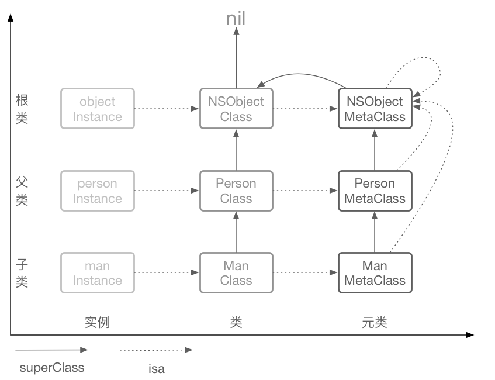

## 1. 怎么打开汇编查看流程,有什么好处?

答：菜单栏Debug->Debug Workflow->Always Show Disassembly（始终显示汇编代码）

## 2. 结构模型

### 2.1 介绍下runtime的内存模型（isa、对象、类、metaclass、结构体的存储信息等）

| 实例对象：（堆区，初始化时指向它的指针在栈区） |
| ---------------------------------------------- |
| isa（前8个字节） 成员变量值 …        |

| 类对象：（全局区）                                           |
| ------------------------------------------------------------ |
| isa （前8个字节） superClass （8个字节） 属性信息 对象方法信息 协议信息 成员变量信息 .... |

| 元类对象：（全局区）                                         |
| ------------------------------------------------------------ |
| isa （前8个字节） superClass （8个字节） 类方法信息 … |

### 2.2 OC对象、类、元类之间的关系

### 2.3 为什么要设计metaclass

- 类对象、元类对象能够复用消息发送流程机制；
- 单一职责原则

### 

## 2. `cache` 在什么时候开始扩容 , 为什么? 

## 4. 方法慢速查找过程中的二分查找流程,请用伪代码实现 ？

## 5. 类的结构里面为什么会有 `rw` 和 `ro` 以及 `rwe` ? 

## 6. `objc_msgSend` 为什么用汇编写 , `objc_msgSend` 是如何递归找到imp? 

## 7. 一个类的类方法没有实现为什么可以调用 `NSObject` 同名对象方法

## load方法和initialize的区别

## 
