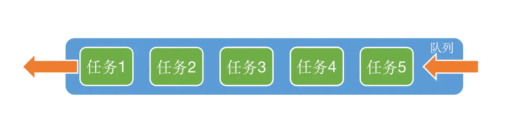

# 1.简介

- 全称是 Grand Central Dispatch，也简称 Dispatch；
- 纯 C 语言，提供了非常多强大的函数；
- GCD 是苹果公司为多核的并行运算提出的解决方案；
- GCD 会自动充分利用设备的多核（比如双核、四核）；
- GCD 会自动管理线程的生命周期（创建线程、调度任务、销毁线程）；
- 开发者只需要告诉 GCD 想要执行什么任务，不需要编写任何线程管理代码

# 2. GCD的两个核心

- 任务：执行什么操作
- 队列：用来存放任务

# 3. 任务

GCD 中的任务有两种封装：`dispatch_block_t `（常用）和 `dispatch_function_t`。

**任务的执行方式有两种:  同步执行和异步执行**

## 3.1 同步

 `dispatch_sync`: 提交一个 block 对象到指定队列以同步执行，并在该 block 完成执行后返回（阻塞）。
（因为这个特性，使用该函数要注意死锁的问题).

`dispatch_sync_f`: 提交一个 function 到指定队列以同步执行，并在该 function 完成执行后返回（阻塞）。

## 3.2 异步

`dispatch_async`: 提交一个 block 对象到指定队列以异步执行，并直接返回（不会阻塞）。

`dispatch_sync_f`: 提交一个 function 到指定队列以异步执行，并直接返回（不会阻塞）。

## 3.3  同步和异步的区别

- 同步：必须等待当前语句执行完毕，才会执行下一条语句（阻塞）；
     在`当前`线程中执行任务，`不具备`开启新线程的能力。
- 异步：不用等待当前语句执行完毕，就可以执行下一条语句（不会阻塞）；
     在`新的`线程中执行任务，`具备`开启新线程的能力。
   （具备开启新线程的能力，不代表一定能开启新线程。如在主队列异步执行，不会开启新线程，因为主队列的任务在主线程上执行）---> 主队列中的任务只能在主线程执行，在主线程执行的任务不一定在主队列中。

# 4.  队列



## 4.1 GCD 队列类型

- **串行队列**（`DISPATCH _QUEUE _SERIAL`）
   以 FIFO 顺序处理传入的任务，即让任务一个接着一个执行。

- **并发队列**（`DISPATCH _QUEUE _CONCURRENT`）
   可以让多个任务并发（同时）执行（自动开启多个线程执行任务）；
   并发功能只有在异步函数`dispatch_async`下才有效；
   尽管任务同时执行，但是您可以使用 barrier 栅栏函数在队列中创建同步点（关于栅栏函数后面会讲到）。

  常用的、系统提供的两种队列：

  > * <font color='red'>**主队列（`dispatch_queue_main_t`）**</font>：
  >    主队列是一种特殊的串行队列，它特殊在与主线程关联，主队列的任务都在主线程上执行，主队列在程序一开始就被系统创建并与主线程关联。
  >
  > * <font color='red'>**全局队列（`dispatch_queue_global_t`）**</font>：
  >
  >   一种特殊的并发队列，可以指定优先级。

## 4.2 全局并发队列与手动创建的并发队列的区别：

1. 手动创建的并发队列可以设置唯一标识，可以跟踪错误，而全局并发队列没有；
2. 在 ARC 中不需要考虑释放内存，`dispatch_release(q);`不需要也不允许调用。而在 MRC 中由于手动创建的并发队列是 create 出来的，所以需要调用`dispatch_release(q);`来释放内存，而全局并发队列不需要;
3. 全局并发队列可以指定优先级（服务质量有助于确定队列执行的任务的优先级）;
4. 一般我们使用全局并发队列。

# 5. GCD 的使用

## 5.1 使用步骤

1. 创建/获取队列：创建/获取一个并发/串行队列；
2. 创建任务：确定要做的事；
3. 将任务添加进队列中（同时指定任务的执行方式）

## 5.2 使用GCD多线程的特征：

GCD 会自动将队列中的任务取出，放到对应的线程中执行；

任务的取出遵循队列的 FIFO 原则：先进先出，后进后出；

GCD 中，要执行队列中的任务时，会自动开启一个线程，当任务执行完，线程不会立刻销毁，而是放到了线程池中。如果接下来还要执行任务的话就从线程池中取出线程，这样节省了创建线程所需要的时间。但如果一段时间内没有执行任务的话，该线程就会被销毁，再执行任务就会创建新的线程。

# 6.死锁

## 6.1 引发死锁的条件

* 互斥：某种资源一次只允许一个进程访问，即该资源一旦分配给某个进程，其他进程就不能再访问，直到该进程访问结束。
* 占用且等待：一个进程本身占有资源（一种或多种），同时还有资源未得到满足，正在等待其他进程释放该资源。
* 不可抢占：别人已经占有了某项资源，你不能因为自己也需要该资源，就去把别人的资源抢过来。
* 循环等待：存在一个进程链，使得每个进程都占有下一个进程所需的至少一种资源。

## 6.2  GCD 中的死锁

**死锁情况**：使用`dispatch_sync`函数往`当前串行队列`中添加任务，会卡住当前的串行队列（产生死锁）。

> 概括：往同一个串行队列中嵌套同步任务。

**死锁原因**：队列引起的循环等待。

(经典) **案例一：** `viewDidLoad `方法体为任务1，block为任务2；主队列中有任务1-->任务2；

```objective-c
- (void)viewDidLoad {
    NSLog(@"任务1--begin");
    [super viewDidLoad];
    dispatch_queue_t queue = dispatch_get_main_queue();
    dispatch_sync(queue, ^{
        NSLog(@"任务2");
    });
    NSLog(@"任务1--end");
}

```

**案例二：**

```objective-c
- (void)viewDidLoad {
    [super viewDidLoad];

    NSLog(@"1");
    dispatch_queue_t queue = dispatch_queue_create("myqueue", DISPATCH_QUEUE_SERIAL);
    dispatch_async(queue, ^{
        NSLog(@"2");
        dispatch_sync(queue, ^{
            NSLog(@"3");
        });
        NSLog(@"4");
    });
    NSLog(@"5");
}
```

