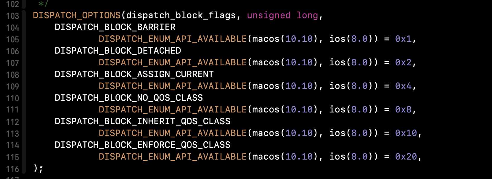

# 2. Dispatch Block

GCD 中的任务有两种封装：dispatch_block_t 和 dispatch_function_t，且 dispatch_block_t 比较常用。

dispatch_block，可以理解为一个block对象，拿到这个对象可以让我们更灵活的操作一个任务，比如等待、执行以及监听任务的完成等.

## 2.1 dispatch_block_create函数

* dispatch_block_create
*  dispatch_block_create_with_qos_class

 🌰代码：

```objective-c
dispatch_block_t block = ^{
  NSLog(@"一只熊脑宝宝向你奔来...");
};  
```

 一般情况下，按照上面🌰代码的操作，block 是创建在栈上的，通过 **dispatch_block_create** 方法可以使block 创建在堆上。

```c
dispatch_block_t  dispatch_block_create(dispatch_block_flags_t flags, dispatch_block_t block);
```

```c
dispatch_block_t  dispatch_block_create_with_qos_class(dispatch_block_flags_t flags, dispatch_qos_class_t qos_class, int relative_priority, dispatch_block_t block);
```

此方法相比于` dispatch_block_create `多了一个`dispatch_qos_class_t `属性，用来设置优先级；以及`relative_priority`属性，表示偏移值，这个参数主要作用是在你给定的优先级系统不能满足的情况下，如果需要调度的话，给定一个调度偏移值。

### 2.1.1 `dispatch_block_flags_t `枚举值解释



 关于`dispatch_block_flags_t `标志位 枚举值介绍：

**DISPATCH_BLOCK_BARRIER**： 当提交到`DISPATCH_QUEUE_CONCURRENT`队列，类似于`dispatch_barrier_async`（后面会介绍）作用。如果标记为这个的block对象被直接调用，将没有barrier效果。

 **DISPATCH_BLOCK_DETACHED**：block对象将解除与当前执行上下文属性的关联，如果直接调用，在分配给block属性之前，在调用线程上block对象将在block任务执行期间移出这些属性。如果提交到队列，block对象将使用队列属性或者分配给Block对象的属性。【注：DETACHED *[dɪ'tætʃt]* ：单独的 / 分离的 / 超然的 / 独立的】

**DISPATCH_BLOCK_ASSIGN_CURRENT**：Block对象被创建的同时会为block对象分配执行上下文属性。如果直接调用，block对象将在block任务执行期间将这些属性应用于调用线程。如果block任务被提交到队列，则这个标识将在提交队列的同时会替换其所关联的block对象默认的上下文属性。

**DISPATCH_BLOCK_NO_QOS_CLASS**： 表示不能设置优先级属性给block，如果block被直接调用，将会使用当前线程的优先级。如果被提交到队列，在提交到队列的同时将会取消原来的优先级属性。在dispatch_block_create_with_qos_class函数中，这个属性无效。

**DISPATCH_BLOCK_INHERIT_QOS_CLASS**： block和队列同时有优先级属性的情况下，优先使用队列的优先级。当队列没有优先级属性的情况下，block的优先级才会被采用，当block被执行调用，这个属性无效；如果被提交到并行异步队列，这个属性是默认的。【 **注**：INHERIT *[ɪn'herɪt]* ：继承/ 遗传 / 接手 】

 **DISPATCH_BLOCK_ENFORCE_QOS_CLASS**： block的优先级属性要高于队列的优先级属性。如果block被直接调用或被提交到并行同步队列，这个属性是默认的。 【 **注**：ENFORCE  *[ɪn'fɔːrs]*：实施 / 强制履行 / 强迫 】

### 2.1.2 关于dispatch_block_flags_t 标志位 的使用规则：

* 创建出来的 block 提交到队列的时候同时会为block 赋值一个默认的优先级属性，但也有例外，这三个标识位就不会默认设置优先级，分别是 DISPATCH_BLOCK_ASSIGN_CURRENT、DISPATCH_BLOCK_NO_QOS_CLASS和DISPATCH_BLOCK_DETACHED。
* 当 block 放入并行同步队列，默认是 DISPATCH_BLOCK_ENFORCE_QOS_CLASS 

- 当 block 放入并行异步队列，默认是 DISPATCH_BLOCK_INHERIT_QOS_CLASS
- 如果一个被赋值了优先级属性的block对象被放入到一个<font color='red'>串行队列</font>，那么系统将会尽可能的让已经在前面的block对象与这个block对象拥有一个优先级或者更高优先级，以<font color='red'>让前面的block任务优先执行</font>。

## 2.2 dispatch_block_notify函数

作用：**在被观察块 block1 执行完毕之后，立即将通知块 block2 提交到指定队列。**

```c++
/*!
 * @param block               block1, 需要观察的block
 * @param queue               notification_block提交的队列
 * @param notification_block  block2, 需要通知的block
 */
void dispatch_block_notify(dispatch_block_t block, dispatch_queue_t queue, dispatch_block_t notification_block);
```

举个🌰：

```objective-c
/// block1执行完后将block2加入队列
- (void)testBlock_notify {
    dispatch_queue_t queue = dispatch_queue_create("queue", DISPATCH_QUEUE_SERIAL);
    dispatch_block_t block1 = dispatch_block_create(0, ^{
        NSLog(@"block1 begin");
        [NSThread sleepForTimeInterval:1];
        NSLog(@"block1 done");
    });
    dispatch_async(queue, block1);
    dispatch_block_t block2 = dispatch_block_create(0, ^{
        NSLog(@"block2 start,queue");
    });
    //当block1执行完毕后，提交block2到global queue中执行
    dispatch_block_notify(block1, dispatch_get_global_queue(DISPATCH_QUEUE_PRIORITY_DEFAULT, 0), block2);
}
```

## 2.3 dispatch_block_wait函数

作用： **同步等待，直到指定的 block 执行完成或指定的超时时间结束为止才返回；**
  设置等待时间 DISPATCH_TIME_NOW 会立刻返回，
  设置 DISPATCH_TIME_FOREVER 会无限期等待指定的 block 执行完成才返回。

```c++
/*!
 * @param block
 *
 * @param timeout 超时时长
 * 
 * @return long  如果 block 在指定的超时时间内完成，则返回0； 超时则返回非0。
 */
long dispatch_block_wait(dispatch_block_t block, dispatch_time_t timeout);
```

举个🌰：

```objective-c
/**
 同步等待，直到指定的 block 执行完成或指定的超时时间结束为止才返回；
 设置等待时间 DISPATCH_TIME_NOW 会立刻返回，
 设置 DISPATCH_TIME_FOREVER 会无限期等待指定的 block 执行完成才返回。
 */
- (void)testBlock_wait {
    dispatch_queue_t queue = dispatch_queue_create("queue", DISPATCH_QUEUE_SERIAL);
    dispatch_block_t block = dispatch_block_create(0, ^{
        NSLog(@"begin %@",[NSThread currentThread]);
        [NSThread sleepForTimeInterval:5];
        NSLog(@"end %@",[NSThread currentThread]);
    });
    dispatch_async(queue, block);
    //等待前面的任务执行完毕
    dispatch_time_t interval = DISPATCH_TIME_FOREVER; // dispatch_time(DISPATCH_TIME_NOW, 4);
   long result = dispatch_block_wait(block, interval);
    NSLog(@"coutinue res:%ld %@",result,[NSThread currentThread]);
}
```

## 2.4 dispatch_block_cancel函数

```c++
void dispatch_block_cancel(dispatch_block_t block);	
```

举个🌰：

```objective-c
/// 异步取消指定的 block，正在执行的 block 不会被取消。
- (void)testBlock_cancel {
    dispatch_queue_t queue = dispatch_queue_create("queue", DISPATCH_QUEUE_SERIAL);
    dispatch_block_t block1 = dispatch_block_create(0, ^{
        NSLog(@"block1 begin");
        [NSThread sleepForTimeInterval:5];
        NSLog(@"block1 done");
    });
    dispatch_block_t block2 = dispatch_block_create(0, ^{
        NSLog(@"block2");
    });
    dispatch_block_t block3 = dispatch_block_create(0, ^{
        NSLog(@"block3");
    });

    dispatch_async(queue, block1);
    dispatch_async(queue, block2);
    dispatch_async(queue, block3);
    //取消block2
    dispatch_block_cancel(block2);
    //测试block2是否被取消 ,"测试指定的 block 是否被取消。返回非0代表已被取消；返回0代表没有取消"
    NSLog(@"block2是否被取消:%ld",dispatch_block_testcancel(block2));
}
```

# 3. Dispatch Group

GCD 队列组，又称“调度组”，**最多的用法便是用dispatch_group_enter和dispatch_group_leave实现一组任务完成的监控或回调。**

常用接口：

* dispatch_group_create

* dispatch_group_async

  ```C
  dispatch_group_async(group, queue, ^{   }); 
  
  //等价于
  dispatch_group_enter(group);
  dispatch_async(queue, ^{
      dispatch_group_leave(group);
  });
  ```

* dispatch_group_enter

* dispatch_group_leave

*  dispatch_group_notify

* dispatch_group_wait

## 3.1 Dispatch Group如何使用

举个🌰：

```objective-c
- (void)testGroup_async {
    dispatch_group_t group = dispatch_group_create();
    dispatch_queue_t queue = dispatch_get_global_queue(DISPATCH_QUEUE_PRIORITY_DEFAULT, 0);
    dispatch_group_async(group, queue, ^{
        // 耗时操作A
        NSLog(@"A");
        dispatch_group_enter(group);
        dispatch_async(queue, ^{
            // 耗时操作A-a
            NSLog(@"A-a");
            dispatch_group_leave(group);
        });
    });
    
    dispatch_group_async(group, queue, ^{
        // 耗时操作B
        NSLog(@"B");
        dispatch_group_enter(group);
        dispatch_async(queue, ^{
            // 耗时操作B-b
            sleep(2);
            NSLog(@"B-b");
            dispatch_group_leave(group);
        });
    });
    dispatch_group_notify(group, queue, ^{
        [YLAlertManager showAlertWithTitle:@"哈喽，猪头" message:nil actionTitle:@"OK" handler:^(UIAlertAction * _Nonnull action) {
            NSLog(@"继续下一步");
        }];
    });
    NSLog(@"dispatch_group_notify 后面");
}
```


dispatch_group有两个需要注意的地方：
1、dispatch_group_enter必须在dispatch_group_leave之前出现
2、dispatch_group_enter和dispatch_group_leave必须成对出现

## 3.2 Dispatch Group实现原理

**思考：如果dispatch_group_enter和dispatch_group_leave不成对出现会出现什么结果？**

dispatch_group本质是个初始值为LONG_MAX的信号量，等待group中的任务完成其实是等待value恢复初始值。
`dispatch_group_enter`和`dispatch_group_leave`必须成对出现。

如果`dispatch_group_enter`比`dispatch_group_leave`多一次，则wait函数等待的
线程不会被唤醒和注册notify的回调block不会执行；

如果`dispatch_group_leave`比`dispatch_group_enter`多一次，则会引起崩溃。

### 3.2.1 dispatch_group_create

Dispatch Group的本质是一个初始value为LONG_MAX的semaphore，通过信号量来实现一组任务的管理，代码如下：

```C
dispatch_group_t dispatch_group_create(void) {
    //申请内存空间
	dispatch_group_t dg = (dispatch_group_t)_dispatch_alloc(
			DISPATCH_VTABLE(group), sizeof(struct dispatch_semaphore_s));
	//使用LONG_MAX初始化信号量结构体
	_dispatch_semaphore_init(LONG_MAX, dg);
	return dg;
}
```

### 3.2.2 dispatch_group_enter

```c++
void dispatch_group_enter(dispatch_group_t dg) {
	dispatch_semaphore_t dsema = (dispatch_semaphore_t)dg;
	long value = dispatch_atomic_dec2o(dsema, dsema_value, acquire);
	if (slowpath(value < 0)) {
		DISPATCH_CLIENT_CRASH(
				"Too many nested calls to dispatch_group_enter()");
	}
}
```

`dispatch_group_enter`的逻辑是将`dispatch_group_t`转换成`dispatch_semaphore_t`后将`dsema_value`的值减一。

### 3.2.3 dispatch_group_leave

```c++
void dispatch_group_leave(dispatch_group_t dg) {
	dispatch_semaphore_t dsema = (dispatch_semaphore_t)dg;
	long value = dispatch_atomic_inc2o(dsema, dsema_value, release);
	if (slowpath(value < 0)) {
		DISPATCH_CLIENT_CRASH("Unbalanced call to dispatch_group_leave()");
	}
	if (slowpath(value == LONG_MAX)) {
		(void)_dispatch_group_wake(dsema);
	}
}
```

`dispatch_group_leave`的逻辑是将`dispatch_group_t`转换成`dispatch_semaphore_t`后将`dsema_value`的值加一。
当value等于LONG_MAX时表示所有任务已完成，调用`_dispatch_group_wake`唤醒group，因此`dispatch_group_leave`与`dispatch_group_enter`需成对出现。

当调用了`dispatch_group_enter`而没有调用`dispatch_group_leave`时，会造成value值不等于LONG_MAX而不会走到唤醒逻辑，`dispatch_group_notify`函数的block无法执行或者`dispatch_group_wait`收不到`semaphore_signal`信号而卡住线程。

当`dispatch_group_leave`比`dispatch_group_enter`多调用了一次时，dispatch_semaphore_t的value会等于LONGMAX+1（2147483647+1）,即long的负数最小值LONG_MIN(–2147483648)。因为此时value小于0，所以会出现”Unbalanced call to dispatch_group_leave()”的崩溃，这是一个特别需要注意的地方。

### 3.2.4 dispatch_group_wait

```c++
long dispatch_group_wait(dispatch_group_t dg, dispatch_time_t timeout) {
	dispatch_semaphore_t dsema = (dispatch_semaphore_t)dg;

	if (dsema->dsema_value == LONG_MAX) {
		return 0;
	}
	if (timeout == 0) {
		return KERN_OPERATION_TIMED_OUT;
	}
	return _dispatch_group_wait_slow(dsema, timeout);
}
```

如果当前value的值为初始值，表示任务都已经完成，直接返回0，如果timeout为0的话返回超时。其余情况会调用_dispatch_group_wait_slow方法。

```c++
static long _dispatch_group_wait_slow(dispatch_semaphore_t dsema, dispatch_time_t timeout) {
	long orig;
	mach_timespec_t _timeout;
	kern_return_t kr;
again:
	if (dsema->dsema_value == LONG_MAX) {
		return _dispatch_group_wake(dsema);
	}
	(void)dispatch_atomic_inc2o(dsema, dsema_group_waiters, relaxed);
	if (dsema->dsema_value == LONG_MAX) {
		return _dispatch_group_wake(dsema);
	}
	_dispatch_semaphore_create_port(&dsema->dsema_port);
	switch (timeout) {
	default:
		do {
			uint64_t nsec = _dispatch_timeout(timeout);
			_timeout.tv_sec = (typeof(_timeout.tv_sec))(nsec / NSEC_PER_SEC);
			_timeout.tv_nsec = (typeof(_timeout.tv_nsec))(nsec % NSEC_PER_SEC);
			kr = slowpath(semaphore_timedwait(dsema->dsema_port, _timeout));
		} while (kr == KERN_ABORTED);

		if (kr != KERN_OPERATION_TIMED_OUT) {
			DISPATCH_SEMAPHORE_VERIFY_KR(kr);
			break;
		}
	case DISPATCH_TIME_NOW:
		orig = dsema->dsema_group_waiters;
		while (orig) {
			if (dispatch_atomic_cmpxchgvw2o(dsema, dsema_group_waiters, orig,
					orig - 1, &orig, relaxed)) {
				return KERN_OPERATION_TIMED_OUT;
			}
		}
	case DISPATCH_TIME_FOREVER:
		do {
			kr = semaphore_wait(dsema->dsema_port);
		} while (kr == KERN_ABORTED);
		DISPATCH_SEMAPHORE_VERIFY_KR(kr);
		break;
	}
	goto again;
 }
```

可以看到跟dispatch_semaphore的`_dispatch_semaphore_wait_slow`方法很类似，不同点在于等待完之后调用的again函数会调用`_dispatch_group_wake`唤醒当前group。`_dispatch_group_wake`的分析见下面的内容。

### 3.2.5 dispatch_group_notify

```c++
void dispatch_group_notify(dispatch_group_t dg, dispatch_queue_t dq,
		dispatch_block_t db) {
	//封装调用dispatch_group_notify_f函数
	dispatch_group_notify_f(dg, dq, _dispatch_Block_copy(db),
			_dispatch_call_block_and_release);
}
//真正的入口函数
void dispatch_group_notify_f(dispatch_group_t dg, dispatch_queue_t dq, void *ctxt,
		void (*func)(void *)) {
	dispatch_semaphore_t dsema = (dispatch_semaphore_t)dg;
	//封装结构体
	dispatch_continuation_t prev, dsn = _dispatch_continuation_alloc();
	dsn->do_vtable = (void *)DISPATCH_OBJ_ASYNC_BIT;
	dsn->dc_data = dq;
	dsn->dc_ctxt = ctxt;
	dsn->dc_func = func;
	dsn->do_next = NULL;
	_dispatch_retain(dq);
	//将结构体放到链表尾部，如果链表为空同时设置链表头部节点并唤醒group
	prev = dispatch_atomic_xchg2o(dsema, dsema_notify_tail, dsn, release);
	if (fastpath(prev)) {
		prev->do_next = dsn;
	} else {
		_dispatch_retain(dg);
		dispatch_atomic_store2o(dsema, dsema_notify_head, dsn, seq_cst);
		dispatch_atomic_barrier(seq_cst); // <rdar://problem/11750916>
		if (dispatch_atomic_load2o(dsema, dsema_value, seq_cst) == LONG_MAX) {
			_dispatch_group_wake(dsema);
		}
	}
}
```

dispatch_group_notify的具体实现在dispatch_group_notify_f函数里，逻辑就是将block和queue封装到dispatch_continuation_t里，并将它加到链表的尾部，如果链表为空同时还会设置链表的头部节点。如果dsema_value的值等于初始值，则调用_dispatch_group_wake执行唤醒逻辑。

### 3.2.6 dispatch_group_wake

```c++
static long _dispatch_group_wake(dispatch_semaphore_t dsema) {
	dispatch_continuation_t next, head, tail = NULL, dc;
	long rval;
   //将dsema的dsema_notify_head赋值为NULL，同时将之前的内容赋给head
	head = dispatch_atomic_xchg2o(dsema, dsema_notify_head, NULL, relaxed);
	if (head) {
		//将dsema的dsema_notify_tail赋值为NULL，同时将之前的内容赋给tail
		tail = dispatch_atomic_xchg2o(dsema, dsema_notify_tail, NULL, relaxed);
	}
	rval = (long)dispatch_atomic_xchg2o(dsema, dsema_group_waiters, 0, relaxed);
	if (rval) {
		// wake group waiters
		_dispatch_semaphore_create_port(&dsema->dsema_port);
		do {
			kern_return_t kr = semaphore_signal(dsema->dsema_port);
			DISPATCH_SEMAPHORE_VERIFY_KR(kr);
		} while (--rval);
	}
	if (head) {
		// async group notify blocks
		do {
			next = fastpath(head->do_next);
			if (!next && head != tail) {
				while (!(next = fastpath(head->do_next))) {
					dispatch_hardware_pause();
				}
			}
			dispatch_queue_t dsn_queue = (dispatch_queue_t)head->dc_data;
			dc = _dispatch_continuation_free_cacheonly(head);
			//执行dispatch_group_notify的block，见dispatch_queue的分析
			dispatch_async_f(dsn_queue, head->dc_ctxt, head->dc_func);
			_dispatch_release(dsn_queue);
			if (slowpath(dc)) {
				_dispatch_continuation_free_to_cache_limit(dc);
			}
		} while ((head = next));
		_dispatch_release(dsema);
	}
	return 0;
}
```

`dispatch_group_wake`首先会循环调用`semaphore_signal`唤醒等待group的信号量，使`dispatch_group_wait`函数中等待的线程得以唤醒；然后依次获取链表中的元素并调用`dispatch_async_f`异步执行`dispatch_group_notify`函数中注册的回调，使得notify中的block得以执行。

### 3.2.7 dispatch_group_async

`dispatch_group_async`的原理和`dispatch_async`比较类似，区别点在于group操作会带上DISPATCH_OBJ_GROUP_BIT标志位。添加group任务时会先执行`dispatch_group_enter`，然后在任务执行时会对带有该标记的执行`dispatch_group_leave`操作。下面看下具体实现：

```c++
void dispatch_group_async(dispatch_group_t dg, dispatch_queue_t dq,
		dispatch_block_t db) {
	//封装调用dispatch_group_async_f函数
	dispatch_group_async_f(dg, dq, _dispatch_Block_copy(db),
			_dispatch_call_block_and_release);
}
void dispatch_group_async_f(dispatch_group_t dg, dispatch_queue_t dq, void *ctxt,
		dispatch_function_t func) {
	dispatch_continuation_t dc;
	_dispatch_retain(dg);
	//先调用dispatch_group_enter操作
	dispatch_group_enter(dg);
	dc = _dispatch_continuation_alloc();
    //DISPATCH_OBJ_GROUP_BIT会在_dispatch_continuation_pop方法中用来判断是否为group，如果为group会执行dispatch_group_leave
	dc->do_vtable = (void *)(DISPATCH_OBJ_ASYNC_BIT | DISPATCH_OBJ_GROUP_BIT);
	dc->dc_func = func;
	dc->dc_ctxt = ctxt;
	dc->dc_data = dg;
	if (dq->dq_width != 1 && dq->do_targetq) {
		return _dispatch_async_f2(dq, dc);
	}
	_dispatch_queue_push(dq, dc);
}
```

`dispatch_group_async_f`与`dispatch_async_f`代码类似，主要执行了以下操作：
1、调用dispatch_group_enter
2、将block和queue等信息记录到dispatch_continuation_t中，并将它加入到group的链表中。
3、_dispatch_continuation_pop执行时会判断任务是否为group，是的话执行完任务再调用dispatch_group_leave以达到信号量value的平衡。

`_dispatch_continuation_pop`简化后的代码如下：

```c++
static inline void _dispatch_continuation_pop(dispatch_object_t dou) {
	dispatch_continuation_t dc = dou._dc, dc1;
	dispatch_group_t dg;
	_dispatch_trace_continuation_pop(_dispatch_queue_get_current(), dou);
	//判断是否为队列，是的话执行队列的invoke函数
	if (DISPATCH_OBJ_IS_VTABLE(dou._do)) {
		return dx_invoke(dou._do);
	} 
	//dispatch_continuation_t结构体，执行具体任务
	if ((long)dc->do_vtable & DISPATCH_OBJ_GROUP_BIT) {
		dg = dc->dc_data;
	} else {
		dg = NULL;
	}
	_dispatch_client_callout(dc->dc_ctxt, dc->dc_func);
	if (dg) {
	   //这是group操作，执行leave操作对应最初的enter
		dispatch_group_leave(dg);
		_dispatch_release(dg);
	}
}
```

# 4. Dispatch Barrier

 当多线程并发读写同一个资源时，为了保证资源读写的正确性，可以用Barrier Block解决该问题。

 Dispatch Barrier会确保队列中先于Barrier Block提交的任务都完成后再执行它，并且执行时队列不会同步执行其它任务，等Barrier Block执行完成后再开始执行其他任务。

## 4.1 dispatch_barrier_async使用

举个🌰：

```objective-c
- (void)testBarrier_create {
    //创建自定义并行队列
    dispatch_queue_t queue = dispatch_queue_create("com.yuli.queue", DISPATCH_QUEUE_CONCURRENT);
    dispatch_async(queue, ^{
        //读操作
        NSLog(@"work1");
    });
    dispatch_barrier_async(queue, ^{
        //barrier block,可用于写操作
        //确保资源更新过程中不会有其他线程读取
        NSLog(@"work2");
        sleep(1);
    });
    dispatch_async(queue, ^{
        //读操作
        NSLog(@"work3");
    });
}
```

<font color='red'>注意点：调用dispatch_barrier_async时,必须提交给一个用DISPATCH_QUEUE_CONCURRENT属性创建的并发队列，不能是系统提供的 global queue。</font>

>  这里有个需要注意也是官方文档上提到的一点，如果我们调用dispatch_barrier_async时将Barrier blocks提交到一个global queue，barrier blocks执行效果与dispatch_async()一致；只有将Barrier blocks提交到使用DISPATCH_QUEUE_CONCURRENT属性创建的并行queue时它才会表现的如同预期。

## 4.2原理


# 5. Dispatch Semaphore

# 6. Dispatch Source

# 7. 其他

### dispatch_apply

### dispatch_once

### dispatch_time

### dispatch_after

