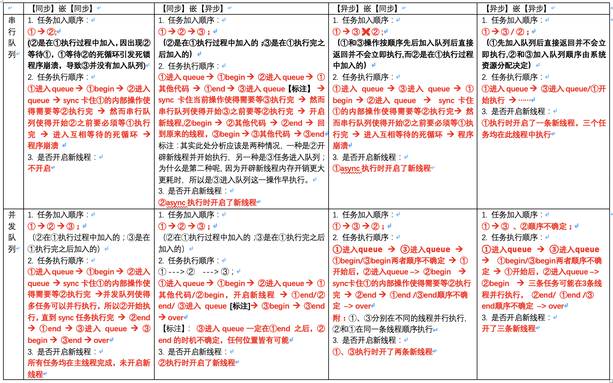

# 1. 基础部分

GCD全称是Grand Central Dispatch

### **并行、串行、同步、异步 概念解释：**

- 串行：任务是一个一个有顺序的执行，一个执行完以后才执行下一个。**(*有序的***)
- 并行：跟串行相反，任务是无序的执行，执行顺序没有顺序关系。（***无序的***）
- 同步：需要等上一个任务执行完成后才能执行下一个任务。（***依赖于上个任务是否执行完毕***）
- 异步：不需要等到上一个任务执行完成才执行下一个任务。（***无需依赖于上个任务是否执行完毕***）

### **GCD优势**

- GCD是C实现的，效率相对更高，可以更好更方便的让并行代码执行在多核设备上
- GCD是系统级的，会自动利用更多的CPU内核（比如双核、四核），帮助程序更合理的利用可用资源
- 跟NSThread相比，使用GCD时不用手动管理任务，只要把任务塞到队列里，系统的线程池会自动管理线程的生命周期（创建线程、调度任务、销毁线程）等
- 在ARC下，GCD的内存管理跟其他对象一样，在非ARC下，需要通过dispatch_retain和dispatch_release进行管理。

总结：GCD是将任务添加到队列，并指定任务执行的函数

### **GCD核心**

GCD的核心是由 **任务 + 队列 + 函数** 构成：

- 使用 dispatch_block_t 创建任务
- 使用 dispatch_queue_t创建队列
- 将任务添加到队列，并指定执行任务的函数：`dispatch_async` / `dispatch_sync`

注意

这里的任务是指执行操作的意思，在使用 dispatch_block_t 创建任务时，主要有以下两点说明：

- 任务使用block封装
- 任务的block没有参数也没有返回值

### **GCD** 函数

在GCD中执行任务的方式有两种，同步执行和异步执行，分别对应 同步函数dispatch_sync 和 异步函数dispatch_async，两者对比如下：

- `dispatch_sync`  同步执行

- - 必须等待当前语句执行完毕，才会执行下一条语句
  - 不会开启线程，即不具备开启新线程的能力
  - 在当前线程中执行block任务（注意！！）

- `dispatch_async` 异步执行

- - 不用等待当前语句执行完毕，就可以执行下一条语句
  - 会开启线程执行block任务，即具备开启新线程的能力（但并不一定开启新线程，这个与任务所指定的队列类型有关）
  - 异步 是 多线程 的代名词

所以，综上所述，两种执行方式的主要区别有两点：

- 是否等待队列的任务执行完毕
- 是否具备开启新线程的能力

### **GCD**队列

队列类型介绍

在GCD中，队列主要分为串行队列（Serial Dispatch Queue） 和 并发队列（Concurrent Dispatch Queue）两种：

- 串行队列：每次只有一个任务被执行，等待上一个任务执行完毕再执行下一个，同一时刻只调度一个任务执行

- - 使用 dispatch_queue_create("xxx", DISPATCH_QUEUE_SERIAL); 创建串行队列
  - 其中的DISPATCH_QUEUE_SERIAL也可以使用NULL表示，这两种均表示 默认的串行队列
  - // 串行队列的获取方法

​	  dispatch_queue_t serialQueue2 = dispatch_queue_create("com.CJL.Queue", DISPATCH_QUEUE_SERIAL);

- 并发队列：一次可以并发执行多个任务，即同一时刻可以调度多个任务执行）

- - 使用dispatch_queue_create("com.TH.Queue", DISPATCH_QUEUE_CONCURRENT);
  - 注意：并发队列的并发功能只有在异步函数下才有效
  - // 并发队列的获取方法

​    dispatch_queue_t concurrentQueue = dispatch_queue_create("com.TH.Queue", DISPATCH_QUEUE_CONCURRENT);

- 主队列（Main Dispatch Queue）：GCD中提供的特殊的串行队列

- - 专门用来在主线程上调度任务的串行队列，依赖于主线程、主Runloop，在main函数调用之前自动创建
  - 不会开启线程
  - 如果当前主线程正在有任务执行，那么无论主队列中当前被添加了什么任务，都不会被调度
  - 使用dispatch_get_main_queue() 获得主队列

​    注意：

- - 使用 dispatch_get_main_queue() 方法获取的主队列是同一个，且在主线程执行的任务都会放到主队列，所以在主线程调用同步执行 dispatch_sync(dispatch_get_main_queue(), ^{}); 会阻塞队列任务造成死锁

- 全局并发队列（Global Dispatch Queue）：GCD提供的默认的并发队列

- - 在使用多线程开发时，如果对队列没有特殊需求，在执行异步任务时，可以直接使用全局队列
  - 使用dispatch_get_global_queue 获取全局并发队列，最简单的是dispatch_get_global_queue(0, 0)
  - 第一个参数表示队列优先级，默认优先级为DISPATCH_QUEUE_PRIORITY_DEFAULT=0，在ios9之后，已经被服务质量（quality-of-service）取代：

- - - 注意：dispatch_get_global_queue得到的队列， dispatch_suspend，dispatch_resume和dispatch_set_context函数对其是无效的

| 优先级 | 新版(iOS8以后)                                               | 旧版本                             |
| ------ | ------------------------------------------------------------ | ---------------------------------- |
| 最高   | QOS_CLASS_USER_INTERACTIVE<br /> //用户交互权限，属于最高等级，常被用于处理交互事件或者刷新UI，因为这些需要即时的 |                                    |
| 高     | QOS_CLASS_USER_INITIATED<br />  // 为了可以进一步的后续操作，当用户发起请求结果需要被立即展示，比如当点了列表页某条信息后需要立即加载详情信息 | DISPATCH_QUEUE_PRIORITY_HIGH       |
| 默认   | QOS_CLASS_DEFAULT<br />  // 默认权限，具体权限由系统根据实际情况来决定使用哪个等级权限，如果实际情况不太利于决定使用何种权限，则从UserInitiated和Utility之间选一个权限并使用 | DISPATCH_QUEUE_PRIORITY_DEFAULT    |
| 低     | QOS_CLASS_UTILITY<br />  // 不需要马上就能得到结果，比如下载任务。当资源被限制后，此权限的任务将运行在节能模式下以提供更多资源给更高的优先级任务 | DISPATCH_QUEUE_PRIORITY_LOW        |
| 后台   | QOS_CLASS_BACKGROUND<br />  // 后台权限，通常用户都不能意识到有任务正在进行，比如数据备份等。大多数处于节能模式下，需要把资源让出来给更高的优先级任务 | DISPATCH_QUEUE_PRIORITY_BACKGROUND |

# 1. GCD的基本使用

使用步骤：

1. 创建一个队列（串行队列或并发队列）；
2. 将任务（同步任务或异步任务）追加到任务的等待队列中，然后系统就会根据任务类型执行任务。

## 1.1 创建/获取队列

* 创建队列的方法

  使用`dispatch_queue_create`方法创建队列

  ```objective-c
  dispatch_queue_t s_queue = dispatch_queue_create("queue.yuli.serial", DISPATCH_QUEUE_SERIAL); // 串行队列 
  dispatch_queue_t c_queue = dispatch_queue_create("queue.yuli.concurrent", DISPATCH_QUEUE_CONCURRENT); // 并发队列
  
  ```

  设置队列的其他性质：

  > - 创建队列时设置队列优先级：**dispatch_queue_attr_make_with_qos_class**
  >
  > ​    🌰代码：
  >
  > ```objective-c
  > dispatch_queue_attr_t attr_t = dispatch_queue_attr_make_with_qos_class(DISPATCH_QUEUE_CONCURRENT,QOS_CLASS_USER_INTERACTIVE, QOS_MIN_RELATIVE_PRIORITY);
  > dispatch_queue_t queue = dispatch_queue_create("com.tangh.test", attr_t);
  > ```
  >
  > - - dispatch_queue_attr_make_with_qos_class 的第二个参数代表队列的优先级，目前优先级有这几个选择：
  >
  >   - - **QOS_CLASS_USER_INTERACTIVE** （DISPATCH_QUEUE_PRIORITY_HIGH）
  >     - **QOS_CLASS_USER_INITIATED** （DISPATCH_QUEUE_PRIORITY_HIGH）
  >     - **QOS_CLASS_UTILITY** （DISPATCH_QUEUE_PRIORITY_LOW）
  >     - **QOS_CLASS_DEFAULT** （DISPATCH_QUEUE_PRIORITY_DEFAULT）
  >     - **QOS_CLASS_BACKGROUND** （DISPATCH_QUEUE_PRIORITY_BACKGROUND）
  >
  > - - dispatch_queue_attr_make_with_qos_class 的第三个参数，需要填写一个负数的偏移值，小于0且大于等于-15(QOS_MIN_RELATIVE_PRIORITY即表示为-15)，必须这么填，不然函数会返回一个null。这个参数主要作用是在你给定的优先级系统不能满足的情况下，如果需要调度的话，给定一个调度偏移值。
  >
  > - 
  >
  > - 修改队列的优先级：**dispatch_set_target_queue**
  >
  > ​    🌰代码：
  >
  > ```objective-c
  > dispatch_queue_t queue1 = dispatch_get_global_queue(NSQualityOfServiceUserInitiated, 0);
  > dispatch_queue_t queue2 = dispatch_get_global_queue(NSQualityOfServiceUserInteractive, 0);
  > ```
  >
  > 
  >
  > ​    // 将第二个队列权限设置为第一个队列一样：
  >
  > ​    dispatch_set_target_queue(queue2, queue1);
  >
  > - - dispatch_set_target_queue 一共有两个功能，除了 变更队列优先级 外，还可以 改变队列层次体系。当我们想让不同队列中的任务同步的执行时，可以创建一个串行队列，然后将这些队列的target指向新建的队列即可。（经测试，这些任务会在 target 队列，相同的线程里执行）
  >
  > ​	   例如：将多个串行queue指定到目标串行queue, 以实现某任务在多个串行 queue 也是先后执行 而非并行
  >
  > ```objective-c
  >     dispatch_queue_t targetQueue = dispatch_queue_create("test.target.queue", DISPATCH_QUEUE_SERIAL);  
  > dispatch_queue_t queue1 = dispatch_queue_create("test.1", DISPATCH_QUEUE_SERIAL);  
  > dispatch_queue_t queue2 = dispatch_queue_create("test.2", DISPATCH_QUEUE_SERIAL);  
  > 
  > dispatch_set_target_queue(queue1, targetQueue);  
  > dispatch_set_target_queue(queue2, targetQueue);  
  > 
  > dispatch_async(queue1, ^{  
  >   // 会在 target 队列，相同的线程里执行
  >   NSLog(@"1 in");  
  >   [NSThread sleepForTimeInterval:3.f];  
  >   NSLog(@"1 out");  
  > });  
  > 
  > dispatch_async(queue2, ^{  
  >   // 会在 target 队列，相同的线程里执行
  >   NSLog(@"2 in");  
  >   [NSThread sleepForTimeInterval:2.f];  
  >   NSLog(@"2 out");  
  > });  
  > 
  > // 1 in  
  > // 1 out  
  > // 2 in  
  > // 2 out  
  > ```
  >
  > ​     注意：dispatch_set_target_queue设置时机应在设置block任务之前，同时不能互相循环设置


* 获取队列的方法

  系统提供了两个默认队列，主队列（串行）和全局队列（并发）。

  ```objective-c
  dispatch_queue_t m_queue = dispatch_get_main_queue(); // 主队列
  dispatch_queue_t g_queue = dispatch_get_global_queue(DISPATCH_QUEUE_PRIORITY_DEFAULT, 0); // 全局队列
  ```
  
  

## 1.2 添加任务

* 同步任务

  ```objective-c
  dispatch_sync(s_queue, ^{
      NSLog(@"这是一个同步任务 4,%@",[NSThread currentThread]);
  });
  ```

* 异步任务

  ```objective-c
  dispatch_async(s_queue, ^{
      NSLog(@"这是一个异步任务 1,%@",[NSThread currentThread]);
  });
  ```


# 2. GCD复杂使用场景

## 2.1 非嵌套场景

a. 串行队列不是主队列

|      | 同步任务+串行队列                                            | 异步任务+串行队列                                            | 同步任务+并发队列                                            | 异步任务+并发队列                                            |
| ---- | ------------------------------------------------------------ | ------------------------------------------------------------ | ------------------------------------------------------------ | ------------------------------------------------------------ |
| 特点 | 1.  同步任务会阻塞住当前任务，等所有同步任务执行完毕才继续执行当前任务后续代码  <br />2．多个同步任务按顺序执行，执行完一个，执行下一个  <br />3. 不开辟新的线程 | 1. 异步任务不会阻塞当前任务而是将异步任务加入串行队列后直接返回，然后继续执行当前任务后续代码 <br /> 2. 多个异步任务会在新线程按加入队列顺序执行，执行完一个，执行下一个  <br />3. 会开辟新线程 | 1. 同步任务会阻塞住当前任务，等所有同步任务执行完毕才继续执行当前任务后续代码<br />  2. 多个同步任务按顺序执行，执行完一个，执行下一个  <br />3. 不开辟新的线程 | 1. 异步任务不会阻塞当前任务而是将异步任务加入串行队列后直接返回，然后继续执行当前任务后续代码；  <br />2. 多个异步任务会在新线程并发执行，顺序不确定  <br />3. 会开辟多条新线程（线程数由内核开销决定） |

代码：

```objc
/// 同步+串行
- (void)testSync_serial {
    NSLog(@"同步+串行---start");
    dispatch_queue_t queue = dispatch_queue_create("queue.yuli.seria", DISPATCH_QUEUE_SERIAL);
    dispatch_sync(queue, ^{
        // 追加任务 1
        [NSThread sleepForTimeInterval:2];              // 模拟耗时操作
        NSLog(@"1---%@",[NSThread currentThread]);      // 打印当前线程
    });
    
    dispatch_sync(queue, ^{
        // 追加任务 2
        [NSThread sleepForTimeInterval:2];              // 模拟耗时操作
        NSLog(@"2---%@",[NSThread currentThread]);      // 打印当前线程
    });
    
    dispatch_sync(queue, ^{
        // 追加任务 3
        [NSThread sleepForTimeInterval:2];              // 模拟耗时操作
        NSLog(@"3---%@",[NSThread currentThread]);      // 打印当前线程
    });
    
    NSLog(@"同步+串行---end");
}

/// 异步+串行
- (void)testAsync_serial {
    NSLog(@"异步+串行---start");
    dispatch_queue_t queue = dispatch_queue_create("queue.yuli.seria", DISPATCH_QUEUE_SERIAL);
    dispatch_async(queue, ^{
        // 追加任务 1
        NSLog(@"start：1---%@",[NSThread currentThread]);      // 打印当前线程

        [NSThread sleepForTimeInterval:2];              // 模拟耗时操作
        NSLog(@"1---%@",[NSThread currentThread]);      // 打印当前线程
    });
    
    dispatch_async(queue, ^{
        // 追加任务 2
        NSLog(@"start：2---%@",[NSThread currentThread]);      // 打印当前线程

        [NSThread sleepForTimeInterval:2];              // 模拟耗时操作
        NSLog(@"2---%@",[NSThread currentThread]);      // 打印当前线程
    });
    
    dispatch_async(queue, ^{
        // 追加任务 3
        NSLog(@"start：3---%@",[NSThread currentThread]);      // 打印当前线程

        [NSThread sleepForTimeInterval:2];
        // 模拟耗时操作
        NSLog(@"3---%@",[NSThread currentThread]);      // 打印当前线程
    });
    
    NSLog(@"异步+串行---end");
}

/// 同步+并发
- (void)testSync_concurrent {
    NSLog(@"同步+并发---start");

    dispatch_queue_t queue = dispatch_queue_create("queue.yuli.concurrent", DISPATCH_QUEUE_CONCURRENT);
    dispatch_sync(queue, ^{
        // 追加任务 1
        [NSThread sleepForTimeInterval:2];              // 模拟耗时操作
        NSLog(@"1---%@",[NSThread currentThread]);      // 打印当前线程
    });
    
    dispatch_sync(queue, ^{
        // 追加任务 2
        [NSThread sleepForTimeInterval:2];              // 模拟耗时操作
        NSLog(@"2---%@",[NSThread currentThread]);      // 打印当前线程
    });
    
    dispatch_sync(queue, ^{
        // 追加任务 3
        [NSThread sleepForTimeInterval:2];              // 模拟耗时操作
        NSLog(@"3---%@",[NSThread currentThread]);      // 打印当前线程
    });
    NSLog(@"同步+并发---end");
}

/// 异步+并发
- (void)testAsync_concurrent {
    NSLog(@"异步+并发---start");

    dispatch_queue_t queue = dispatch_queue_create("queue.yuli.concurrent", DISPATCH_QUEUE_CONCURRENT);
    dispatch_async(queue, ^{
        // 追加任务 1
        [NSThread sleepForTimeInterval:2];              // 模拟耗时操作
        NSLog(@"1---%@",[NSThread currentThread]);      // 打印当前线程
    });
    
    dispatch_async(queue, ^{
        // 追加任务 2
        [NSThread sleepForTimeInterval:2];              // 模拟耗时操作
        NSLog(@"2---%@",[NSThread currentThread]);      // 打印当前线程
    });
    
    dispatch_async(queue, ^{
        // 追加任务 3
        [NSThread sleepForTimeInterval:2];              // 模拟耗时操作
        NSLog(@"3---%@",[NSThread currentThread]);      // 打印当前线程
    });
        
    NSLog(@"异步+并发---end");
}
```

b. 串行队列是主队列，当前任务所在也是主队列（该场景已经是嵌套场景了，姑且放这里吧）

|      | 同步任务+主队列                                              | 异步任务+主队列                                              |
| ---- | ------------------------------------------------------------ | ------------------------------------------------------------ |
| 特点 | 1.  同步任务会阻塞住主队列任务，因为主队列任务被阻塞住迟迟无法完成，后续同步任务也不能开始，长时间互相等待导致当前线程被挂起，主线程被阻塞，出现死锁程序崩溃<br />2. 不开辟新的线程 | 1. 异步任务不会阻塞主队列任务而是将异步任务加入主队列后直接返回，然后继续执行主队列任务后续代码  <br />2. 多个异步任务会在主线程按加入队列顺序执行，执行完一个，执行下一个  <br />3. 不会开辟新线程 |

```objc
/// 同步任务+主队列
- (void)testSync_main {
    NSLog(@"同步任务+主队列---start");

    dispatch_queue_t queue = dispatch_get_main_queue();
    dispatch_sync(queue, ^{
        // 追加任务 1
        [NSThread sleepForTimeInterval:2];              // 模拟耗时操作
        NSLog(@"1---%@",[NSThread currentThread]);      // 打印当前线程
    });
    
    dispatch_sync(queue, ^{
        // 追加任务 2
        [NSThread sleepForTimeInterval:2];              // 模拟耗时操作
        NSLog(@"2---%@",[NSThread currentThread]);      // 打印当前线程
    });
    
    dispatch_sync(queue, ^{
        // 追加任务 3
        [NSThread sleepForTimeInterval:2];              // 模拟耗时操作
        NSLog(@"3---%@",[NSThread currentThread]);      // 打印当前线程
    });
    
    NSLog(@"同步任务+主队列---end");
}

/// 异步任务+主队列
- (void)testAsync_main {
    NSLog(@"异步任务+主队列---start");

    dispatch_queue_t queue = dispatch_get_main_queue();
    dispatch_async(queue, ^{
        // 追加任务 1
        NSLog(@"start：1---%@",[NSThread currentThread]);      // 打印当前线程

        [NSThread sleepForTimeInterval:2];              // 模拟耗时操作
        NSLog(@"1---%@",[NSThread currentThread]);      // 打印当前线程
    });
    
    dispatch_async(queue, ^{
        // 追加任务 2
        NSLog(@"start：2---%@",[NSThread currentThread]);      // 打印当前线程

        [NSThread sleepForTimeInterval:2];              // 模拟耗时操作
        NSLog(@"2---%@",[NSThread currentThread]);      // 打印当前线程 8
    });
    
    dispatch_async(queue, ^{
        // 追加任务 3
        NSLog(@"start：3---%@",[NSThread currentThread]);      // 打印当前线程

        [NSThread sleepForTimeInterval:2];
        // 模拟耗时操作
        NSLog(@"3---%@",[NSThread currentThread]);      // 打印当前线程
    });
    
    NSLog(@"异步任务+主队列---end");
}

```

## 2.2 嵌套场景

a.串行队列（非主队列）



代码（以一种情况为例分析其输出结果）

```objc

```

