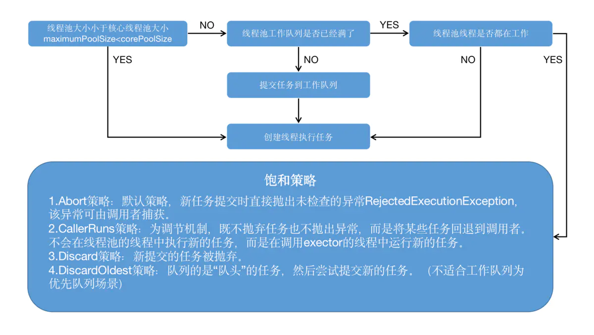

# 1.pthread

## 1.1 pthread 介绍

- 全称 POSIX Thread，POSIX（Portable Operating System Interface）表示可移植操作系统接口；
- 一套用 C 语言写的通用的多线程 API；
- 适用于 Unix / Linux / Windows 等系统；
- 跨平台/可移植；
- 使用难度大、使用频率低；
- 线程生命周期由程序员管理；
- 现在 iOS 中用到 pthread 的多数情况是使用 pthread_mutex 互斥锁，性能较高。

## 1.2 pthread 的简单使用

```objectivec
#import <pthread.h>

- (void)touchesBegan:(NSSet<UITouch *> *)touches withEvent:(UIEvent *)event
{
    //创建子线程
    pthread_t pthread; //线程编号
    /*
     参数一：线程编号的地址
     参数二：线程的属性
     参数三：线程要执行的函数 void * （*）（void *）
     参数四：函数的参数，参数类型：void *
     返回值：0代表成功，非0代表失败
     pthread_create(pthread_t  _Nullable *restrict _Nonnull,
                    const pthread_attr_t *restrict _Nullable,
                    void * _Nullable (* _Nonnull)(void * _Nullable),
                    void *restrict _Nullable)
     */
    int result = pthread_create(&pthread, NULL, demo, NULL);
    if (result == 0) {
        NSLog(@"成功");
    } else {
        NSLog(@"失败");
    }
}

void *demo(void *param) {
    NSLog(@"hello,%@",[NSThread currentThread]);
    return NULL;
}
```

# 2. NSThread

## 2.1 NSThread 介绍

- 使用更加面向对象；
- 简单易用，可直接操作线程对象；
- 语言 OC，线程生命周期由程序员管理，偶尔使用。

## 2.2 NSThread 的基本使用

方式一：需要手动调用 start 方法开启线程

```objectivec
    // SEL
    NSThread *thread = [[NSThread alloc] initWithTarget:self selector:@selector(demo) object:nil];
    [thread start];
```

```objectivec
    // block
    NSThread *thread = [[NSThread alloc] initWithBlock:^{
        NSLog(@"hello,%@",[NSThread currentThread]);
    }];
    [thread start];
```

方式二：

```objectivec
    // SEL
    [NSThread detachNewThreadSelector:@selector(demo) toTarget:self withObject:nil];
```

```objectivec
    // block
    [NSThread detachNewThreadWithBlock:^{
        NSLog(@"hello,%@",[NSThread currentThread]);
    }];
```

方式三：

```objectivec
    // SEL
    [self performSelectorInBackground:@selector(demo) withObject:nil];
```

## 2.3 线程的状态、生命周期


```objectivec
- (void)touchesBegan:(NSSet<UITouch *> *)touches withEvent:(UIEvent *)event
{
    //新建状态
    NSThread *thread = [[NSThread alloc] initWithTarget:self selector:@selector(demo) object:nil];
    //就绪状态
    [thread start];  
}

- (void)demo {    
    //运行状态
    for (int i = 0; i < 20; i++) {
        NSLog(@"%d",i);
        if (i == 5) {
            //阻塞状态
            [NSThread sleepForTimeInterval:5];
        }        
        if (i == 10) {
            //线程退出，死亡状态
            [NSThread exit];
        }
    }
}
```

## 2.4 线程池的原理



| 参数名          | 代表含义                                                     |
| --------------- | ------------------------------------------------------------ |
| corePoolSize    | 线程池的基本大小（核心线程池大小）                           |
| maximumPoolSize | 线程池的最大大小                                             |
| keepAliveTime   | 线程池中超过 corePoolSize 数目的空闲线程的最大存活时间       |
| unit            | keepAliveTime 参数的时间单位                                 |
| workQueue       | 任务阻塞队列                                                 |
| threadFactory   | 新建线程的工厂                                               |
| handler         | 当提交的任务数超过 maximumPoolSize 与 workQueue 之和时，任务会交给 RejectedExecutionHandler 来处理 |

## 2.5 线程的属性

- **线程名称**：
   设置线程名称可以当线程执行的方法内部出现异常的时候记录异常和当前线程。
- **线程的优先级**：
   内核调度算法在决定该运行哪个线程时，会把线程的优先级作为考量因素，较高优先级的线程会比较低优先级的线程有更多的运行机会。较高优先级不保证你的线程具体执行的时间，不保证可以等它执行完再执行较低优先级的线程，只是比较低优先级的线程更有可能被调度器选择执行而已。

```objectivec
    NSThread *thread = [[NSThread alloc] initWithTarget:self selector:@selector(demo) object:nil];
    //线程名称
    thread.name = @"thread1";
    //线程优先级：范围 0.0-1.0，默认 0.5
    thread.threadPriority = 1.0;
    [thread start];
```

