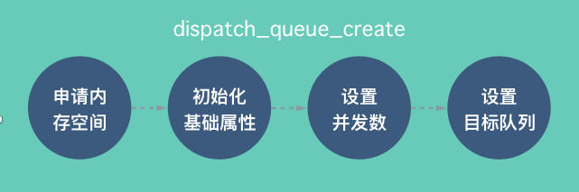
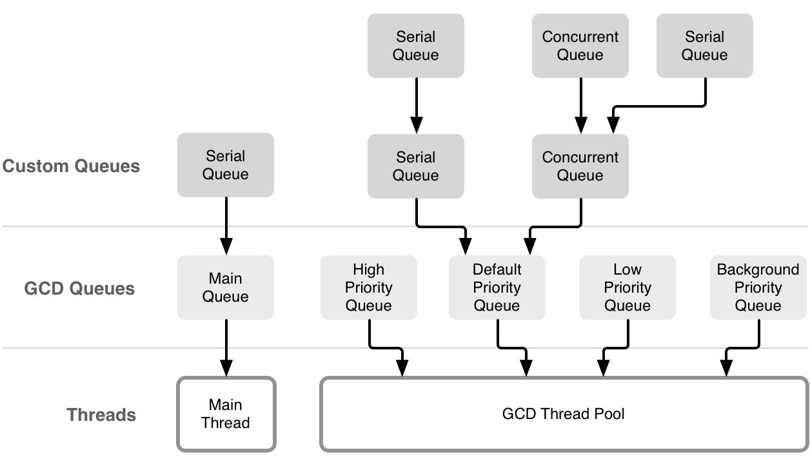
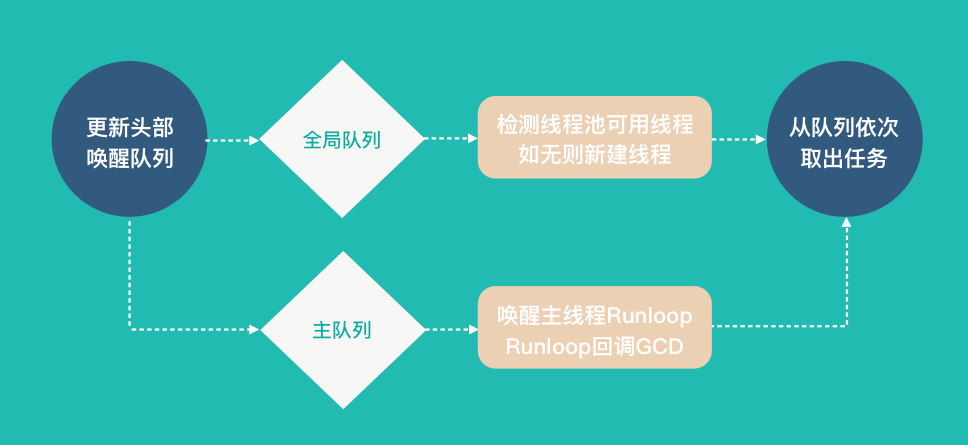
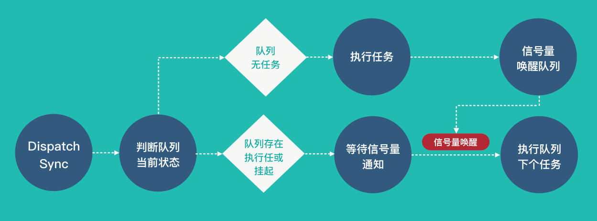
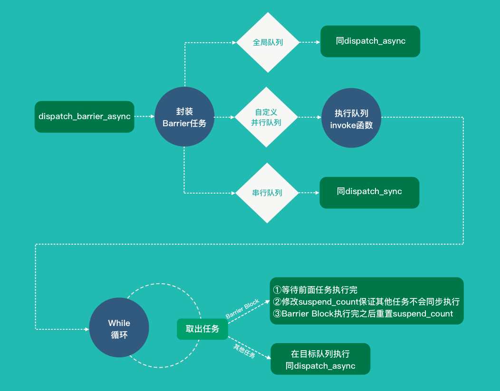

# 1. 常用API源码分析

## 1.1 dispatch_get_global_queue

```c++
dispatch_queue_t dispatch_get_global_queue(long priority, unsigned long flags)
{
	if (flags & ~(unsigned long)DISPATCH_QUEUE_OVERCOMMIT) {
		return NULL;
	}
	//封装调用_dispatch_get_root_queue函数
	return _dispatch_get_root_queue(priority,
			flags & DISPATCH_QUEUE_OVERCOMMIT);
}
```

```c++
static inline dispatch_queue_t _dispatch_get_root_queue(long priority, bool overcommit)
{
	if (overcommit) switch (priority) {
	case DISPATCH_QUEUE_PRIORITY_BACKGROUND:
		return &_dispatch_root_queues[
				DISPATCH_ROOT_QUEUE_IDX_BACKGROUND_OVERCOMMIT_PRIORITY];
	case DISPATCH_QUEUE_PRIORITY_LOW:
	case DISPATCH_QUEUE_PRIORITY_NON_INTERACTIVE:
		return &_dispatch_root_queues[
				DISPATCH_ROOT_QUEUE_IDX_LOW_OVERCOMMIT_PRIORITY];
	case DISPATCH_QUEUE_PRIORITY_DEFAULT:
		return &_dispatch_root_queues[
				DISPATCH_ROOT_QUEUE_IDX_DEFAULT_OVERCOMMIT_PRIORITY];
	case DISPATCH_QUEUE_PRIORITY_HIGH:
		return &_dispatch_root_queues[
				DISPATCH_ROOT_QUEUE_IDX_HIGH_OVERCOMMIT_PRIORITY];
	}
	switch (priority) {
	case DISPATCH_QUEUE_PRIORITY_BACKGROUND:
		return &_dispatch_root_queues[
				DISPATCH_ROOT_QUEUE_IDX_BACKGROUND_PRIORITY];
	case DISPATCH_QUEUE_PRIORITY_LOW:
	case DISPATCH_QUEUE_PRIORITY_NON_INTERACTIVE:
		return &_dispatch_root_queues[DISPATCH_ROOT_QUEUE_IDX_LOW_PRIORITY];
	case DISPATCH_QUEUE_PRIORITY_DEFAULT:
		return &_dispatch_root_queues[DISPATCH_ROOT_QUEUE_IDX_DEFAULT_PRIORITY];
	case DISPATCH_QUEUE_PRIORITY_HIGH:
		return &_dispatch_root_queues[DISPATCH_ROOT_QUEUE_IDX_HIGH_PRIORITY];
	default:
		return NULL;
	}
}
```

队列优先级有八个，分别为低、默认、高、后台以及对应的overcommit。枚举定义如下：

```
enum {
	DISPATCH_ROOT_QUEUE_IDX_LOW_PRIORITY = 0,                //低优先级
	DISPATCH_ROOT_QUEUE_IDX_LOW_OVERCOMMIT_PRIORITY,         //低优先级+overcommit
	DISPATCH_ROOT_QUEUE_IDX_DEFAULT_PRIORITY,                //默认优先级
	DISPATCH_ROOT_QUEUE_IDX_DEFAULT_OVERCOMMIT_PRIORITY,     //默认优先级+overcommit
	DISPATCH_ROOT_QUEUE_IDX_HIGH_PRIORITY,                   //高优先级
	DISPATCH_ROOT_QUEUE_IDX_HIGH_OVERCOMMIT_PRIORITY,        //高优先级+overcommit
	DISPATCH_ROOT_QUEUE_IDX_BACKGROUND_PRIORITY,             //后台
	DISPATCH_ROOT_QUEUE_IDX_BACKGROUND_OVERCOMMIT_PRIORITY,  //后台+overcomit
};
```

`_dispatch_get_root_queue`从_dispatch_root_queues结构体中获取对应优先级的队列。最后1bit为1的代表overcommit，带有overcommit标记的队列会在任务提交时新创建一个线程处理它。

`_dispatch_root_queues`取出的`dispatch_queue_s`队列的do_ctxt字段表示queue的线程池，定义于`_dispatch_root_queue_contexts`结构体中，每个线程池的最大线程数限制是255。

下面看一下global queue的do_vtable结构体，它比较重要的是do_probe的调用函数`_dispatch_root_queue_probe`,这个函数在后续的分析中会用到。结构体定义如下:

```c++
//global queue的vtable定义
DISPATCH_VTABLE_SUBCLASS_INSTANCE(queue_root, queue,
	.do_type = DISPATCH_QUEUE_ROOT_TYPE,
	.do_kind = "global-queue",
	.do_dispose = _dispatch_pthread_root_queue_dispose, //销毁时调用
	.do_probe = _dispatch_root_queue_probe,             //重要，唤醒队列时调用
	.do_debug = dispatch_queue_debug,                   //debug回调
);
```

<font color='red'>总结：`dispatch_get_global_queue`是通过底层函数`_dispatch_get_root_queue（）`从_dispatch_root_queues结构体中获取对应优先级的队列。`_dispatch_root_queues`取出的`dispatch_queue_s`队列的do_ctxt字段表示queue的线程池，定义于`_dispatch_root_queue_contexts`结构体中，每个线程池的最大线程数限制是255。</font>

## 1.2 dispatch_get_main_queue

该API的使用主要是在更新UI时获取`dispatch_get_main_queue()`并把任务提交到主队列中。它的源码如下：

```
//宏定义，返回到是_dispatch_main_q
#define dispatch_get_main_queue() \
		DISPATCH_GLOBAL_OBJECT(dispatch_queue_t, _dispatch_main_q)

//main_queue结构体定义
struct dispatch_queue_s _dispatch_main_q = {
	.do_vtable = DISPATCH_VTABLE(queue),
	.do_targetq = &_dispatch_root_queues[
			DISPATCH_ROOT_QUEUE_IDX_DEFAULT_OVERCOMMIT_PRIORITY],  //目标队列
	.do_ref_cnt = DISPATCH_OBJECT_GLOBAL_REFCNT,   
	.do_xref_cnt = DISPATCH_OBJECT_GLOBAL_REFCNT,  
	.do_suspend_cnt = DISPATCH_OBJECT_SUSPEND_LOCK,
	.dq_label = "com.apple.main-thread",   //队列名
	.dq_running = 1,          
	.dq_width = 1,            //最大并发数是1，串行队列
	.dq_is_thread_bound = 1,  //线程绑定
	.dq_serialnum = 1,        //序列号为1
};
```

main queue设置了并发数为1，即串行队列,并且将targetq指向com.apple.root.default-overcommit-priority队列。

<font color='red'>总结：</font>

### 

## 1.3 dispatch_queue_create

`dispatch_queue_create`主要用来创建自定义的队列，流程图和源码如下：




```c++
dispatch_queue_t dispatch_queue_create(const char *label, dispatch_queue_attr_t attr) {
  //调用dispatch_queue_create_with_target
	return dispatch_queue_create_with_target(label, attr,
			DISPATCH_TARGET_QUEUE_DEFAULT);
}
//dispatch_queue_create具体实现函数
dispatch_queue_t dispatch_queue_create_with_target(const char *label,
		dispatch_queue_attr_t attr, dispatch_queue_t tq) {
	dispatch_queue_t dq;
   //申请内存空间
	dq = _dispatch_alloc(DISPATCH_VTABLE(queue),
			sizeof(struct dispatch_queue_s) - DISPATCH_QUEUE_CACHELINE_PAD);
  //初始化，设置自定义队列的基本属性，方法实现见下面
	_dispatch_queue_init(dq);
	if (label) {
	   //设置队列名
		dq->dq_label = strdup(label);
	}
	if (attr == DISPATCH_QUEUE_CONCURRENT) {
	   //并行队列设置dq_width为UINT32_MAX
		dq->dq_width = UINT32_MAX;
		if (!tq) {
		   //默认targetq，优先级为DISPATCH_QUEUE_PRIORITY_DEFAULT
			tq = _dispatch_get_root_queue(0, false);
		}
	} else {
		if (!tq) {
		   //默认targetq，优先级为DISPATCH_ROOT_QUEUE_IDX_DEFAULT_OVERCOMMIT_PRIORITY
			// Default target queue is overcommit!
			tq = _dispatch_get_root_queue(0, true);
		}
	}
	//设置自定义队列的目标队列，dq队列的任务会放到目标队列执行
	dq->do_targetq = tq;
	return _dispatch_introspection_queue_create(dq);
}
//队列初始化方法
static inline void _dispatch_queue_init(dispatch_queue_t dq)
{
	dq->do_next = (struct dispatch_queue_s *)DISPATCH_OBJECT_LISTLESS;
	dq->dq_running = 0;      //队列当前运行时初始为0
	dq->dq_width = 1;        //队列并发数默认为1，串行队列
	dq->dq_serialnum = dispatch_atomic_inc_orig(&_dispatch_queue_serial_numbers,
			relaxed);          //序列号,在_dispatch_queue_serial_numbers基础上原子性加1
}
	
```

上面的代码介绍了自定义队列是如何创建的，初始化时会将dq_width默认设置为1，即串行队列。如果外部设置attr为DISPATCH_QUEUE_CONCURRENT，将并发数改为UINT32_MAX；
自定义队列的serialnum是在_dispatch_queue_serial_numbers基础上原子性加一，即从12开始累加。1到11被保留的序列号定义如下（后续版本有改动，自定义序列从16开始累加）：

```c++
// skip zero        //跳过0
// 1 - main_q       //主队列
// 2 - mgr_q        //管理队列
// 3 - mgr_root_q   //管理队列的目标队列
// 4,5,6,7,8,9,10,11 - global queues   //全局队列
// we use 'xadd' on Intel, so the initial value == next assigned
unsigned long volatile _dispatch_queue_serial_numbers = 12;
```

同时还会设置队列的target_queue，向队列提交的任务，都会被放到它的目标队列来执行。串行队列的target_queue是一个支持overcommit的全局队列，而全局队列的底层则是一个线程池。

借用一张队列的图片：




## 1.4 dispatch_async

`dispatch_async`用来异步执行任务，它的代码比较复杂，我们可以分成三个阶段来看：

第一阶段是更新队列链表；

第二阶段是从队列取任务；

第三阶段是执行任务。

每个阶段都有一张流程图表示，觉得代码多的话可以直接看每个阶段对应的流程图。

从`dispatch_async`的入口函数开始:

```c++
void dispatch_async(dispatch_queue_t dq, void (^work)(void)) {
	dispatch_async_f(dq, _dispatch_Block_copy(work), _dispatch_call_block_and_release);
}
```

dispatch_async封装调用了dispatch_async_f函数，先将block拷贝到堆上，避免block执行前被销毁，同时传入_dispatch_call_block_and_release来保证block执行后会执行Block_release。下面看一下dispatch_async_f的实现：

```c++
void dispatch_async_f(dispatch_queue_t dq, void *ctxt, dispatch_function_t func) {
	dispatch_continuation_t dc;
	if (dq->dq_width == 1) {
	   //如果是串行队列，执行dispatch_barrier_async_f，和当前函数的不同点在于
	   //.do_vtable = (void *)(DISPATCH_OBJ_ASYNC_BIT | DISPATCH_OBJ_BARRIER_BIT)
		return dispatch_barrier_async_f(dq, ctxt, func);
	}
	//将任务封装到dispatch_continuation_t结构体中
	dc = fastpath(_dispatch_continuation_alloc_cacheonly());
	if (!dc) {
		return _dispatch_async_f_slow(dq, ctxt, func);
	}
	dc->do_vtable = (void *)DISPATCH_OBJ_ASYNC_BIT;  //将vtable设置为ASYNC标志位
	dc->dc_func = func; 
	dc->dc_ctxt = ctxt;
	if (dq->do_targetq) {
	   //如果有do_targetq，将任务放到目标队列执行
		return _dispatch_async_f2(dq, dc);
	}
	//将任务压入队列(FIFO)
	_dispatch_queue_push(dq, dc);
}
```

接下来分析一下_dispatch_queue_push，这是一个宏定义，展开后的调用栈如下:

```
_dispatch_queue_push
└──_dispatch_trace_queue_push
    └──_dispatch_queue_push
```

看一下_dispatch_queue_push的具体实现：

```
static inline void _dispatch_queue_push(dispatch_queue_t dq, dispatch_object_t _tail) {
	struct dispatch_object_s *tail = _tail._do;
	//判断链表中是否已经存在节点，有的话返回YES,否则返回NO
	if (!fastpath(_dispatch_queue_push_list2(dq, tail, tail))) {
	   //将任务放到链表头部
		_dispatch_queue_push_slow(dq, tail);
	}
}
//判断链表中是否已经存在节点
static inline bool _dispatch_queue_push_list2(dispatch_queue_t dq, struct dispatch_object_s *head,
		struct dispatch_object_s *tail) {
	struct dispatch_object_s *prev;
	tail->do_next = NULL;
	//将tail原子性赋值给dq->dq_items_tail，同时返回之前的值并赋给prev
	prev = dispatch_atomic_xchg2o(dq, dq_items_tail, tail, release);
	if (fastpath(prev)) {
	   //如果prev不等于NULL，直接在链表尾部添加节点
		prev->do_next = head;
	}
	//链表中之前有元素返回YES，否则返回NO
	return (prev != NULL);
}
//将节点放到链表开头
void _dispatch_queue_push_slow(dispatch_queue_t dq,
		struct dispatch_object_s *obj)
{
	if (dx_type(dq) == DISPATCH_QUEUE_ROOT_TYPE && !dq->dq_is_thread_bound) {
	   //原子性的将head存储到链表头部
		dispatch_atomic_store2o(dq, dq_items_head, obj, relaxed);
		//唤醒global queue队列
		return _dispatch_queue_wakeup_global(dq);
	}
	//将obj放到链表头部并执行_dispatch_wakeup函数里的dx_probe()函数
	_dispatch_queue_push_list_slow2(dq, obj);
}
```

由上面的代码可以看出_dispatch_queue_push分为两种情况：
1、如果队列的链表不为空，将节点添加到链表尾部，即dq->dq_item_tail=dc。然后队列会按先进先出(FIFO)来处理任务。
2、如果队列此时为空，进入到_dispatch_queue_push_slow函数。如果队列是全局队列会进入if分支，原子性的将节点添加到队列开头，并执行_dispatch_queue_wakeup_global唤醒全局队列；如果队列是主队列或自定义串行队列if分支判断不成立，执行_dispatch_queue_push_list_slow2函数，它会将节点添加到队列开头并执行`_dispatch_wakeup`函数唤醒队列。

`dispatch_async`第一阶段的工作主要是封装外部任务并添加到队列的链表中，可以用下图来表示：’


接着来看队列唤醒的逻辑，主要分成主队列和全局队列的唤醒和任务执行逻辑：
1、如果是主队列，会先调用`_dispatch_wakeup`唤醒队列，然后执行_dispatch_main_queue_wakeup函数来唤醒主线程的Runloop，代码如下：

```c
dispatch_queue_t _dispatch_wakeup(dispatch_object_t dou) {
	if (slowpath(DISPATCH_OBJECT_SUSPENDED(dou._do))) {
		return NULL;
	}
	//_dispatch_queue_probe判断dq_items_tail是否为空，if分支不成立
	if (!dx_probe(dou._do)) {
		return NULL;
	}
	//如果dou._do->do_suspend_cnt==0，返回YES,否则返回NO；
	//同时将DISPATCH_OBJECT_SUSPEND_LOCK赋值给dou._do->do_suspend_cnt
	if (!dispatch_atomic_cmpxchg2o(dou._do, do_suspend_cnt, 0,
			DISPATCH_OBJECT_SUSPEND_LOCK, release)) {
			//因为主线程do_suspend_cnt非0，所以主线程if分支判断成功
#if DISPATCH_COCOA_COMPAT
		if (dou._dq == &_dispatch_main_q) {
			//主队列的任务执行和Runloop关联，唤醒主队列
			return _dispatch_main_queue_wakeup();
		}
#endif
		return NULL;
	}
	//放到目标队列中，重新走_dispatch_queue_push方法
	_dispatch_retain(dou._do);
	dispatch_queue_t tq = dou._do->do_targetq;
	_dispatch_queue_push(tq, dou._do);
	return tq;
}
//唤醒主线程Runloop
static dispatch_queue_t _dispatch_main_queue_wakeup(void) {
	dispatch_queue_t dq = &_dispatch_main_q;
	if (!dq->dq_is_thread_bound) {
		return NULL;
	}
	//只初始化一次mach_port_t
	dispatch_once_f(&_dispatch_main_q_port_pred, dq,
			_dispatch_runloop_queue_port_init);
	_dispatch_runloop_queue_wakeup_thread(dq);
	return NULL;
}
//唤醒runloop
static inline void _dispatch_runloop_queue_wakeup_thread(dispatch_queue_t dq) {
	mach_port_t mp = (mach_port_t)dq->do_ctxt;
	if (!mp) {
		return;
	}
	//唤醒主线程的runloop
	kern_return_t kr = _dispatch_send_wakeup_runloop_thread(mp, 0);
	switch (kr) {
	case MACH_SEND_TIMEOUT:
	case MACH_SEND_TIMED_OUT:
	case MACH_SEND_INVALID_DEST:
		break;
	default:
		(void)dispatch_assume_zero(kr);
		break;
	}
}
```

当我们调用 dispatch_async(dispatch_get_main_queue(), block) 时，libDispatch 向主线程的 RunLoop 发送消息，RunLoop会被唤醒，并从消息中取得这个 block，并在回调 **CFRUNLOOP_IS_SERVICING_THE_MAIN_DISPATCH_QUEUE**() 里执行这个 block。用Xcode在block处打断点就会看到下图中的调用栈:


2、如果是全局队列，调用_dispatch_queue_wakeup_global函数，它封装调用了核心函数`_dispatch_queue_wakeup_global_slow`，调用栈和核心代码如下：

```c++
_dispatch_queue_wakeup_global_slow
└──_dispatch_queue_wakeup_global2
    └──_dispatch_queue_wakeup_global_slow
static void _dispatch_queue_wakeup_global_slow(dispatch_queue_t dq, unsigned int n) {
	static dispatch_once_t pred;
	dispatch_root_queue_context_t qc = dq->do_ctxt;
	uint32_t i = n;
	int r;

	_dispatch_debug_root_queue(dq, __func__);
	//初始化dispatch_root_queue_context_s
	dispatch_once_f(&pred, NULL, _dispatch_root_queues_init);

#if DISPATCH_USE_PTHREAD_POOL
    //为了防止有些timer每隔一分钟调用，线程执行任务后会有65s的超时用来等待signal唤醒
    //降低线程频繁创建销毁的性能消耗
	if (fastpath(qc->dgq_thread_mediator)) {
		while (dispatch_semaphore_signal(qc->dgq_thread_mediator)) {
			if (!--i) {
				return;
			}
		}
	}
	//检测线程池可用大小，如果还有，则将线程池减一
	uint32_t j, t_count = qc->dgq_thread_pool_size;
	do {
		if (!t_count) {
		  //线程池已达到最大使用量
			_dispatch_root_queue_debug("pthread pool is full for root queue: "
					"%p", dq);
			return;
		}
		j = i > t_count ? t_count : i;
	} while (!dispatch_atomic_cmpxchgvw2o(qc, dgq_thread_pool_size, t_count,
			t_count - j, &t_count, relaxed));
   //创建新的线程，入口函数是_dispatch_worker_thread
	do {
		_dispatch_retain(dq);
		while ((r = pthread_create(pthr, attr, _dispatch_worker_thread, dq))) {
			if (r != EAGAIN) {
				(void)dispatch_assume_zero(r);
			}
			_dispatch_temporary_resource_shortage();
		}
		if (!attr) {
			r = pthread_detach(*pthr);
			(void)dispatch_assume_zero(r);
		}
	} while (--j);
#endif // DISPATCH_USE_PTHREAD_POOL
}
```

创建新的线程后执行`_dispatch_worker_thread`函数，代码简化后如下：

```
static void * _dispatch_worker_thread(void *context) {
	const int64_t timeout = (pqc ? 5ull : 65ull) * NSEC_PER_SEC;
	//为了防止有些timer每隔一分钟调用，线程执行任务后会有65s的超时用来等待signal唤醒
	//降低线程频繁创建销毁的性能消耗
	do {
	   //取出一个任务并执行
		_dispatch_root_queue_drain(dq);
	} while (dispatch_semaphore_wait(qc->dgq_thread_mediator,
			dispatch_time(0, timeout)) == 0);
    //将线程池加一
	(void)dispatch_atomic_inc2o(qc, dgq_thread_pool_size, relaxed);
	_dispatch_queue_wakeup_global(dq);
	_dispatch_release(dq);

	return NULL;
}
```

从队列取任务的入口是_dispatch_root_queue_drain函数，简化的代码如下：

```c++
static void _dispatch_root_queue_drain(dispatch_queue_t dq) {
	_dispatch_thread_setspecific(dispatch_queue_key, dq);

#if DISPATCH_COCOA_COMPAT
	// ensure that high-level memory management techniques do not leak/crash
	if (dispatch_begin_thread_4GC) {
		dispatch_begin_thread_4GC();
	}
	//autoreleasepool的push操作
	void *pool = _dispatch_autorelease_pool_push();
#endif // DISPATCH_COCOA_COMPAT

	_dispatch_perfmon_start();
	struct dispatch_object_s *item;
	//取出队列的头部节点(FIFO)
	while ((item = fastpath(_dispatch_queue_concurrent_drain_one(dq)))) {
		//对取出的内容进行处理，核心函数
		_dispatch_continuation_pop(item);
	}
	_dispatch_perfmon_end();

#if DISPATCH_COCOA_COMPAT
    //autoreleasepool的pop操作
	_dispatch_autorelease_pool_pop(pool);
	if (dispatch_end_thread_4GC) {
		dispatch_end_thread_4GC();
	}
#endif // DISPATCH_COCOA_COMPAT

	_dispatch_thread_setspecific(dispatch_queue_key, NULL);
}
```

队列唤醒后的工作主要是用线程池(全局队列)或者唤醒Runloop(主队列)的方式从队列的链表中依次取出要执行的任务，流程图如下：



总结一下：`dispatch_async`的流程是用链表保存所有提交的block，然后在底层线程池中，依次取出block并执行；而向主队列提交block则会向主线程的Runloop发送消息并唤醒Runloop，接着会在回调函数中取出block并执行。


## 1.5 dispatch_sync

了解了dispatch_async的逻辑后，再来看下dispatch_sync的实现和流程。`dispatch_sync`主要封装调用了`dispatch_sync_f`函数，看一下具体代码:

```c++
void dispatch_sync_f(dispatch_queue_t dq, void *ctxt, dispatch_function_t func) {
	if (fastpath(dq->dq_width == 1)) {
	   //串行队列执行同步方法
		return dispatch_barrier_sync_f(dq, ctxt, func);
	}
	if (slowpath(!dq->do_targetq)) {
	   //global queue不要求执行顺序，直接执行具体的block
		// the global concurrent queues do not need strict ordering
		(void)dispatch_atomic_add2o(dq, dq_running, 2, relaxed);
		return _dispatch_sync_f_invoke(dq, ctxt, func);
	}
	//并发队列压入同步方法
	_dispatch_sync_f2(dq, ctxt, func);
}
```

由上面的代码可以看出，后续逻辑主要分为两种情况：

1、向串行队列提交同步任务，执行dispatch_barrier_sync_f函数：

```c++
void dispatch_barrier_sync_f(dispatch_queue_t dq, void *ctxt,
		dispatch_function_t func) {
	if (slowpath(dq->dq_items_tail) || slowpath(DISPATCH_OBJECT_SUSPENDED(dq))){
		return _dispatch_barrier_sync_f_slow(dq, ctxt, func);
	}
	if (slowpath(!dispatch_atomic_cmpxchg2o(dq, dq_running, 0, 1, acquire))) {
		return _dispatch_barrier_sync_f_slow(dq, ctxt, func);
	}
	if (slowpath(dq->do_targetq->do_targetq)) {
		return _dispatch_barrier_sync_f_recurse(dq, ctxt, func);
	}
	_dispatch_barrier_sync_f_invoke(dq, ctxt, func);
}
```

如果队列无任务执行，调用_dispatch_barrier_sync_f_invoke执行任务。`_dispatch_barrier_sync_f_invoke`代码逻辑展开后如下：

```c++
static void _dispatch_barrier_sync_f_invoke(dispatch_queue_t dq, void *ctxt,
		dispatch_function_t func) {
    //任务执行核心逻辑，将当前线程的dispatch_queue_key设置为dq，然后执行block，
    //执行完之后再恢复到之前的old_dq
	dispatch_queue_t old_dq = _dispatch_thread_getspecific(dispatch_queue_key);
	_dispatch_thread_setspecific(dispatch_queue_key, dq);
	_dispatch_client_callout(ctxt, func);
	_dispatch_perfmon_workitem_inc();
	_dispatch_thread_setspecific(dispatch_queue_key, old_dq);

    //如果队列中存在其他任务，用信号量的方法唤醒，然后继续执行下一个任务
	if (slowpath(dq->dq_items_tail)) {
		return _dispatch_barrier_sync_f2(dq);
	}
	if (slowpath(dispatch_atomic_dec2o(dq, dq_running, release) == 0)) {
		_dispatch_wakeup(dq);
	}
}
```

如果队列存在其他任务或者被挂起，调用`_dispatch_barrier_sync_f_slow`函数，等待该队列的任务执行完之后用信号量通知队列继续执行任务。代码如下：

```c++
static void _dispatch_barrier_sync_f_slow(dispatch_queue_t dq, void *ctxt,
		dispatch_function_t func) {
	_dispatch_thread_semaphore_t sema = _dispatch_get_thread_semaphore();
	struct dispatch_continuation_s dc = {
		.dc_data = dq,
		.dc_func = func,
		.dc_ctxt = ctxt,
		.dc_other = (void*)sema,
	};
	struct dispatch_continuation_s dbss = {
		.do_vtable = (void *)(DISPATCH_OBJ_BARRIER_BIT |
				DISPATCH_OBJ_SYNC_SLOW_BIT),
		.dc_func = _dispatch_barrier_sync_f_slow_invoke,
		.dc_ctxt = &dc,
#if DISPATCH_INTROSPECTION
		.dc_data = (void*)_dispatch_thread_self(),
#endif
	};
    //使用信号量等待其他任务执行完成
	_dispatch_queue_push(dq, &dbss);
	_dispatch_thread_semaphore_wait(sema); // acquire
	_dispatch_put_thread_semaphore(sema);
    //收到signal信号，继续执行当前任务
	if (slowpath(dq->do_targetq->do_targetq)) {
		_dispatch_function_recurse(dq, ctxt, func);
	} else {
		_dispatch_function_invoke(dq, ctxt, func);
	}
}
```

2、向并发队列提交同步任务，执行`_dispatch_sync_f2`函数。如果队列存在其他任务，或者队列被挂起，或者有正在执行的任务，则调用`_dispatch_sync_f_slow`函数，使用信号量等待，否则直接调用`_dispatch_sync_f_invoke`执行任务。代码如下：

```c++
static inline void _dispatch_sync_f2(dispatch_queue_t dq, void *ctxt, dispatch_function_t func) {
	if (slowpath(dq->dq_items_tail) || slowpath(DISPATCH_OBJECT_SUSPENDED(dq))){
		return _dispatch_sync_f_slow(dq, ctxt, func, false);
	}
	uint32_t running = dispatch_atomic_add2o(dq, dq_running, 2, relaxed);
	// re-check suspension after barrier check <rdar://problem/15242126>
	if (slowpath(running & 1) || slowpath(DISPATCH_OBJECT_SUSPENDED(dq))) {
		running = dispatch_atomic_sub2o(dq, dq_running, 2, relaxed);
		return _dispatch_sync_f_slow(dq, ctxt, func, running == 0);
	}
	if (slowpath(dq->do_targetq->do_targetq)) {
		return _dispatch_sync_f_recurse(dq, ctxt, func);
	}
	_dispatch_sync_f_invoke(dq, ctxt, func);
}
//队列存在其他任务|队列被挂起|有正在执行的任务，信号等待
static void _dispatch_sync_f_slow(dispatch_queue_t dq, void *ctxt, dispatch_function_t func,
		bool wakeup) {
	_dispatch_thread_semaphore_t sema = _dispatch_get_thread_semaphore();
	struct dispatch_continuation_s dss = {
		.do_vtable = (void*)DISPATCH_OBJ_SYNC_SLOW_BIT,
		.dc_func = func,
		.dc_ctxt = ctxt,
		.dc_data = (void*)_dispatch_thread_self(),
		.dc_other = (void*)sema,
	};
	_dispatch_queue_push_wakeup(dq, &dss, wakeup);
    //信号等待
	_dispatch_thread_semaphore_wait(sema);
	_dispatch_put_thread_semaphore(sema);
    //信号唤醒，执行同步任务
	if (slowpath(dq->do_targetq->do_targetq)) {
		_dispatch_function_recurse(dq, ctxt, func);
	} else {
		_dispatch_function_invoke(dq, ctxt, func);
	}
	if (slowpath(dispatch_atomic_sub2o(dq, dq_running, 2, relaxed) == 0)) {
		_dispatch_wakeup(dq);
	}
}
```

`dispatch_sync`的逻辑主要是将任务放入队列，并用线程专属信号量做等待，保证每次只会有一个block在执行。流程图如下：



## 1.6 dispatch_barrier_async

`dispatch_barrier_async`是开发中解决多线程读写同一个资源比较好的方案，接下来看一下它的实现。
该函数封装调用了`dispatch_barrier_async_f`，它和dispatch_async_f类似，不同点在于vtable多了DISPATCH_OBJ_BARRIER_BIT标志位。

```c++
void dispatch_barrier_async_f(dispatch_queue_t dq, void *ctxt,
		dispatch_function_t func) {
	dispatch_continuation_t dc;
	dc = fastpath(_dispatch_continuation_alloc_cacheonly());
	if (!dc) {
		return _dispatch_barrier_async_f_slow(dq, ctxt, func);
	}
    //设置do_vtable的标志位，从队列中取任务时会用到
	dc->do_vtable = (void *)(DISPATCH_OBJ_ASYNC_BIT | DISPATCH_OBJ_BARRIER_BIT);
	dc->dc_func = func;
	dc->dc_ctxt = ctxt;

	_dispatch_queue_push(dq, dc);
}
```

`dispatch_barrier_async`如果传入的是global queue，在唤醒队列时会执行`_dispatch_queue_wakeup_global`函数，故执行效果同`dispatch_async`一致，验证了使用篇中的备注内容；
`dispatch_barrier_async`传的queue为自定义队列时，`_dispatch_continuation_pop`参数是自定义的queue，然后在`_dispatch_continuation_pop`中执行自定义队列的dx_invoke函数，即`dispatch_queue_invoke`。它的调用栈是：

```c++
_dispatch_queue_invoke
└──_dispatch_queue_class_invoke
    └──dispatch_queue_invoke2
        └──_dispatch_queue_drain
```

重点看一下_dispatch_queue_drain函数，代码如下：

```c++
_dispatch_thread_semaphore_t _dispatch_queue_drain(dispatch_object_t dou) {
	dispatch_queue_t dq = dou._dq, orig_tq, old_dq;
	old_dq = _dispatch_thread_getspecific(dispatch_queue_key);
	struct dispatch_object_s *dc, *next_dc;
	_dispatch_thread_semaphore_t sema = 0;
	orig_tq = dq->do_targetq;
	_dispatch_thread_setspecific(dispatch_queue_key, dq);

	while (dq->dq_items_tail) {
		dc = _dispatch_queue_head(dq);
		do {
			if (DISPATCH_OBJECT_SUSPENDED(dq)) {
			   //barrier block执行时修改了do_suspend_cnt导致此时为YES
			   //保证barrier block执行时其他block不会同时执行
				goto out;
			}
			if (dq->dq_running > dq->dq_width) {
				goto out;
			}
			bool redirect = false;
			if (!fastpath(dq->dq_width == 1)) {
				if (!DISPATCH_OBJ_IS_VTABLE(dc) &&
						(long)dc->do_vtable & DISPATCH_OBJ_BARRIER_BIT) {
					if (dq->dq_running > 1) {
						goto out;
					}
				} else {
					redirect = true;
				}
			}
			next_dc = _dispatch_queue_next(dq, dc);
			if (redirect) {
				_dispatch_continuation_redirect(dq, dc);
				continue;
			}
			//barrier block之前的block已经执行完，开始执行barrier block
			if ((sema = _dispatch_barrier_sync_f_pop(dq, dc, true))) {
				goto out;
			}
			_dispatch_continuation_pop(dc);
			_dispatch_perfmon_workitem_inc();
		} while ((dc = next_dc));
	}
out:
	_dispatch_thread_setspecific(dispatch_queue_key, old_dq);
	return sema;
}
```

在while循环中依次取出任务并调用_dispatch_continuation_redirect函数，使得block并发执行。当遇到DISPATCH_OBJ_BARRIER_BIT标记时，会修改do_suspend_cnt标志以保证后续while循环时直接goto out。barrier block的任务执行完之后_dispatch_queue_class_invoke会将do_suspend_cnt重置回去，所以barrier block之后的任务会继续执行。

`dispatch_barrier_async`的流程见下图：




# 总结：

dispatch_async将任务添加到队列的链表中并唤醒队列，全局队列唤醒时中会从线程池里取出可用线程，如果没有则会新建线程，然后在线程中执行队列取出的任务;主队列会唤醒主线程的Runloop，然后在Runloop循环中通知GCD执行主队列提交的任务。

dispatch_sync一般都在当前线程执行,如果是主队列的任务还是会切换到主线程执行。它使用线程信号量来实现串行执行的功能。

如果我们调用dispatch_barrier_async时将Barrier blocks提交到一个global queue，barrier blocks执行效果与dispatch_async()一致；只有将Barrier blocks提交到使用DISPATCH_QUEUE_CONCURRENT属性创建的queue时它才会表现的如同预期。

队列的流程比较复杂，上述分析难免有遗漏或者理解不到位的地方，请指正学习。

# 2. 队列的服务质量与优先级

队列的服务质量与优先级的对应关系：

| 优先级 | 新版(iOS8以后)                                               | 旧版本                             |
| ------ | ------------------------------------------------------------ | ---------------------------------- |
| 最高   | QOS_CLASS_USER_INTERACTIVE<br /> //用户交互权限，属于最高等级，常被用于处理交互事件或者刷新UI，因为这些需要即时的 | Main Thread                        |
| 高     | QOS_CLASS_USER_INITIATED<br />  // 由用户发起的并且需要立即得到结果的任务，比如滑动 scroll view 时去加载数据用于后续 cell 的显示，这些任务通常跟后续的用户交互相关，在几秒或者更短的时间内完成； | DISPATCH_QUEUE_PRIORITY_HIGH       |
| 默认   | QOS_CLASS_DEFAULT<br />  // 默认权限，具体权限由系统根据实际情况来决定使用哪个等级权限，如果实际情况不太利于决定使用何种权限，则从UserInitiated和Utility之间选一个权限并使用 | DISPATCH_QUEUE_PRIORITY_DEFAULT    |
| 低     | QOS_CLASS_UTILITY<br />  // 不需要马上就能得到结果，比如下载任务。当资源被限制后，此权限的任务将运行在节能模式下以提供更多资源给更高的优先级任务 | DISPATCH_QUEUE_PRIORITY_LOW        |
| 后台   | QOS_CLASS_BACKGROUND<br />  // 后台权限，通常用户都不能意识到有任务正在进行，比如数据备份等。大多数处于节能模式下，需要把资源让出来给更高的优先级任务 | DISPATCH_QUEUE_PRIORITY_BACKGROUND |

## 1.2  dispatch_queue_attr_make_with_qos_class

作用： **初始化队列时，设置队列服务质量**

```objective-c
/// 设置队列优先级
- (void)testQueue_qos_make {
    dispatch_queue_attr_t arr = dispatch_queue_attr_make_with_qos_class(DISPATCH_QUEUE_CONCURRENT, QOS_CLASS_USER_INTERACTIVE, QOS_MIN_RELATIVE_PRIORITY);
    dispatch_queue_t queue = dispatch_queue_create("yuli.gcd.queue.concurrent", arr);
    dispatch_async(queue, ^{
        NSLog(@"%s say: Hello world!",dispatch_queue_get_label(queue));
    });
}
```

## 1.3 dispatch_set_target_queue

作用： **变更队列优先级or改变队列层次体系**

### 1.3.1 变更队列优先级

```objective-c
- (void)testQueue_set_target {
  dispatch_queue_t q1 = dispatch_queue_create("q1", DISPATCH_QUEUE_SERIAL);
  dispatch_queue_t globalQueue = dispatch_get_global_queue(QOS_CLASS_USER_INTERACTIVE, 0);
  NSLog(@"before (%s: %u,%s:%u)",dispatch_queue_get_label(q1),dispatch_queue_get_qos_class(q1, nil),dispatch_queue_get_label(globalQueue),dispatch_queue_get_qos_class(globalQueue, nil));

  dispatch_set_target_queue(q1, globalQueue);
  dispatch_async(q1, ^{
      NSLog(@"1");
  });
  NSLog(@"after (%s: %u,%s:%u)",dispatch_queue_get_label(q1),dispatch_queue_get_qos_class(q1, nil),dispatch_queue_get_label(globalQueue),dispatch_queue_get_qos_class(globalQueue, nil));
}
```

### 1.3.2 改变队列层次体系

```objective-c
/// 目标队列可以成为原队列的执行阶层(✅：验证通过)
- (void)testQueue_set_target1 {
    dispatch_queue_t q1 = dispatch_queue_create("q1", DISPATCH_QUEUE_SERIAL);
    dispatch_queue_t q2 = dispatch_queue_create("q2", DISPATCH_QUEUE_SERIAL);
    dispatch_queue_t q3 = dispatch_queue_create("q3", DISPATCH_QUEUE_SERIAL);
    dispatch_queue_t targetQueue = dispatch_queue_create("serial", DISPATCH_QUEUE_SERIAL);
    dispatch_set_target_queue(q1, targetQueue);
    dispatch_set_target_queue(q2, targetQueue);
    dispatch_set_target_queue(q3, targetQueue);
    dispatch_async(q1, ^{
        NSLog(@"1");
    });
    
    dispatch_async(q2, ^{
        NSLog(@"2");
    });
    
    dispatch_async(q3, ^{
        NSLog(@"3");
    });
}

```

