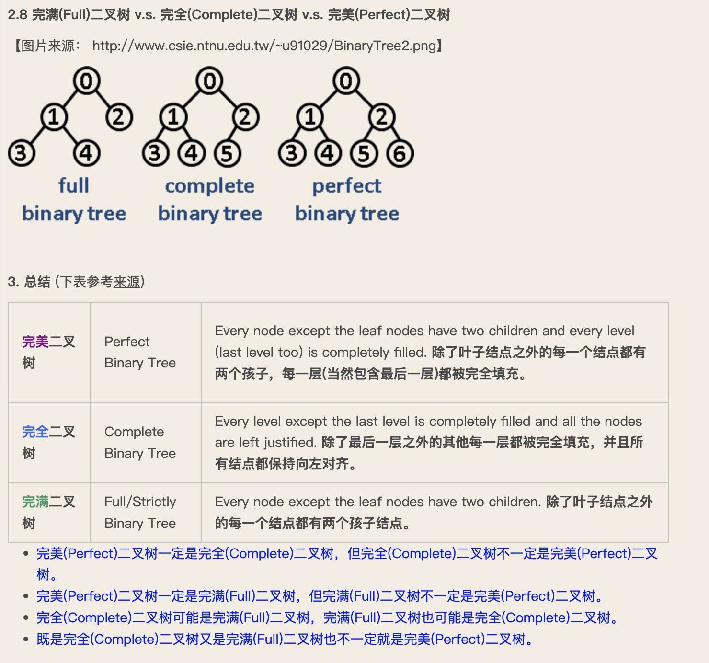

# 常用数据结构

## 1. 二叉树

### 1.1 二叉搜索树

概念：

> 二叉搜索树（又：二叉查找树，二叉排序树，Binary Search Tree，BST）是一种二叉树，其中每个结点最多有两个子结点且具有二叉搜索树性质：左子树上所有结点的值均小于它的根结点的值以及右子树上所有结点的值均大于它的根结点的值（在这个可视化中，我们假定所有的值都是独特的。

### 1.2 平衡二叉树

概念：

> **平衡二叉树又称AVL树**。它可以是一颗空树，或者具有以下性质的**二叉排序树**：它的左子树和右子树的高度之差(平衡因子)的绝对值不超过1且它的左子树和右子树都是一颗平衡二叉树。

### 1.3 完美二叉树、完全二叉树、完满二叉树

